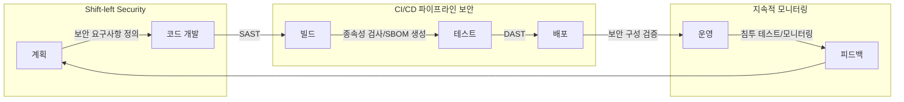

# DevSecOps: 소프트웨어 개발 전주기에 걸친 보안 통합 전략

<!-- mtoc-start -->

- [정의 및 개념](#정의-및-개념)
- [주요 특징](#주요-특징)
- [프로세스 흐름도](#프로세스-흐름도)
- [활용 사례](#활용-사례)
- [기대 효과 및 필요성](#기대-효과-및-필요성)
- [마무리](#마무리)
- [Keywords](#keywords)

<!-- mtoc-end -->

DevSecOps(Development, Security, Operations)는 소프트웨어 개발 프로세스의 모든 단계에 보안을 통합하는 문화와 방법론을 의미합니다. 전통적인 접근 방식과 달리 개발 초기 단계부터 보안을 고려하여 CI 파이프라인 보안과 SBOM(Software Bill of Materials) 작성 등을 통해 선제적 보안 강화(Shift-left)를 추구합니다.

## 정의 및 개념

- DevSecOps: 개발, 보안, 운영 영역을 통합하여 소프트웨어 개발 생명주기 전반에 걸쳐 보안을 자동화하고 통합하는 접근 방식.
- 선제적 보안 강화(Shift-left): 개발 라이프사이클의 초기 단계로 보안 활동을 이동시켜 문제를 조기에 발견하고 해결하는 전략.

- 목적: 비용 효율적인 보안 결함 해결, 출시 시간 단축, 개발-보안-운영 간 협업 강화
- 필요성: 애자일과 DevOps 환경에서 빈번한 배포 속도에 맞춘 보안 통합, 규제 요구사항 준수, 사이버 위협 대응

## 주요 특징

1. **지속적 통합/배포 파이프라인 보안** - CI/CD 파이프라인에 자동화된 보안 테스트 통합으로 코드 검사, 취약점 스캔, 컴플라이언스 검증 자동화
2. **SBOM(Software Bill of Materials)** - 소프트웨어 구성 요소와 종속성을 문서화하여 취약점 관리 및 규제 준수 지원
3. **인프라 코드(IaC) 보안** - 인프라 구성의 보안 검증 자동화를 통한 클라우드 리소스 보안 관리
4. **자동화된 보안 테스트** - SAST(정적 분석), DAST(동적 분석), SCA(소프트웨어 구성 분석) 등 다양한 보안 테스트 도구 통합
5. **지속적 모니터링과 대응** - 운영 환경에서의 실시간 보안 모니터링 및 자동화된 대응 체계 구축

## 프로세스 흐름도

DevSecOps는 개발 계획부터 운영 및 피드백까지 전체 소프트웨어 개발 라이프사이클에 보안을 통합합니다. 초기 단계부터 보안을 고려하는 'Shift-left' 전략으로 비용 효율적인 결함 수정과 출시 시간 단축이 가능합니다.

## 활용 사례

1. **금융 서비스** - 민감한 고객 데이터를 다루는 금융 애플리케이션 개발 시 DevSecOps 적용으로 규제 준수 및 보안 강화
2. **클라우드 네이티브 애플리케이션** - 마이크로서비스 아키텍처와 컨테이너 기반 애플리케이션의 보안 관리 자동화
3. **의료 정보 시스템** - HIPAA 등 규제 준수와 환자 데이터 보호를 위한 보안 통합 개발
4. **IoT 디바이스 개발** - 펌웨어 및 소프트웨어 개발 과정에 보안 통합으로 안전한 IoT 솔루션 제공
5. **정부 및 국방 시스템** - 강화된 보안 요구사항과 컴플라이언스 충족을 위한 자동화된 보안 프로세스 적용

## 기대 효과 및 필요성

1. **취약점 조기 발견과 해결** - 개발 초기 단계의 보안 테스트로 결함 수정 비용 감소 및 시간 단축
2. **컴플라이언스 준수 간소화** - 자동화된 보안 검증을 통한 규제 요구사항 충족 증명 용이성
3. **보안 문화 조성** - 개발자들의 보안 인식 향상과 소유권 의식 고취
4. **출시 시간 단축** - 개발 후반부 보안 문제로 인한 지연 감소
5. **투자 대비 수익(ROI) 향상** - 보안 결함 수정 비용 절감 및 데이터 유출 위험 감소로 인한 경제적 이점
6. **운영 효율성 증대** - 보안 프로세스 자동화를 통한 수동 작업 감소 및 일관성 향상

## 마무리

DevSecOps는 빠른 개발 속도와 높은 수준의 보안이 동시에 요구되는 현대 소프트웨어 개발 환경에서 필수적인 접근 방식입니다. CI 파이프라인 보안과 SBOM 작성을 통한 선제적 보안 강화(Shift-left)는 결함 수정 비용을 절감하고 출시 시간을 단축하며 조직의 보안 문화를 형성합니다. 기업들은 DevSecOps 도입을 통해 개발, 보안, 운영 간의 협업을 강화하고 소프트웨어 제품의 품질과 보안성을 동시에 향상시킬 수 있습니다.

## Keywords

DevSecOps, CI 파이프라인 보안, SBOM(Software Bill of Materials), Shift-left Security, 보안 자동화, 지속적 통합, 취약점 스캔, 컴플라이언스 자동화, 정적 분석(SAST), 동적 분석(DAST)
