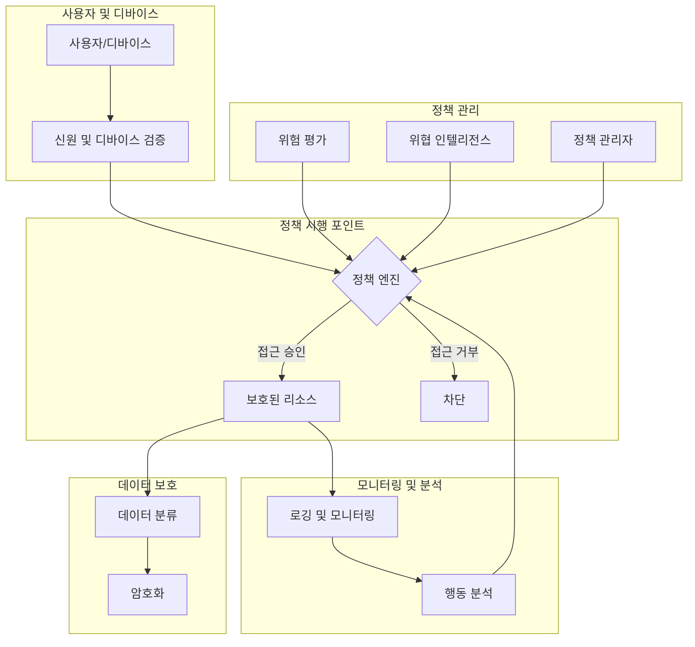

# 제로 트러스트 아키텍처: 경계 없는 보안의 새로운 패러다임

<!-- mtoc-start -->

- [정의 및 개념](#정의-및-개념)
- [주요 특징](#주요-특징)
- [아키텍처 구성도](#아키텍처-구성도)
- [활용 사례](#활용-사례)
- [기대 효과 및 필요성](#기대-효과-및-필요성)
- [마무리](#마무리)
- [Keywords](#keywords)

<!-- mtoc-end -->

제로 트러스트 아키텍처(Zero Trust Architecture, ZTA)는 "신뢰하지 말고 항상 검증하라(Never Trust, Always Verify)"라는 핵심 원칙을 기반으로 하는 보안 모델입니다. 전통적인 경계 기반 보안과 달리, 내부 네트워크와 외부 네트워크의 구분 없이 모든 접근 시도를 잠재적 위협으로 간주하고 지속적인 인증과 권한 부여 프로세스를 요구합니다. 디지털 전환과 원격 근무 환경이 확대됨에 따라 기존의 경계 중심 보안이 더 이상 효과적이지 않게 되면서 기업들이 채택하는 필수적인 보안 전략으로 자리잡고 있습니다.

## 정의 및 개념

- 정의: 모든 사용자와 디바이스를 잠재적 위협으로 간주하고, 네트워크 위치와 관계없이 모든 접근 요청에 대해 철저한 인증과 권한 부여를 요구하는 사이버 보안 접근 방식.
- 목적: 내외부 위협으로부터 조직의 데이터와 시스템을 보호하고, 최소 권한 원칙을 적용하여 보안 침해 발생 시 피해 범위 최소화.
- 특징: 지속적인 모니터링과 검증, 최소 권한 원칙 적용, 세분화된 접근 제어, 데이터 중심 보호 전략 구현.

## 주요 특징

- **계속적 신원 검증**: 일회성 인증이 아닌 세션 전체에 걸쳐 사용자와 디바이스의 신원을 지속적으로 검증하는 지속적 인증 메커니즘 적용.
- **최소 권한의 원칙**: 사용자에게 필요한 최소한의 권한만 부여하여 내부자 위협 및 권한 상승 공격 위험 감소.
- **마이크로 세그멘테이션**: 네트워크를 작은 영역으로 분할하여 공격자의 측면 이동(lateral movement)을 제한하고 위협 확산 방지.
- **데이터 중심 보호**: 네트워크 경계가 아닌 데이터 자체에 보호 조치를 적용하여 데이터 위치와 상관없이 일관된 보안 정책 적용.
- **지속적인 모니터링과 분석**: 실시간 위협 탐지와 이상 행동 분석을 통한 선제적 대응 체계 구축.

## 아키텍처 구성도

제로 트러스트 아키텍처는 사용자/디바이스의 신원 검증부터 정책 시행, 지속적 모니터링 및 데이터 보호까지 상호 연계된 요소로 구성됩니다. 모든 접근 요청은 정책 엔진을 통해 평가되며, 실시간 위험 분석과 지속적인 모니터링을 통해 동적으로 보안 정책이 적용됩니다.

## 활용 사례

- **하이브리드/멀티 클라우드 환경**: 온프레미스와 클라우드 환경에 걸쳐 일관된 보안 정책을 적용하여 복잡한 IT 인프라 보호.
- **원격 근무 보안**: VPN에 의존하지 않고 위치에 관계없이 기업 리소스에 대한 안전한 접근 제공.
- **IoT 보안 강화**: 다양한 IoT 디바이스의 인증 및 권한 관리를 통해 보안 취약점 최소화.
- **규제 준수**: 금융, 의료, 공공 등 규제가 엄격한 산업에서 데이터 접근 통제 및 감사 추적 요구사항 충족.
- **공급망 보안**: 파트너사 및 공급업체와의 안전한 협업을 위한 세분화된 접근 제어 구현.

## 기대 효과 및 필요성

- **보안 침해 영향 최소화**: 공격자가 네트워크에 침투하더라도 측면 이동이 제한되어 피해 범위 감소.
- **가시성 향상**: 모든 네트워크 트래픽과 접근 시도에 대한 포괄적인 모니터링으로 보안 상황 인식 개선.
- **규제 준수 간소화**: 세분화된 접근 제어와 감사 로깅을 통해 규제 요구사항 충족 용이.
- **하이브리드 워크 지원**: 재택근무, 원격근무 등 다양한 근무 형태에서 일관된 보안 정책 적용 가능.
- **비즈니스 민첩성 향상**: 보안 위험을 최소화하면서 새로운 디지털 이니셔티브와 기술 도입 가속화.
- **내부자 위협 대응**: 최소 권한 원칙과 지속적인 행동 모니터링을 통해 악의적 내부자 위협 감소.

## 마무리

제로 트러스트 아키텍처는 단순한 보안 솔루션이 아닌 조직 전체의 보안 철학의 변화를 요구합니다. "경계 내부는 안전하다"는 기존 패러다임에서 벗어나 "아무것도 신뢰하지 않고 항상 검증한다"는 접근법으로 전환함으로써, 오늘날의 복잡한 디지털 환경에서 발생하는 다양한 보안 위협에 효과적으로 대응할 수 있습니다. 조직은 제로 트러스트 여정을 단계적으로 시작하여 점진적으로 보안 태세를 강화하는 것이 중요합니다.

## Keywords

Zero Trust Architecture, Zero Trust Network Access(ZTNA), 제로 트러스트 아키텍처, 최소 특권 원칙, 마이크로 세그멘테이션, 지속적 인증, 적응형 인증, 맥락 기반 접근 제어, 신뢰하지 말고 항상 검증, Never Trust Always Verify
