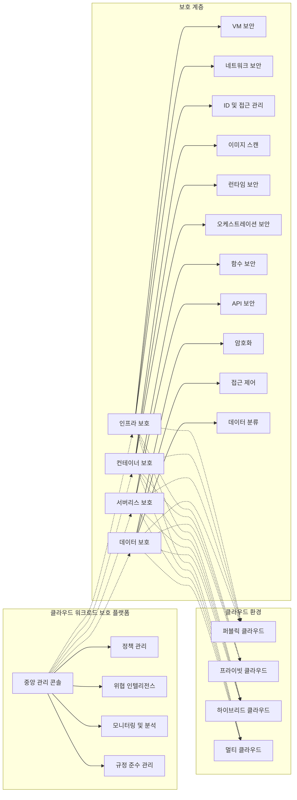

# 클라우드 워크로드 보호: 효과적인 클라우드 환경 보안 강화 전략

<!-- mtoc-start -->

- [정의 및 개념](#정의-및-개념)
- [주요 특징](#주요-특징)
- [아키텍처](#아키텍처)
- [활용 사례](#활용-사례)
- [기대 효과 및 필요성](#기대-효과-및-필요성)
- [마무리](#마무리)
- [Keywords](#keywords)

<!-- mtoc-end -->

클라우드 워크로드 보호(Cloud Workload Protection)는 클라우드 환경에서 운영되는 애플리케이션, 서비스, 인프라 등 모든 워크로드의 보안을 강화하기 위한 포괄적인 접근 방식입니다. 디지털 전환이 가속화되고 클라우드 도입이 확대됨에 따라 전통적 경계 기반 보안을 넘어 클라우드 특성에 맞는 새로운 보안 패러다임이 필요해졌습니다. 클라우드 워크로드 보호는 인프라, 애플리케이션, 데이터 등 클라우드 환경의 모든 계층에서 발생할 수 있는 보안 위협에 대응하는 종합적인 보안 전략입니다.

## 정의 및 개념

- 클라우드 워크로드 보호: 퍼블릭, 프라이빗, 하이브리드 클라우드 환경에서 실행되는 모든 워크로드의 보안을 강화하기 위한 기술 및 프로세스 집합. 컨테이너, 가상머신, 서버리스 기능 등 다양한 형태의 워크로드를 보호하는 체계.
- 목적: 클라우드 환경에서의 가시성 확보, 취약점 관리, 구성 오류 방지, 위협 탐지 및 대응을 통한 종합적 보안 체계 구축.
- 특징: 클라우드 네이티브 설계, 자동화 기반 보안, API 중심 통합, 탄력적 확장성, 다중 클라우드 지원.

## 주요 특징

1. **멀티레이어 보호 기능**: 인프라스트럭처, 컨테이너, 애플리케이션, 서비스, 데이터 계층까지 모든 워크로드 수준에서 보안 통제 제공
2. **취약점 관리**: 지속적인 스캔과 모니터링을 통해 보안 취약점을 사전에 식별하고 해결하는 프로세스 자동화
3. **컴플라이언스 관리**: 규제 요구사항 준수를 위한 지속적인 모니터링 및 보고 체계 구축
4. **클라우드 구성 보안**: 클라우드 인프라 구성 오류 방지를 위한 보안 평가 및 자동 교정 기능
5. **런타임 보호**: 실행 중인 워크로드의 이상 행동 감지 및 실시간 위협 대응 능력 제공

## 아키텍처

클라우드 워크로드 보호 아키텍처는 중앙 관리 콘솔을 통해 다양한 보호 계층을 통합적으로 관리하며, 인프라, 컨테이너, 서버리스, 데이터 등 각 계층별 맞춤형 보안 통제를 다양한 클라우드 환경에 적용합니다. 계층화된 보안 접근 방식으로 각 워크로드 유형에 최적화된 보호 기능을 제공합니다.

## 활용 사례

1. **금융 서비스 보안 강화**: 금융 기관의 클라우드 마이그레이션 시 고객 데이터 보호와 규제 준수를 보장하며 안전한 디지털 서비스 제공
2. **의료 정보 시스템 보호**: 환자 데이터 보호와 HIPAA 등 의료 규제 준수를 위한 클라우드 기반 의료 시스템의 보안 강화
3. **소매업 멀티클라우드 환경 보호**: 여러 클라우드 제공업체를 사용하는 소매업체의 일관된 보안 정책 적용 및 통합 관리
4. **제조업 IoT 장치 보호**: 스마트 팩토리의 IoT 장치와 연결된 클라우드 워크로드 보안을 통한 생산 시스템 보호
5. **SaaS 제공업체 데이터 보호**: 다양한 고객에게 서비스를 제공하는 SaaS 업체의 고객 데이터 분리 및 보안 보장

## 기대 효과 및 필요성

- **보안 위험 감소**: 클라우드 환경에서의 취약점, 구성 오류, 악성 활동을 사전에 식별하고 방지함으로써 전반적인 보안 위험 감소
- **규제 준수 간소화**: 자동화된 모니터링 및 보고 기능을 통해 다양한 규제 요구사항 준수 프로세스 간소화
- **운영 효율성 향상**: 보안 운영의 자동화를 통해 보안 팀의 업무 효율성 증대 및 인적 오류 감소
- **비즈니스 연속성 강화**: 위협 탐지 및 대응 능력을 통해 비즈니스 중단 위험 최소화
- **클라우드 전환 가속화**: 포괄적인 보안 체계를 통해 안전한 클라우드 마이그레이션 및 전환 지원

## 마무리

클라우드 워크로드 보호는 현대 기업의 디지털 전환과 클라우드 도입이 가속화됨에 따라 필수적인 보안 체계로 자리잡고 있습니다. 다양한 클라우드 환경에서 실행되는 워크로드의 특성을 고려한 맞춤형 보안 접근 방식을 통해 조직은 클라우드의 이점을 안전하게 활용할 수 있습니다. 지속적인 모니터링, 취약점 관리, 위협 탐지를 통합한 체계적인 클라우드 워크로드 보호 전략을 도입함으로써 클라우드 시대의 보안 도전과제에 효과적으로 대응할 수 있을 것입니다.

## Keywords

Cloud Workload Protection, 클라우드 보안, Infrastructure-as-Code Security, 컨테이너 보안, Runtime Protection, 취약점 관리, 규제 준수, Identity-based Security, 위협 인텔리전스, 보안 자동화
