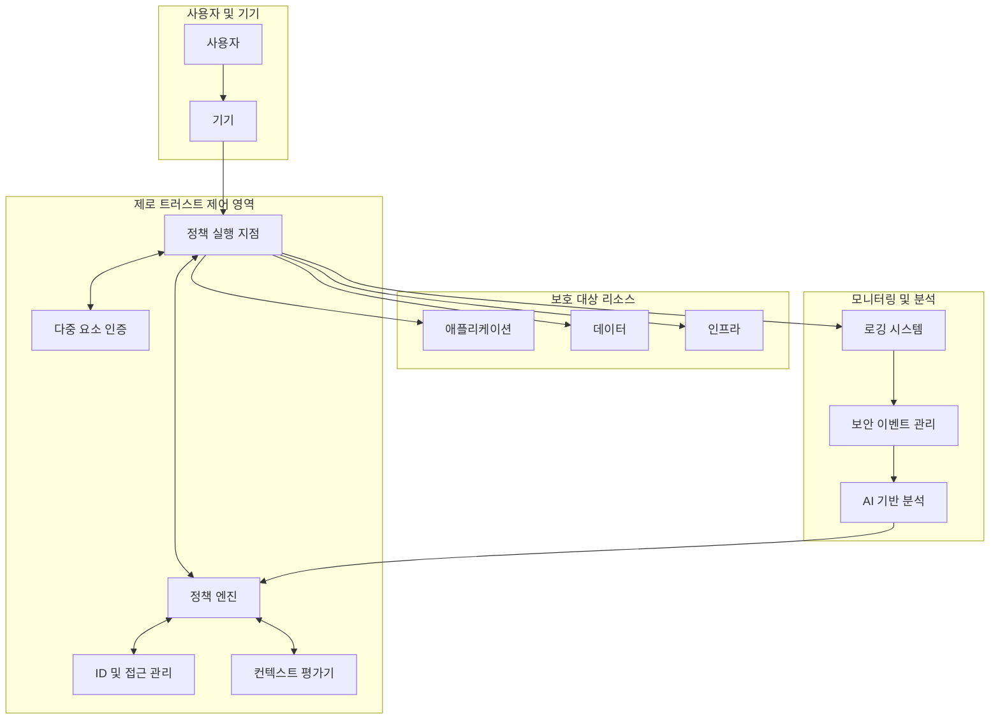

# Zero Trust Security (제로 트러스트 보안): 경계 없는 보안 패러다임

<!-- mtoc-start -->

- [정의 및 개념](#정의-및-개념)
- [주요 특징](#주요-특징)
- [아키텍처 구성요소](#아키텍처-구성요소)
- [구현 전략](#구현-전략)
  - [1. 단계적 접근법](#1-단계적-접근법)
  - [2. 핵심 기술 요소](#2-핵심-기술-요소)
- [활용 사례](#활용-사례)
- [기대 효과 및 필요성](#기대-효과-및-필요성)
- [도입 시 고려사항](#도입-시-고려사항)
  - [기술적 측면](#기술적-측면)
  - [조직적 측면](#조직적-측면)
- [마무리](#마무리)
- [Keywords](#keywords)

<!-- mtoc-end -->

제로 트러스트 보안(Zero Trust Security)은 전통적인 경계 기반 보안 모델의 한계를 극복하기 위해 등장한 현대적 보안 접근 방식입니다. '네트워크 내부는 안전하다'라는 기존 가정을 폐기하고, 내·외부 구분 없이 모든 접근 요청을 잠재적 위협으로 간주하여 지속적인 검증을 요구합니다. 클라우드 컴퓨팅과 원격 근무 환경의 확산으로 네트워크 경계가 흐려지면서 그 중요성이 더욱 부각되고 있습니다.

## 정의 및 개념

- 기본 원칙: 네트워크, 애플리케이션, 데이터에 대한 모든 접근 요청을 기본적으로 신뢰하지 않고 지속적으로 검증하는 보안 모델.
- 핵심 사상: "절대 신뢰하지 말고, 항상 검증하라(Never Trust, Always Verify)"를 기반으로 내·외부 구분 없이 모든 접속을 잠재적 위협으로 간주.

- 특징:
  - 최소 권한 원칙(Least Privilege) 적용
  - 다중 요소 인증(MFA) 필수
  - 마이크로 세분화(Micro-segmentation) 활용
  - 지속적 모니터링 및 분석

## 주요 특징

1. **지속적 검증(Continuous Verification)**: 사용자와 기기의 신원, 상태, 행동을 세션 내내 지속적으로 모니터링하고 재평가하여 권한을 동적으로 관리합니다.

2. **세분화된 접근 제어(Granular Access Control)**: 업무 역할, 필요성, 상황에 기반한 최소 권한을 부여하고, 접근 결정 시 다양한 컨텍스트 정보(시간, 위치, 기기 상태 등)를 고려합니다.

3. **암호화 강화(Encryption Everywhere)**: 모든 데이터를 저장 및 전송 중 암호화하여 유출 위험을 최소화하고, 암호화 키 관리를 통해 데이터 보호 계층을 추가합니다.

4. **완전한 가시성(Complete Visibility)**: 모든 네트워크 트래픽, 접근 요청, 사용자 활동에 대한 로깅과 분석을 통해 보안 이상 징후를 신속히 탐지하고 대응합니다.

## 아키텍처 구성요소

제로 트러스트 아키텍처는 정책 엔진을 중심으로 모든, 접근 요청을 실시간으로 검증하고 승인하는 체계를 구현합니다. 사용자 신원, 기기 상태, 접근 컨텍스트, 요청 리소스의 민감도 등 다양한 요소를 종합적으로 평가하여 최소 권한 원칙에 따른 접근 제어를 실현합니다.

## 구현 전략

### 1. 단계적 접근법

- **현황 평가**: 기존 자산, 사용자, 워크플로우, 보안 요구사항 파악
- **우선순위 결정**: 중요 자산과 시스템부터 단계적 적용
- **기술 선택**: 기존 인프라와 통합 가능한 솔루션 선정
- **시범 적용**: 제한된 범위에서 검증 후 확대

### 2. 핵심 기술 요소

- **ID 관리 솔루션**: 강력한 인증 및 권한 관리 체계
- **네트워크 세분화**: 마이크로 세그먼트 구성으로 횡적 이동 제한
- **엔드포인트 보안**: 기기 상태 및 규정 준수 여부 지속 모니터링
- **암호화 솔루션**: 전송 및 저장 데이터 보호
- **분석 플랫폼**: 행동 기반 이상 탐지 및 대응 자동화

## 활용 사례

1. **원격 근무 환경**: 위치에 관계없이 동일한 보안 수준을 유지하면서 회사 리소스에 안전하게 접근할 수 있는 체계를 구축합니다.

2. **클라우드 마이그레이션**: 멀티클라우드 환경에서 일관된 보안 정책을 적용하고, 서비스 간 통신 보안을 강화합니다.

3. **IoT 보안 강화**: 대규모 IoT 장치의 접근 관리 및 모니터링을 통해 취약점 노출을 최소화합니다.

4. **규제 준수**: 금융, 의료 등 엄격한 규제가 적용되는 산업에서 데이터 접근에 대한 세밀한 통제로 컴플라이언스 요구사항을 충족합니다.

## 기대 효과 및 필요성

- **보안 태세 강화**: 사이버 위협 표면 축소 및 내부자 위협 대응 능력 향상
- **가시성 증대**: 네트워크 활동 전반에 대한 상세한 로깅과 모니터링 제공
- **침해 영향 최소화**: 측면 이동(lateral movement) 제한으로 공격 범위 축소
- **유연한 업무 환경 지원**: 원격 근무, BYOD 등 현대적 업무 방식에 대한 보안 지원
- **규제 준수 용이성**: 세분화된 접근 제어로 데이터 보호 관련 규제 요구사항 충족
- **운영 효율성**: 중앙화된 정책 관리와 자동화를 통한 보안 운영 간소화

## 도입 시 고려사항

### 기술적 측면

- 기존 인프라와의 통합 복잡성
- 성능 및 사용자 경험에 미치는 영향
- 레거시 시스템 호환성 문제

### 조직적 측면

- 사용자 교육 및 변화 관리 필요성
- 초기 구현 비용 및 ROI 평가
- 보안 팀 역량 강화 요구

## 마무리

제로 트러스트 보안은 단순한 기술 도입을 넘어 조직의 보안 문화와 접근 방식의 근본적인 변화를 요구합니다. 클라우드 환경, 원격 근무, IoT의 확산으로 인해 전통적인 경계 기반 보안 모델의 효과가 감소하는 현 시점에서, 제로 트러스트는 현대 조직이 진화하는 위협 환경에 대응하기 위한 필수적인 보안 패러다임으로 자리잡고 있습니다. 단계적이고 체계적인 접근을 통해 제로 트러스트 모델을 도입함으로써, 조직은 디지털 트랜스포메이션을 안전하게 추진하며 비즈니스 민첩성과 보안 간의 균형을 달성할 수 있을 것입니다.

## Keywords

Zero Trust Security, 제로 트러스트 보안, Never Trust Always Verify, 지속적 검증, Micro-segmentation, 마이크로 세분화, Least Privilege, 최소 권한 원칙, Context-based Authentication, 컨텍스트 기반 인증, Identity-centric Security, 정책 기반 접근 제어, 암호화
