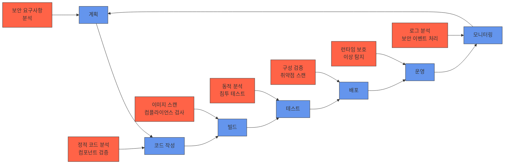

# DevSecOps: 개발과 운영에 보안을 통합한 혁신적 접근법

<!-- mtoc-start -->

- [정의 및 개념](#정의-및-개념)
- [주요 특징](#주요-특징)
- [DevSecOps 프로세스](#devsecops-프로세스)
- [핵심 구성요소](#핵심-구성요소)
  - [1. 문화적 요소](#1-문화적-요소)
  - [2. 기술적 요소](#2-기술적-요소)
- [활용 사례](#활용-사례)
- [기대 효과 및 필요성](#기대-효과-및-필요성)
- [도입 시 고려사항](#도입-시-고려사항)
- [마무리](#마무리)
- [Keywords](#keywords)

<!-- mtoc-end -->

DevSecOps(Development, Security, Operations)는 소프트웨어 개발 생애주기 전반에 보안을 통합하는 혁신적인 접근 방식입니다. 전통적인 DevOps에 보안(Security)을 핵심 요소로 추가함으로써, 개발 초기 단계부터 보안을 고려하는 '시프트 레프트(Shift-Left)' 전략을 구현합니다. 이는 개발 속도와 혁신을 유지하면서도 보안 취약점을 조기에 발견하고 조치하여 전체적인 시스템 안정성을 향상시키는 방법론입니다.

## 정의 및 개념

- DevSecOps: 개발(Development), 보안(Security), 운영(Operations)을 통합하여 소프트웨어 개발 생애주기 전체에 보안을 내재화한 방법론.
- 목적: 개발 초기 단계부터 보안을 통합함으로써 취약점을 조기에 발견하고 비용 효율적으로 해결하는 것.
- 특징: 자동화된 보안 테스트, 지속적인 모니터링, 팀 간 협업 강화, 보안 책임의 분산.

## 주요 특징

- **시프트 레프트 접근법**: 보안 테스트와 검증을 개발 생애주기의 초기 단계로 이동시켜 문제를 조기에 발견하고 해결
- **자동화**: CI/CD 파이프라인에 보안 검사를 자동화하여 지속적인 보안 검증 실현
- **협업 문화**: 개발, 보안, 운영 팀 간의 긴밀한 협업을 통해 책임 공유 및 전문성 활용
- **지속적인 모니터링**: 배포 후에도 보안 취약점과 위협을 지속적으로 모니터링하여 신속한 대응 가능

## DevSecOps 프로세스

DevSecOps 프로세스는 계획부터 모니터링까지 순환하는 개발 생애주기의 각 단계에 보안 활동을 통합합니다. 각 단계에서 특화된 보안 검사를 수행하여 취약점을 조기에 발견하고 지속적인 보안 개선을 실현합니다.

## 핵심 구성요소

### 1. 문화적 요소

- **책임 공유**: 보안은 특정 팀만의 책임이 아닌 모든 구성원의 공동 책임
- **투명성**: 보안 이슈와 취약점에 대한 열린 커뮤니케이션
- **지속적 학습**: 최신 보안 위협과 방어 기법에 대한 지속적인 교육

### 2. 기술적 요소

- **보안 자동화 도구**: SAST(정적 애플리케이션 보안 테스트), DAST(동적 애플리케이션 보안 테스트)
- **취약점 관리 시스템**: 발견된 취약점을 추적하고 관리하는 도구
- **컨테이너 보안**: 컨테이너 이미지 스캔, 런타임 보호
- **인프라 보안**: IaC(Infrastructure as Code) 보안 검증, 구성 관리

## 활용 사례

- **금융 서비스**: 고객 데이터와 금융 거래의 보안을 강화하면서도 디지털 혁신을 가속화
- **의료 산업**: 환자 정보 보호와 의료 장비 보안을 강화하면서 의료 서비스 개선
- **클라우드 네이티브 애플리케이션**: 마이크로서비스 아키텍처를 활용한 애플리케이션에서 각 서비스의 보안 강화
- **공공 서비스**: 시민 데이터 보호와 서비스 연속성 보장을 위한 보안 강화

## 기대 효과 및 필요성

- **보안 취약점 감소**: 개발 초기 단계에서 보안 문제를 발견하여 최종 제품의 취약점 감소
- **규제 준수 향상**: 산업별 규제 및 컴플라이언스 요구사항 충족 용이
- **비용 절감**: 후기 단계 보안 문제 수정 비용 감소 (초기 발견 시 수정 비용은 후기 발견 대비 최대 100배 절감)
- **출시 시간 단축**: 보안 검토로 인한 출시 지연 감소
- **고객 신뢰 향상**: 보안이 강화된 제품과 서비스로 고객 신뢰 구축

## 도입 시 고려사항

- **점진적 접근**: 모든 프로세스를 한번에 변경하기보다는 단계적으로 도입
- **역량 강화**: 개발자와 운영자에게 보안 교육 제공
- **도구 선택**: 개발 환경과 호환되는 적절한 보안 도구 선택
- **측정 지표 정의**: DevSecOps 성공을 평가할 수 있는 지표 설정
- **경영진 지원**: 조직 문화 변화에 필요한 리더십 지원 확보

## 마무리

DevSecOps는 현대 소프트웨어 개발에서 보안을 효과적으로 통합하는 필수적인 접근 방식입니다. 개발 초기 단계부터 보안을 고려함으로써 취약점을 조기에 발견하고, 비용을 절감하며, 출시 시간을 단축할 수 있습니다. 디지털 혁신과 사이버 위협이 증가하는 환경에서 DevSecOps 도입은 조직의 경쟁력과 회복탄력성을 강화하는 핵심 전략이 될 것입니다.

## Keywords

DevSecOps, 시프트 레프트(Shift-Left), 보안 자동화, 지속적 통합, 취약점 관리, 보안 내재화, 컨테이너 보안, 인프라 보안, 규제 준수, 사이버 회복탄력성
