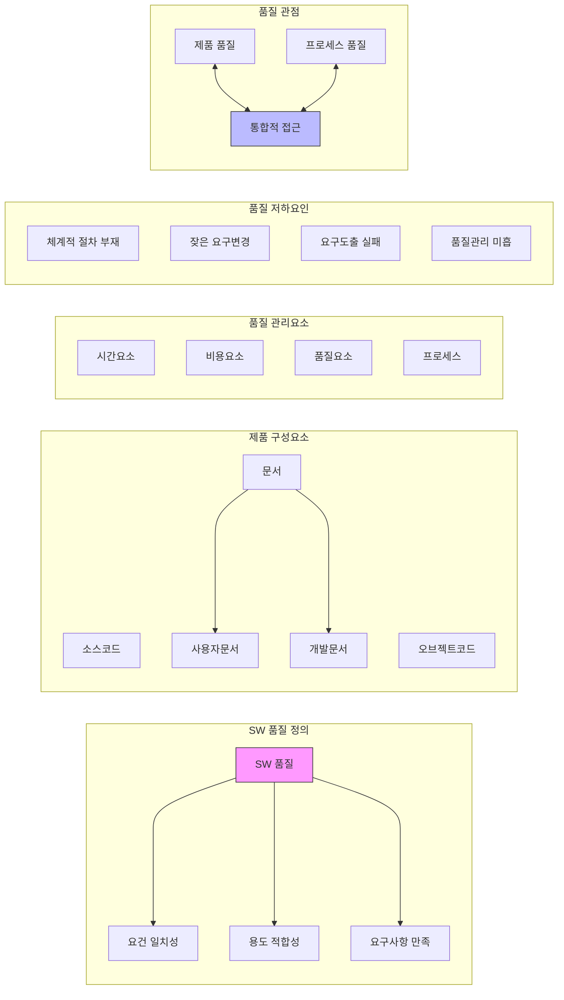

# SW 품질: 소프트웨어 품질 관리의 중요성과 핵심 요소

<!-- mtoc-start -->

- [1. SW 품질의 정의](#1-sw-품질의-정의)
- [2. SW 품질 관리의 어려움](#2-sw-품질-관리의-어려움)
- [3. SW 제품의 구성 요소](#3-sw-제품의-구성-요소)
- [4. SW 품질 저하의 주요 원인](#4-sw-품질-저하의-주요-원인)
- [5. SW 품질 관리에 영향을 미치는 요소](#5-sw-품질-관리에-영향을-미치는-요소)
- [6. SW 품질 관점](#6-sw-품질-관점)
  - [통합적 접근이 중요](#통합적-접근이-중요)
- [7. SW 개발 프로세스와 품질 핵심](#7-sw-개발-프로세스와-품질-핵심)
- [8. 문서: 중요한 품질 요소](#8-문서-중요한-품질-요소)
- [9. SW 품질 영향 요소](#9-sw-품질-영향-요소)
- [SW 품질 체계도](#sw-품질-체계도)
  - [1. SW 품질의 본질](#1-sw-품질의-본질)
  - [2. 품질 확보의 두 가지 핵심 관점](#2-품질-확보의-두-가지-핵심-관점)
  - [3. 품질 저하의 주요 원인](#3-품질-저하의-주요-원인)
  - [4. 품질 향상을 위한 중요 요소](#4-품질-향상을-위한-중요-요소)
- [마무리](#마무리)
- [Keywords](#keywords)

<!-- mtoc-end -->

소프트웨어 품질(SW 품질)은 제품 또는 서비스가 명시적 및 묵시적 요구사항을 충족하는 정도를 의미한다. 이는 단순히 오류가 없는 프로그램을 의미하는 것이 아니라, 제품이 기대하는 성능을 충족하고, 사용자의 요구에 적합하며, 유지보수와 확장이 용이한 상태를 포함한다.

## 1. SW 품질의 정의

소프트웨어 품질은 제품이 요구사항을 충족하고 사용자의 기대를 만족시키는 정도, 이는 소프트웨어의 성능, 안정성, 유지보수성, 보안성 등의 다양한 요소로 구성된다.

- **제품 및 서비스 품질**: 사용자의 기대를 충족하는 수준
- **요건 일치성**: 개발 시 명확한 요구사항 반영
- **용도 적합성**: 특정 환경에서 기능이 정상적으로 작동
- **명시적/묵시적 요구사항 충족**: 문서화된 요구뿐만 아니라, 사용자 기대도 포함
- **특징 및 특성**: 성능, 보안, 사용성 등 다양한 품질 속성 포함

## 2. SW 품질 관리의 어려움

소프트웨어 품질 관리는 쉽지 않으며, 다음과 같은 어려움이 존재한다.

- **정의의 모호성**: 품질에 대한 기준이 다양하고 주관적일 수 있음
- **품질 테스팅의 어려움**: 소프트웨어의 복잡성과 테스트 환경 구축의 한계
- **품질 관리의 어려움**: 개발 과정에서 품질을 지속적으로 유지하는 것이 어려움

## 3. SW 제품의 구성 요소

소프트웨어 제품은 코드뿐만 아니라 다양한 문서와 함께 구성된다.

- **소스코드(Source Code)**: 프로그래밍 언어로 작성된 코드
- **오브젝트 코드(Object Code)**: 실행 가능한 바이너리 코드
- **문서(Documents)**:
  - **사용자 문서**: 사용자 매뉴얼, 가이드 등
  - **개발 문서**: 요구사항, 설계 문서, 테스트 계획서 등

## 4. SW 품질 저하의 주요 원인

소프트웨어 품질 저하는 체계적인 개발 절차의 부재에서 비롯된다.

- 적절한 방법과 도구가 적용되지 않은 개발 절차
- 명확하지 않은 요구사항 정의 및 변경 관리 실패
- 비효율적인 테스팅과 결함 관리

## 5. SW 품질 관리에 영향을 미치는 요소

소프트웨어 품질 관리는 다양한 요소에 의해 영향을 받는다.

- **시간적 요소**: 일정 내 제품 출시와 품질 확보의 균형
- **비용 요소**: 품질을 확보하기 위한 추가 비용 발생
- **제품 품질 요소**: 성능, 안정성, 보안성 등

## 6. SW 품질 관점

소프트웨어 품질은 두 가지 주요 관점에서 고려할 수 있다.

- **SW 제품 품질 관점**: 제품 자체의 성능, 보안, 안정성, 사용성
- **제품 개발 프로세스 관점**: 개발 과정에서의 효율성과 품질 보증 활동

### 통합적 접근이 중요

이 두 가지 관점을 통합하여 관리할 때, 보다 높은 품질의 소프트웨어를 개발할 수 있다.

## 7. SW 개발 프로세스와 품질 핵심

비효율적인 개발 프로세스는 품질 저하로 이어진다.

- **비체계적 개발(주먹구구식 개발)** → **잦은 변경 발생** → **정확한 요구사항 도출 실패** → **효율적 품질 관리 실패**
- 따라서, 표준화된 개발 프로세스를 도입하여 요구사항을 정확히 정의하고, 변경 관리를 철저히 해야 한다.

## 8. 문서: 중요한 품질 요소

문서는 소프트웨어 품질 유지에 핵심적인 역할을 한다.

- 요구사항 문서, 설계 문서, 테스트 문서는 개발 프로세스 전반에서 품질 보장을 위한 필수 요소
- 문서화가 부족할 경우, 개발 이후 유지보수 및 확장 시 품질 저하 가능

## 9. SW 품질 영향 요소

소프트웨어 품질은 여러 요소에 의해 결정된다.

- **개발 프로세스**: 체계적인 개발 방법론 적용
- **개발 계획**: 명확한 목표 설정 및 일정 관리
- **개발 요구사항**: 사용자 및 비즈니스 요구사항의 정확한 반영
- **테스팅**: 기능, 성능, 보안 테스트 수행
- **각종 문서**: 설계 문서, 테스트 문서, 유지보수 문서 등

## SW 품질 체계도

### 1. SW 품질의 본질

- 제품/서비스가 명시적/묵시적 요구사항을 얼마나 잘 충족하는지를 나타내는 척도
- 소스코드, 오브젝트 코드, 각종 문서를 포함하는 총체적 개념

### 2. 품질 확보의 두 가지 핵심 관점

- 제품 자체의 품질
- 개발 프로세스의 품질
  → 이 두 관점의 통합적 접근이 필요

### 3. 품질 저하의 주요 원인

- 체계적인 개발 절차의 부재
- 잦은 요구사항 변경
- 부정확한 요구사항 도출
- 비효율적인 품질 관리

### 4. 품질 향상을 위한 중요 요소

- 철저한 개발 계획
- 정확한 요구사항 관리
- 체계적인 테스팅
- 철저한 문서화

결론적으로, SW 품질은 단순히 제품의 완성도뿐만 아니라 개발 과정 전반의 체계적인 관리와 문서화가 핵심.

## 마무리

소프트웨어 품질 관리는 제품의 성능과 사용자 만족도를 결정하는 중요한 요소이다. 체계적인 개발 프로세스와 철저한 품질 관리를 통해 소프트웨어의 품질을 높이는 것이 필수적이다. 특히, 품질을 고려한 개발 프로세스와 문서화가 이루어진다면, 보다 신뢰할 수 있는 소프트웨어 제품을 제공할 수 있다.

## Keywords

소프트웨어 품질, 품질 관리, 소프트웨어 개발, SW 테스트, 요구사항 분석, 개발 프로세스, 품질 보증, 문서화, 제품 품질, 소프트웨어 유지보수
