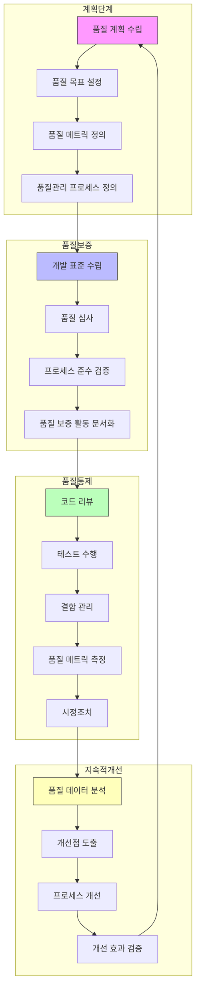

# SW 품질관리: 체계적인 평가와 관리

<!-- mtoc-start -->

- [정의 및 개념](#정의-및-개념)
- [주요 특징](#주요-특징)
- [SW 품질관리 프로세스](#sw-품질관리-프로세스)
  - [1. 계획단계](#1-계획단계)
  - [2. 품질보증 (Quality Assurance)](#2-품질보증-quality-assurance)
  - [3. 품질통제 (Quality Control)](#3-품질통제-quality-control)
  - [4. 지속적 개선](#4-지속적-개선)
- [품질계획](#품질계획)
- [품질평가](#품질평가)
- [품질관리](#품질관리)
- [품질측정](#품질측정)
  - [1. 계획 및 관리 측정](#1-계획-및-관리-측정)
  - [2. 구축활동 측정](#2-구축활동-측정)
  - [3. 분석적 측정](#3-분석적-측정)
  - [4. 심리기반 측정](#4-심리기반-측정)
- [기대 효과 및 필요성](#기대-효과-및-필요성)
- [마무리](#마무리)
- [Keywords](#keywords)

<!-- mtoc-end -->

소프트웨어 품질관리는 소프트웨어의 신뢰성과 효율성을 보장하기 위한 필수적인 과정이다. 이는 품질계획, 품질평가, 품질관리의 단계로 구성되며, 지속적인 품질 개선을 위한 체계적인 접근법을 포함한다.

## 정의 및 개념

- 품질계획: 제품, 절차, 필수 확인내용에 대한 요구사항을 평가하고 품질특성을 정량화하는 과정
- 품질평가: 기술적 및 관리적 검토를 수행하여 품질을 확인하는 과정
- 품질관리: 품질 평가 결과를 바탕으로 지속적인 피드백을 수행하는 과정

## 주요 특징

- **품질계획**: 요구사항 평가, 품질특성 선택 및 정량화, IEEE9001 적용
- **품질평가**: SW 요구사항 및 디자인 검토, 테스트 계획 검토, 시스템 감사
- **품질관리**: 형상관리, 변경 요구관리, SW 공학 적용
- **품질측정**: 계획 및 관리, 구축활동, 분석적 측정, 심리기반 측정

## SW 품질관리 프로세스

품질관리 프로세스는 계획, 평가, 관리 단계를 거치며 지속적인 피드백을 통해 품질을 향상.

### 1. 계획단계

- 조직의 품질 목표와 기준을 명확히 설정하고, 이를 달성하기 위한 구체적인 메트릭과 프로세스를 정의합니다.
- 프로젝트의 특성과 리스크를 고려한 맞춤형 품질관리 계획을 수립합니다.

### 2. 품질보증 (Quality Assurance)

- 개발 표준과 가이드라인을 수립하여 일관된 품질 수준을 유지합니다.
- 프로세스 준수 여부를 정기적으로 검증하고 문서화합니다.
- 예방적 관점에서 품질 문제를 사전에 방지하는 데 중점을 둡니다.

### 3. 품질통제 (Quality Control)

- 코드 리뷰, 테스팅 등을 통해 실제 산출물의 품질을 검증합니다.
- 발견된 결함을 체계적으로 관리하고 해결합니다.
- 품질 메트릭을 지속적으로 측정하고 모니터링합니다.

### 4. 지속적 개선

- 수집된 품질 데이터를 분석하여 개선 기회를 발견합니다.
- 프로세스의 효율성과 효과성을 주기적으로 평가하고 개선합니다.
- 개선 활동의 효과를 검증하고 필요한 경우 추가 개선을 수행합니다.

이러한 프로세스는 순환적으로 이루어지며, 각 단계가 유기적으로 연결되어 전체적인 소프트웨어 품질 향상에 기여. \
특히 품질 메트릭의 정의와 측정, 데이터 기반의 의사결정이 프로세스 전반에 걸쳐 중요한 역할.

## 품질계획

- 요구사항 평가: 제품, 절차, 필수 확인 내용 검토
- 품질특성 선정 및 정량화: 적절한 분류 및 가중치 설정
- IEEE9001 적용: 목적, 참고목록, 관리, SW 문서, 표준 및 지침

## 품질평가

- SW 요구사항 검토 및 디자인 검토
- 테스트 계획 및 시스템 기능 감사
- 물리적 제약사항 검토 및 사용자 매뉴얼 확인

## 품질관리

1. **SW 형상관리**: 버전 및 환경 관리
2. **변경 요구관리**: 문제 발생 시 변경 요청 및 처리
3. **SW 공학 적용**: 에러 예방을 위한 SW 개발 원칙 적용

## 품질측정

### 1. 계획 및 관리 측정

- 품질 평가 시스템의 구축, 유지, 실행
- 시간 단위별 품질 평가 측정

### 2. 구축활동 측정

- 품질에 영향을 주는 모든 요소 분석
- 에러 예방 및 정정 활동 포함

### 3. 분석적 측정

- 정량적 분석 후 비용, 복잡성, 효율성 등 요소 적용
- KLOC, COCOMO, CK 메트릭 활용

### 4. 심리기반 측정

- 프로젝트 팀원의 역할 및 관심에 따른 품질 측정
- SW 품질평가 분야에서 아직 미흡한 영역

## 기대 효과 및 필요성

소프트웨어의 중요성이 증가함에 따라, 고장 발생 시 심각한 위험을 초래할 수 있다. 따라서 정확한 품질평가와 지속적인 품질개선이 필수적이다.

소프트웨어 품질은 8가지 품질 특성(기능성, 신뢰성, 사용성, 효율성, 유지보수성, 이식성, 호환성, 보안성)과 고객 요구 반영 수준에 따라 결정된다.

ISO25000(SQuaRE)은 ISO9126과 ISO14598을 통합하여 품질평가 체계를 정립하고 있다.

## 마무리

SW 품질관리는 신뢰성과 효율성을 보장하기 위한 필수적인 과정이다. 지속적인 품질 평가와 개선을 통해 소프트웨어의 가치를 극대화할 수 있으며, 이를 위해 체계적인 품질 계획, 평가, 관리 프로세스를 준수하는 것이 중요하다.

## Keywords

Software Quality Management, 품질계획, 품질평가, 품질관리, SW 형상관리, SW 공학, 품질측정, ISO25000, SQuaRE, IEEE9001
