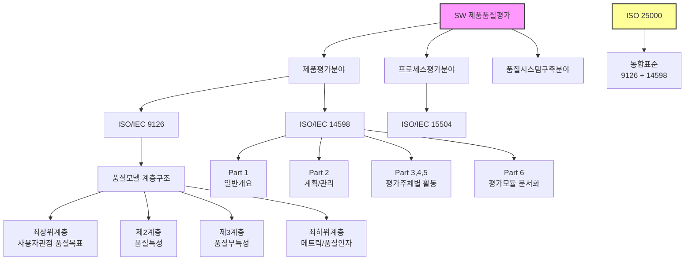

# SW 제품품질평가: 효과적인 소프트웨어 품질 보증

<!-- mtoc-start -->

- [정의 및 개념](#정의-및-개념)
- [주요 평가 모델](#주요-평가-모델)
- [품질모델 계층구조](#품질모델-계층구조)
- [ISO/IEC 14598 평가 프로세스](#isoiec-14598-평가-프로세스)
- [SW 제품품질평가 구조도](#sw-제품품질평가-구조도)
  - [1. SW 제품품질평가의 3대 분야](#1-sw-제품품질평가의-3대-분야)
  - [2. ISO/IEC 9126의 품질모델 특징](#2-isoiec-9126의-품질모델-특징)
  - [3. ISO/IEC 14598의 구성](#3-isoiec-14598의-구성)
  - [4. 표준의 통합 발전](#4-표준의-통합-발전)
- [활용 사례](#활용-사례)
- [기대 효과 및 필요성](#기대-효과-및-필요성)
- [마무리](#마무리)
- [Keywords](#keywords)

<!-- mtoc-end -->

소프트웨어 제품품질평가는 소프트웨어의 품질을 정량적으로 측정하고 평가하는 체계를 의미한다. 제품 자체의 품질뿐만 아니라, 개발 프로세스와 품질경영 체계를 포함하여 소프트웨어의 전반적인 품질을 향상시키는 것이 목표이다.

## 정의 및 개념

- **제품평가분야**: 소프트웨어 제품의 품질을 정량적으로 기술하고, 객관적이고 공정한 평가 절차를 정립하는 영역 (ISO/IEC 9126, ISO/IEC 14598)
- **프로세스평가분야**: 소프트웨어 개발 조직의 능력을 평가하고, 개발 공정을 개선하는 데 필요한 표준을 제시하는 영역 (ISO/IEC 15504)
- **품질시스템구축분야**: 소프트웨어 조직이 품질경영 체제를 도입하고 품질인증을 획득하는 데 관련된 사항을 중점적으로 다루는 영역

## 주요 평가 모델

- **ISO/IEC 9126**: 품질특성, 내부메트릭, 외부메트릭, 품질측정절차를 분리하여 정의
- **ISO/IEC 14598**: 소프트웨어 제품의 품질을 평가하는 방법과 절차를 여섯 부분으로 나눠 정의
- **ISO/IEC 15504**: 소프트웨어 프로세스 개선 및 평가를 위한 표준 (SPICE)
- **ISO 25000 (SQuaRE)**: ISO/IEC 9126과 ISO/IEC 14598을 통합하여 제품 품질 표준과 평가 표준을 조화
- **4+1 구조**: 품질모델, 품질메트릭, 품질요구사항, 품질평가, 품질관리의 다섯 가지 요소로 구성

## 품질모델 계층구조

ISO/IEC 9126 품질모델은 소프트웨어 품질을 평가하기 위한 요소와 특성을 정의하여, 품질을 객관적으로 정량화하는 데 도움을 준다.

1. **최상위 계층**: 사용자 관점에서 소프트웨어 품질 목표 정의
2. **제2 계층**: 품질 목표를 달성할 수 있는 광범위한 품질특성 (Quality Characteristics)
3. **제3 계층**: 상위 특성을 구성하는 구체적인 품질 부특성 (Sub-Characteristics)
4. **최하위 계층**: 소프트웨어 특성을 측정하기 위한 메트릭 (Metric) 및 품질 인자

## ISO/IEC 14598 평가 프로세스

ISO/IEC 14598은 소프트웨어 제품의 품질 평가를 위한 방법과 절차를 정의하는 표준으로, 다음과 같은 단계로 구성된다.

1. **Part 1**: 일반적인 개요 (General Overview)
2. **Part 2**: 제품 품질 측정 계획 수립 및 관리 (Planning & Management)
3. **Part 3, 4, 5**: 품질 평가 주체별 평가 활동 (개발자, 구매자, 평가자)
4. **Part 6**: 평가 자료와 명령의 구조적 집합 및 평가 모듈 문서화 (Evaluation Module Documentation)

## SW 제품품질평가 구조도

### 1. SW 제품품질평가의 3대 분야

- 제품평가: ISO/IEC 9126(품질특성 정의)과 14598(평가방법/절차)
- 프로세스평가: ISO/IEC 15504(개발조직 능력평가)
- 품질시스템구축: 품질경영체제 도입 및 인증

### 2. ISO/IEC 9126의 품질모델 특징

- 4계층 구조로 품질 체계화
- 사용자 관점에서 최상위 품질목표 설정
- 단계적으로 구체화(품질특성 → 부특성 → 메트릭)

### 3. ISO/IEC 14598의 구성

- 6개 파트로 구성된 평가 프레임워크
- 평가주체별(개발자, 구매자, 평가자) 세부지침 제공
- 평가계획부터 문서화까지 전체 프로세스 정의

### 4. 표준의 통합 발전

- ISO 25000: 9126과 14598 통합
- 4+1 구조 도입(품질모델, 메트릭, 요구사항, 평가, 관리)

이러한 표준들은 소프트웨어 품질을 체계적으로 평가하고 관리하기 위한 프레임워크를 제공하며, 지속적으로 발전하고 통합.

## 활용 사례

- **소프트웨어 개발 조직**: 개발 프로세스 개선을 통한 품질 향상
- **기업 및 기관**: SW 품질평가를 통한 제품 신뢰성 확보 및 경쟁력 강화
- **정부 및 규제기관**: SW 품질 표준 준수를 위한 평가 기준 마련

## 기대 효과 및 필요성

- 소프트웨어 품질 향상을 통한 유지보수 비용 절감
- 품질 표준 준수를 통한 신뢰성 확보 및 시장 경쟁력 강화
- 개발 프로세스의 표준화 및 효율적인 품질 관리 체계 구축
- 제품의 신뢰성과 사용자 만족도 향상

## 마무리

SW 제품품질평가는 소프트웨어의 신뢰성과 성능을 확보하기 위한 필수 과정이다. 국제 표준을 기반으로 한 평가 체계를 적용하면 개발 조직은 품질을 향상시키고, 기업은 경쟁력을 높이며, 최종 사용자에게는 더욱 신뢰성 높은 소프트웨어를 제공할 수 있다.

## Keywords

Software Quality Evaluation, ISO/IEC 9126, ISO/IEC 14598, ISO 25000, 품질평가, 소프트웨어 프로세스 평가, 품질경영, 품질모델, 소프트웨어 품질측정, 소프트웨어 품질관리
