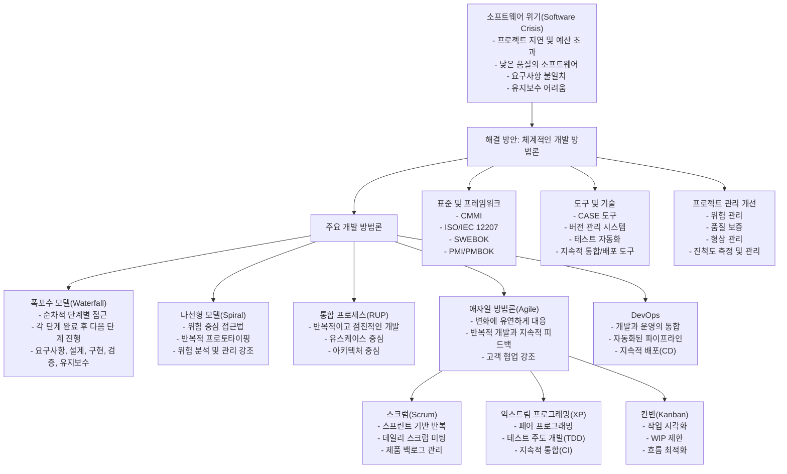

# SW 개발 방법론: Software crisis의 해결책

<!-- mtoc-start -->

- [정의 및 개념](#정의-및-개념)
- [구성도](#구성도)
- [소프트웨어 위기와 개발 방법론의 진화](#소프트웨어-위기와-개발-방법론의-진화)
- [소프트웨어 위기(Software Crisis)와 개발 방법론의 핵심](#소프트웨어-위기software-crisis와-개발-방법론의-핵심)
- [주요 특징](#주요-특징)
- [활용 사례](#활용-사례)
- [기대 효과 및 필요성](#기대-효과-및-필요성)
- [마무리](#마무리)
- [Keywords](#keywords)

<!-- mtoc-end -->

소프트웨어 개발 방법론은 Software crisis를 해결하기 위한 접근 방식으로, SW Engineering 원리를 SW 생명주기에 적용하여 작업 활동, 프로세스, 산출물 등을 체계적으로 정리하는 개념이다. 이를 통해 소프트웨어 개발의 복잡성을 관리하고, 개발 생산성과 품질을 향상시키는 것을 목표로 한다.

## 정의 및 개념

- SW 개발 방법론: 소프트웨어 개발 과정에서 체계적인 절차, 도구, 기법을 적용하여 품질과 생산성을 향상하는 방법론
- 특징:
  - 개발 생산성 향상 (작업의 표준화, 모듈화, 재사용)
  - 수행 공정 가시화 (효과적인 프로젝트 관리)

## 구성도

작업절차를 기반으로 작업방법이 정의되며, 이를 통해 산출물이 생성된다. 기법과 도구를 활용하여 개발 품질과 효율성을 향상시킨다.

## 소프트웨어 위기와 개발 방법론의 진화

## 소프트웨어 위기(Software Crisis)와 개발 방법론의 핵심

소프트웨어 위기는 1960-70년대에 대두된 문제로, 소프트웨어 개발이 복잡해지면서 발생한 다양한 문제들을 지칭:

1. **소프트웨어 위기의 주요 증상**:

   - 프로젝트 일정 지연 및 예산 초과
   - 낮은 품질의 소프트웨어 제품
   - 사용자 요구사항과의 불일치
   - 유지보수의 어려움

2. **주요 해결 방안으로서의 개발 방법론**:

   - **폭포수 모델(Waterfall)**: 요구사항 분석부터 유지보수까지 순차적으로 진행하는 전통적 접근법
   - **나선형 모델(Spiral)**: 위험 관리를 중심으로 반복적인 개발 접근법
   - **통합 프로세스(RUP)**: 유스케이스와 아키텍처 중심의 반복적, 점진적 개발 방법론
   - **애자일 방법론(Agile)**: 변화에 유연하게 대응하며 작은 단위로 빠르게 개발하는 방법론

3. **애자일의 주요 실천 방법**:

   - **스크럼(Scrum)**: 스프린트 단위 개발, 데일리 스크럼 미팅
   - **XP(익스트림 프로그래밍)**: 페어 프로그래밍, TDD, 지속적 통합
   - **칸반(Kanban)**: 작업 시각화, 작업 진행 중(WIP) 제한

4. **최신 트렌드**:
   - **DevOps**: 개발과 운영을 통합하여 배포 자동화와 지속적 개선 추구

이러한 방법론들은 소프트웨어 개발의 예측 가능성을 높이고, 품질을 향상시키며, 위험을 관리하고, 변화에 효과적으로 대응할 수 있게 함으로써 소프트웨어 위기를 해결하는 데 기여.

## 주요 특징

- **체계적인 개발 프로세스**: 소프트웨어 개발을 구조화하여 계획, 설계, 구현, 테스트, 유지보수 단계를 명확하게 구분
- **표준화된 개발 방법론 적용**: 일관된 개발 원칙과 절차를 적용하여 개발 품질 향상
- **재사용성과 모듈화 지원**: 코드 및 설계 요소의 재사용을 촉진하여 생산성 향상
- **효과적인 프로젝트 관리**: 일정, 자원, 비용을 체계적으로 관리하여 프로젝트 성공률 증가
- **도구 및 기법의 활용**: 다양한 소프트웨어 개발 도구와 기법을 적용하여 효율적인 개발 지원

## 활용 사례

- **전통적 방법론**: 워터폴 모델(Waterfall Model), V-모델 등
- **애자일 방법론**: 스크럼(Scrum), XP(eXtreme Programming)
- **하이브리드 접근**: 폭포수 모델과 애자일 기법을 결합한 DevOps 방식

## 기대 효과 및 필요성

- 개발 생산성 및 품질 향상
- 프로젝트 일정 및 비용 절감
- 유지보수 및 확장성 강화
- 협업 및 커뮤니케이션 효율성 증대
- 소프트웨어 위기(Software Crisis) 해결 및 안정적인 시스템 구축

## 마무리

SW 개발 방법론은 체계적인 절차와 도구를 적용하여 개발 생산성과 품질을 향상시키는 핵심 개념이다. 프로젝트의 성공률을 높이고 유지보수를 용이하게 하기 위해 적절한 방법론을 선택하고 적용하는 것이 중요하다.

## Keywords

Software Development Methodology, SW Engineering, Software Process, Agile, Waterfall Model, Scrum, DevOps, Software Quality, Software Productivity, Software Management
