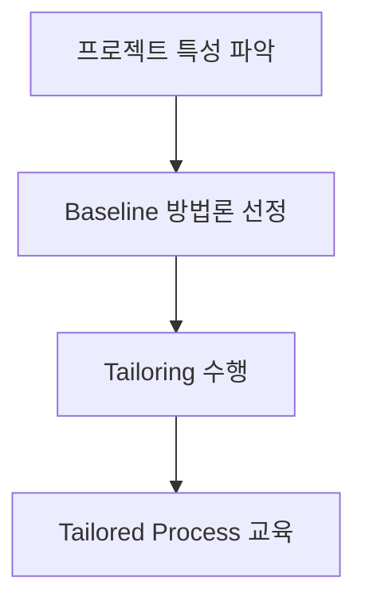
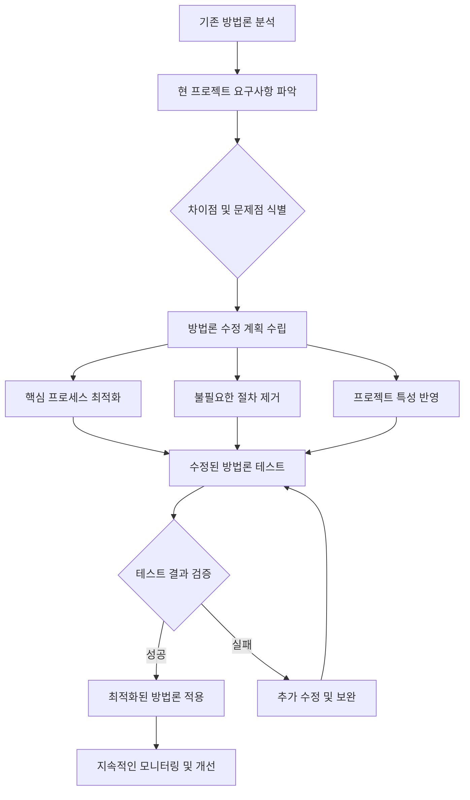

# Tailoring: 기존 방법론의 현 프로젝트 최적화 수정

<!-- mtoc-start -->

- [정의 및 개념](#정의-및-개념)
- [Tailoring 절차](#tailoring-절차)
- [기존 방법론의 프로젝트 최적화 수정 프로세스](#기존-방법론의-프로젝트-최적화-수정-프로세스)
  - [기존 방법론의 프로젝트 최적화 수정 핵심 내용](#기존-방법론의-프로젝트-최적화-수정-핵심-내용)
- [주요 특징](#주요-특징)
- [활용 사례](#활용-사례)
- [기대 효과 및 필요성](#기대-효과-및-필요성)
- [마무리](#마무리)
- [Keywords](#keywords)

<!-- mtoc-end -->

Tailoring은 현 프로젝트 상황에 맞도록 기존에 정의된 개발 방법론의 절차, 기법, 산출물 등을 수정하여 적용하는 방법이다. 이를 통해 프로젝트의 특성과 요구사항을 반영하여 최적화된 개발 프로세스를 수립할 수 있다.

## 정의 및 개념

- **Tailoring**: 기 정의된 개발 방법론을 프로젝트 특성에 맞게 수정 및 적용하는 과정
- **목적**: 프로젝트 성공률 향상, 효율적인 개발 프로세스 적용

## Tailoring 절차

프로젝트 특성을 분석한 후, 적절한 Baseline 방법론을 선정하고, 필요한 조정을 수행한 뒤 최적화된 프로세스를 교육하여 적용한다.

## 기존 방법론의 프로젝트 최적화 수정 프로세스

### 기존 방법론의 프로젝트 최적화 수정 핵심 내용

1. **분석 단계**: 기존 방법론을 철저히 분석하고 현 프로젝트의 구체적인 요구사항 파악.
2. **차이점 식별**: 기존 방법론과 프로젝트 요구사항 간의 차이점과 문제점을 명확히 식별.
3. **수정 계획**: 식별된 차이점을 바탕으로 방법론 수정 계획을 수립.
4. **최적화 3가지 방향**:
   - 핵심 프로세스 최적화
   - 불필요한 절차 제거
   - 프로젝트 특성 반영
5. **검증 과정**: 수정된 방법론을 테스트하고 결과를 검증하여 성공 시 적용하고, 실패 시 추가 수정.
6. **지속적 개선**: 적용 후에도 지속적인 모니터링과 개선을 통해 방법론을 계속 발전.

## 주요 특징

- **유연한 프로세스 적용**: 프로젝트 특성에 맞게 방법론을 수정하여 적용 가능
- **효율적인 리소스 활용**: 불필요한 절차를 제거하고 최적화된 프로세스 활용
- **일관된 품질 유지**: 조직의 품질 표준을 유지하면서도 프로젝트 맞춤형 적용
- **지속적인 개선 가능**: 프로젝트 진행 중 지속적으로 프로세스를 조정하여 최적화

## 활용 사례

- 애자일 방법론에서 특정 프로젝트 요구에 맞게 스크럼(Scrum) 또는 칸반(Kanban) 방식을 조정
- CMMI 기반 개발에서 조직 표준 프로세스를 프로젝트에 맞게 수정하여 적용
- 대규모 소프트웨어 프로젝트에서 일정과 리소스 제한을 고려하여 방법론을 최적화

## 기대 효과 및 필요성

- 프로젝트 요구사항과 환경에 최적화된 프로세스 제공
- 개발 생산성과 효율성 향상
- 조직의 표준 프로세스 유지 및 개선
- 프로젝트 성공률 증가 및 리스크 최소화

## 마무리

Tailoring은 기존 개발 방법론을 현 프로젝트에 맞게 최적화하여 적용하는 중요한 기법이다. 효과적인 Tailoring을 통해 프로젝트의 성공 가능성을 높이고, 개발 프로세스를 보다 효율적으로 운영할 수 있다.

## Keywords

Tailoring, Software Process Customization, Agile Tailoring, Baseline Methodology, Tailored Process, Software Engineering, Project Optimization, Process Improvement, Software Development, Process Tailoring
