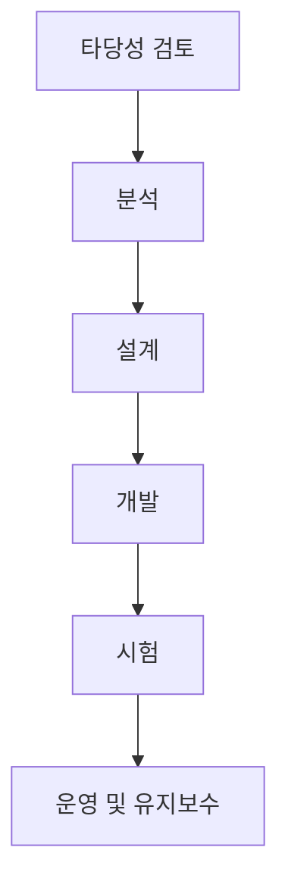
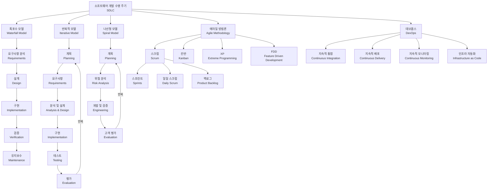

# SDLC: 소프트웨어 공학 패러다임

<!-- mtoc-start -->

- [정의 및 개념](#정의-및-개념)
- [등장 배경](#등장-배경)
- [SDLC 구성 요소](#sdlc-구성-요소)
- [주요 방법론 (폭프나점레, WPSIR)](#주요-방법론-폭프나점레-wpsir)
- [SW 공학 패러다임(SDLC)](#sw-공학-패러다임sdlc)
  - [1. **폭포수 모델 (Waterfall Model)**](#1-폭포수-모델-waterfall-model)
  - [2. **반복적 모델 (Iterative Model)**](#2-반복적-모델-iterative-model)
  - [3. **나선형 모델 (Spiral Model)**](#3-나선형-모델-spiral-model)
  - [4. **애자일 방법론 (Agile Methodology)**](#4-애자일-방법론-agile-methodology)
  - [5. **데브옵스 (DevOps)**](#5-데브옵스-devops)
- [참고: SW 생명주기 표준 프로세스](#참고-sw-생명주기-표준-프로세스)
- [기대 효과 및 필요성](#기대-효과-및-필요성)
- [마무리](#마무리)
- [Keywords](#keywords)

<!-- mtoc-end -->

소프트웨어 개발 생명주기(SDLC, Software Development Life Cycle)는 소프트웨어 개발 타당성으로부터 개발에서 폐기까지의 전 과정을 하나의 생명주기로 정의한 모델이다. 이는 소프트웨어 개발의 체계성과 품질을 높이고 생산성을 향상시키기 위해 도입되었다.

## 정의 및 개념

- **SDLC**: 소프트웨어 개발의 타당성 검토부터 폐기까지의 전 과정을 체계적으로 정의한 생명주기 모델
- **목적**: 소프트웨어 개발의 효율성 증대, 품질 확보, 개발 프로세스 가시성 향상

## 등장 배경

- **패러독스 문제 해결**: 프로젝트 진행 중 요구사항의 변동과 품질 보장 문제
- **소프트웨어 대규모화**: 복잡한 시스템 개발을 위한 체계적 접근 필요
- **고품질과 생산성 요구**: 개발 속도와 품질을 동시에 확보
- **비가시성 보완**: 개발 진행 상태와 위험 요소를 명확히 파악

## SDLC 구성 요소

위 구성 요소들은 SDLC의 핵심 단계로, 타당성 검토에서 시작하여 운영 및 유지보수에 이르기까지 각 단계를 거치면서 소프트웨어가 개발되고 관리된다.

## 주요 방법론 (폭프나점레, WPSIR)

- **Waterfall Model (폭포수 모델)**: 선형적인 개발 접근 방식으로 단계별 진행
- **Prototyping Model (프로토타이핑 모델)**: 빠른 프로토타입 개발 후 개선 반복
- **Spiral Model (나선형 모델)**: 위험 분석과 반복적 개발 적용
- **Iterative Model (반복적 모델)**: 반복적인 개선과 개발 주기 활용
- **RAD Model (레피드 애플리케이션 개발)**: 신속한 개발을 위한 프로세스

## SW 공학 패러다임(SDLC)

### 1. **폭포수 모델 (Waterfall Model)**

- 순차적 접근 방식으로 각 단계가 이전 단계 완료 후 시작
- 요구사항 분석 → 설계 → 구현 → 검증 → 유지보수 순서로 진행
- 초기 요구사항이 명확할 때 효과적이지만 변경에 대응하기 어려움

### 2. **반복적 모델 (Iterative Model)**

- 전체 시스템을 여러 반복 주기로 개발
- 각 반복마다 기능 추가 및 개선을 통해 점진적으로 시스템 완성
- 피드백을 반영해 유연하게 대응 가능

### 3. **나선형 모델 (Spiral Model)**

- 반복적 접근과 위험 관리를 결합한 모델
- 계획 → 위험 분석 → 개발 및 검증 → 고객 평가의 사이클 반복
- 대규모 프로젝트와 높은 위험 요소가 있는 프로젝트에 적합

### 4. **애자일 방법론 (Agile Methodology)**

- 빠른 개발과 지속적인 개선에 중점을 둔 방법론
- 주요 프레임워크: 스크럼, 칸반, XP(익스트림 프로그래밍), FDD
- 고객 참여와 변화 대응을 통한 가치 전달 중시

### 5. **데브옵스 (DevOps)**

- 개발(Dev)과 운영(Ops)의 통합을 통한 개발 생명주기 자동화
- 지속적 통합, 지속적 배포, 지속적 모니터링
- 빠른 피드백 루프와 자동화를 통한 빠른 개발 및 배포 실현

각 패러다임은 프로젝트의 특성, 규모, 복잡성에 따라 선택되며, 현대 소프트웨어 개발은 여러 패러다임의 장점을 결합하여 하이브리드 접근 방식을 취하는 경우가 많습니다.

## 참고: SW 생명주기 표준 프로세스

- **ISO/IEC 12207**: 소프트웨어 생명주기 프로세스를 표준화한 국제 규격

## 기대 효과 및 필요성

- 개발 프로세스의 체계적 관리
- 소프트웨어 품질 향상 및 리스크 최소화
- 프로젝트 일정 및 비용 절감
- 유지보수 효율성 향상

## 마무리

SDLC는 소프트웨어 개발을 구조적으로 접근하여 품질을 보장하고 생산성을 향상시키는 중요한 개념이다. 프로젝트 성격에 맞는 SDLC 모델을 선택하여 최적의 개발 방식을 적용하는 것이 중요하다.

## Keywords

SDLC, Software Development Life Cycle, Waterfall Model, Spiral Model, Agile, ISO 12207, Software Engineering, Software Process, Software Maintenance, System Development
