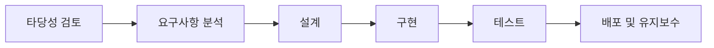
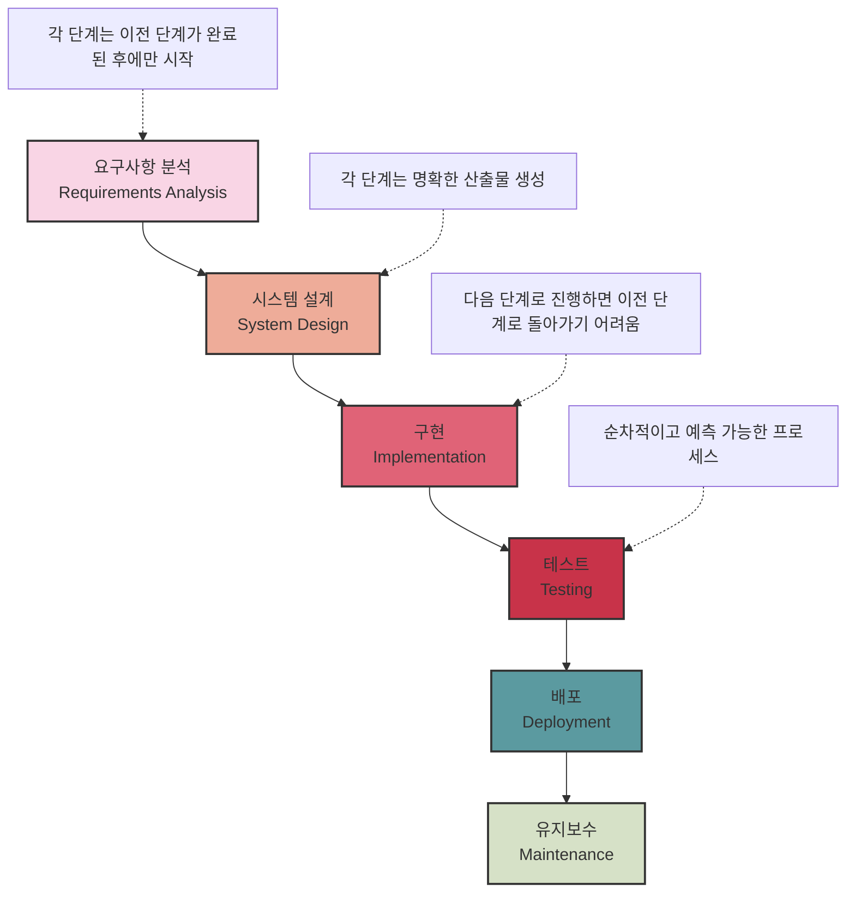

# 폭포수 모델: 체계적인 소프트웨어 개발 접근 방식

<!-- mtoc-start -->

- [정의 및 개념](#정의-및-개념)
- [폭포수 모델의 주요 단계](#폭포수-모델의-주요-단계)
- [폭포수 모델 주요 핵심 단계](#폭포수-모델-주요-핵심-단계)
  - [1. **순차적 진행**: 각 단계는 이전 단계가 완전히 완료된 후에만 시작됩니다.](#1-순차적-진행-각-단계는-이전-단계가-완전히-완료된-후에만-시작됩니다)
  - [2. **명확한 단계별 산출물**: 각 단계는 다음 단계의 입력으로 사용되는 구체적인 문서나 결과물을 생성합니다.](#2-명확한-단계별-산출물-각-단계는-다음-단계의-입력으로-사용되는-구체적인-문서나-결과물을-생성합니다)
  - [3. **단방향 프로세스**: 이론적으로는 한 번 다음 단계로 넘어가면 이전 단계로 돌아가지 않습니다.](#3-단방향-프로세스-이론적으로는-한-번-다음-단계로-넘어가면-이전-단계로-돌아가지-않습니다)
  - [4. **장점**:](#4-장점)
  - [5. **단점**:](#5-단점)
- [주요 특징](#주요-특징)
- [장점](#장점)
- [단점](#단점)
- [활용 사례](#활용-사례)
- [기대 효과 및 필요성](#기대-효과-및-필요성)
- [마무리](#마무리)
- [Keywords](#keywords)

<!-- mtoc-end -->

폭포수 모델(Waterfall Model)은 소프트웨어 개발 생명주기(SDLC) 중 가장 전통적인 모델로, 각 단계가 선형적으로 진행되는 구조를 가진다. 프로젝트의 각 단계가 완료된 후 다음 단계로 넘어가며, 되돌아가는 과정이 최소화된 방식이다.

## 정의 및 개념

- **폭포수 모델**: 소프트웨어 개발 과정을 타당성 검토에서 유지보수까지 일련의 순차적 단계로 정의한 모델
- **목적**: 개발 프로세스의 체계적인 관리, 명확한 문서화, 프로젝트 일정 및 품질 관리

## 폭포수 모델의 주요 단계

각 단계는 앞 단계의 결과물을 기반으로 진행되며, 특정 단계가 완료되기 전에는 다음 단계로 넘어가지 않는다.

## 폭포수 모델 주요 핵심 단계

폭포수 모델은 소프트웨어 개발의 전통적인 접근 방식으로, 다음과 같은 핵심 특징이 있습니다:

### 1. **순차적 진행**: 각 단계는 이전 단계가 완전히 완료된 후에만 시작됩니다.

- 요구사항 분석 → 시스템 설계 → 구현 → 테스트 → 배포 → 유지보수

### 2. **명확한 단계별 산출물**: 각 단계는 다음 단계의 입력으로 사용되는 구체적인 문서나 결과물을 생성합니다.

- 요구사항 명세서, 설계 문서, 소스 코드, 테스트 결과 등

### 3. **단방향 프로세스**: 이론적으로는 한 번 다음 단계로 넘어가면 이전 단계로 돌아가지 않습니다.

### 4. **장점**:

- 이해하기 쉽고 관리가 용이함
- 명확한 이정표와 산출물
- 안정적인 요구사항에 적합

### 5. **단점**:

- 요구사항 변경에 대응하기 어려움
- 사용자 피드백이 늦게 반영됨
- 위험 관리가 어려움
- 실제 결과물은 프로젝트 후반에 확인 가능

폭포수 모델은 요구사항이 잘 정의되어 있고, 변경 가능성이 낮은 프로젝트에 적합합니다.

## 주요 특징

- **선형적 진행**: 단계별로 순차적으로 진행되며, 되돌아가는 과정이 제한적
- **명확한 문서화**: 모든 개발 단계에서 철저한 문서화 수행
- **고정된 요구사항**: 프로젝트 초기 요구사항이 확정되며 변경이 어려움
- **적용 가능성**: 명확한 목표와 일정이 필요한 대규모 프로젝트에 적합

## 장점

- 체계적인 접근 방식으로 프로젝트 관리 용이
- 각 단계에서 명확한 산출물이 존재하여 진행 상황 추적 가능
- 문서화가 철저하여 유지보수와 인수인계가 용이

## 단점

- 초기 요구사항 변경이 어려워 유연성이 부족
- 후반 단계에서 오류 발견 시 수정 비용이 증가
- 고객 요구사항 변경에 대한 반영이 어려움

## 활용 사례

- 정부 및 방산 프로젝트와 같이 명확한 요구사항이 필요한 프로젝트
- 금융 및 의료 시스템 개발과 같이 높은 신뢰성이 요구되는 시스템
- 하드웨어 및 임베디드 시스템 개발과 같이 계획이 명확한 프로젝트

## 기대 효과 및 필요성

- 프로젝트 진행의 명확한 구조 확립
- 일정과 예산 관리 용이성 증가
- 품질 보장 및 오류 최소화

## 마무리

폭포수 모델은 명확한 목표와 구조를 가진 프로젝트에서 유용하게 활용될 수 있다. 그러나 요구사항이 자주 변하는 환경에서는 애자일과 같은 유연한 방법론이 더 적합할 수 있다.

## Keywords

Waterfall Model, Software Development Life Cycle, SDLC, Structured Development, Software Engineering, Systematic Process, Sequential Development, Software Process Management, Traditional Software Model
