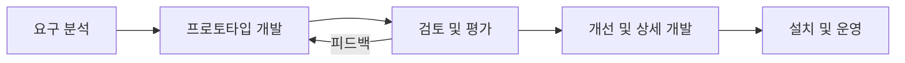
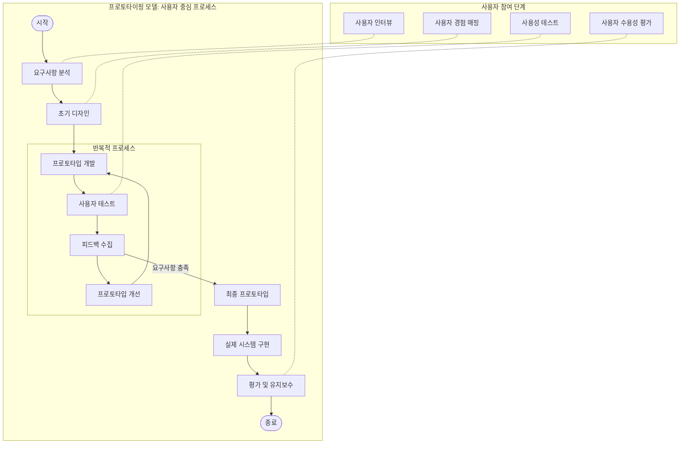

# 프로토타이핑 모델: 사용자 중심의 프로세스 모델

<!-- mtoc-start -->

- [정의 및 개념](#정의-및-개념)
- [개발 프로세스](#개발-프로세스)
- [사용자 중심의 프로토타이핑 프로세스 모델](#사용자-중심의-프로토타이핑-프로세스-모델)
- [주요 특징](#주요-특징)
- [프로토타이핑 모델의 주요 절차](#프로토타이핑-모델의-주요-절차)
- [프로토타이핑 모델의 유형](#프로토타이핑-모델의-유형)
- [활용 사례](#활용-사례)
- [기대 효과 및 필요성](#기대-효과-및-필요성)
- [마무리](#마무리)
- [Keywords](#keywords)

<!-- mtoc-end -->

프로토타이핑 모델(Prototyping Model)은 기본 요구사항을 기반으로 신속하게 모형 시스템을 개발한 후, 사용자 피드백을 반영하여 보완해가는 소프트웨어 개발 방식이다. 이는 사용자의 요구를 보다 명확히 정의하고, 개발 과정에서 발생할 수 있는 문제를 사전에 해결할 수 있도록 돕는다.

## 정의 및 개념

- **프로토타이핑 모델**: 초기 단계에서 소프트웨어의 모형을 신속하게 개발하고, 사용자의 피드백을 통해 점진적으로 개선해 나가는 개발 모델
- **목적**: 사용자 요구사항을 보다 정확히 파악하고, 개발 과정에서 변경사항을 유연하게 반영하여 최적의 결과물을 도출하는 것

## 개발 프로세스

위 구성도는 프로토타이핑 모델이 반복적인 피드백 과정을 통해 점진적으로 소프트웨어를 개선해 나가는 방식을 보여준다.

## 사용자 중심의 프로토타이핑 프로세스 모델

프로토타이핑 모델은 사용자의 요구와 피드백을 중심으로 반복적인 개발을 진행하는 방법론:

1. **요구사항 분석**: 사용자 인터뷰를 통해 필요와 기대를 파악합니다.
2. **초기 디자인**: 사용자 경험 매핑을 기반으로 기본 디자인을 설계합니다.
3. **반복적 프로세스**:
   - 프로토타입 개발: 실제로 작동하는 모형을 만듭니다.
   - 사용자 테스트: 실제 사용자가 프로토타입을 사용해봅니다.
   - 피드백 수집: 사용성, 기능성에 대한 의견을 모읍니다.
   - 프로토타입 개선: 피드백을 바탕으로 수정합니다.
4. **최종 구현 및 평가**: 요구사항이 충족되면 실제 시스템을 구현하고 지속적으로 평가합니다.

이 모델의 장점은 개발 초기 단계부터 사용자를 참여시켜 최종 제품의 사용자 만족도를 높이고, 개발 후반부에 발생할 수 있는 큰 변경사항을 줄일 수 있다는 점입니다.

## 주요 특징

- **사용자 중심 개발**: 사용자 요구사항을 명확히 반영할 수 있음
- **빠른 피드백 반영**: 초기 단계에서 요구사항 변경 및 개선 가능
- **유연한 개발 방식**: 기존 개발 방식보다 요구사항 변경 대응이 용이
- **리스크 감소**: 초기에 잘못된 요구사항을 방지할 수 있음

## 프로토타이핑 모델의 주요 절차

1. **요구 분석**: 기본 요구사항을 수집하고 개략적인 설계를 수행
2. **프로토타입 개발**: 신속한 프로토타입 제작
3. **검토 및 평가**: 사용자 피드백을 수집하여 개선점 도출
4. **개선 및 상세 개발**: 피드백을 반영하여 세부 설계 및 구현 진행
5. **설치 및 운영**: 최종 제품을 배포하고 운영 시작

## 프로토타이핑 모델의 유형

1. **실험적 모형**
   - 개발의 타당성을 검증하는 것이 목적
   - 요구 분석이 어려운 경우 직접 개발하여 요구사항을 명확히 함
2. **진화적 모형**
   - 프로토타입을 지속적으로 발전시켜 최종 소프트웨어 완성
   - 나선형 모델과 유사한 점진적 개선 방식

## 활용 사례

- UI/UX 디자인 개선을 위한 인터페이스 개발
- 신규 기술 적용 시 타당성 검토
- 고객 맞춤형 소프트웨어 개발

## 기대 효과 및 필요성

- 사용자 만족도 향상
- 요구사항 변경에 대한 유연한 대응
- 초기 단계에서 개발 리스크 감소

## 마무리

프로토타이핑 모델은 사용자와 개발자가 긴밀하게 협력하여 요구사항을 조기에 명확히 하고, 지속적인 개선을 통해 최적의 소프트웨어를 완성할 수 있는 유용한 개발 방법론이다.

## Keywords

Prototyping Model, SDLC, Software Development, User-Centered Design, Experimental Model, Evolutionary Model, Feedback-Driven Development, Rapid Prototyping, Software Engineering
