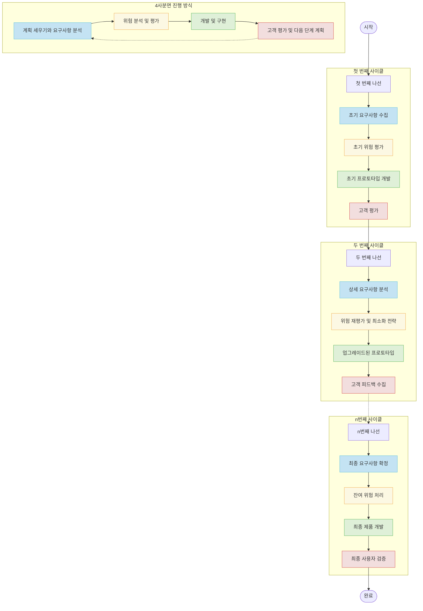

# 나선형 모델: 위험 최소화의 진화적 프로토타이핑

<!-- mtoc-start -->

- [정의 및 개념](#정의-및-개념)
- [나선형 모델의 주요 단계 (계위개고)](#나선형-모델의-주요-단계-계위개고)
- [나선형 개발 모델](#나선형-개발-모델)
  - [핵심 특징:](#핵심-특징)
  - [4단계 사이클 (각 나선):](#4단계-사이클-각-나선)
- [주요 특징](#주요-특징)
- [나선형 모델의 주요 절차](#나선형-모델의-주요-절차)
- [나선형 모델의 유형](#나선형-모델의-유형)
- [활용 사례](#활용-사례)
- [기대 효과 및 필요성](#기대-효과-및-필요성)
- [마무리](#마무리)
- [Keywords](#keywords)

<!-- mtoc-end -->

나선형 모델(Spiral Model)은 소프트웨어 개발 시 발생하는 위험을 관리하기 위해 나선을 돌면서 점진적으로 완벽한 소프트웨어를 개발하는 모델이다. 이 모델은 계획, 위험 분석, 개발 및 평가의 반복적인 과정을 통해 프로젝트의 위험을 최소화하면서 소프트웨어를 발전시킨다.

## 정의 및 개념

- **나선형 모델**: 개발 과정에서 발생할 수 있는 위험을 사전에 식별하고 관리하면서 반복적으로 개선하는 소프트웨어 개발 모델
- **목적**: 프로젝트의 위험 요소를 줄이고, 점진적인 개발을 통해 최적의 소프트웨어를 구축하는 것

## 나선형 모델의 주요 단계 (계위개고)

위 구성도는 나선형 모델이 반복적인 피드백과 개선 과정을 통해 점진적으로 소프트웨어를 완성하는 방식을 보여준다.

## 나선형 개발 모델

### 핵심 특징:

1. **위험 중심 접근법**: 모든 개발 단계에서 위험 식별 및 관리가 핵심입니다.
2. **점진적 진화**: 간단한 프로토타입에서 시작해 완전한 시스템으로 진화합니다.
3. **고객 참여**: 각 사이클이 끝날 때마다 고객 평가를 통해 방향을 조정합니다.
4. **유연성**: 프로젝트 진행 중에도 요구사항 변경이 가능합니다.

### 4단계 사이클 (각 나선):

1. **계획 및 요구사항 분석**: 목표 설정, 제약 조건 파악, 대안 식별
2. **위험 분석 및 평가**: 위험 요소 파악, 해결 전략 개발, 시뮬레이션/벤치마킹
3. **개발 및 구현**: 설계, 코딩, 테스트
4. **고객 평가**: 결과물 검토, 피드백 수집, 다음 단계 계획

나선형 모델은 대규모 시스템이나 고위험 프로젝트에 특히 적합하며, 초기에 불확실성이 높은 프로젝트에서 점진적으로 위험을 줄여나가는 방법론입니다.

## 주요 특징

- **위험 관리 중심**: 프로젝트 진행 중 발생할 수 있는 위험을 사전에 식별하고 대응
- **요구사항 식별 용이**: 반복적인 개발 과정을 통해 요구사항을 구체화
- **대규모 프로젝트 적합**: 복잡한 프로젝트에서 효과적으로 활용 가능
- **프로젝트 관리 어려움**: 반복적인 분석과 개발로 인해 일정 및 비용 관리가 까다로움

## 나선형 모델의 주요 절차

1. **계획 및 정의**: 목표 설정 및 프로젝트 제약 조건 정의
2. **위험 분석**: 우선순위 기능을 선택하고 위험 요소를 평가
3. **개발 및 구축**: 선택된 기능을 중심으로 개발 수행
4. **고객 평가 및 리뷰**: 개발된 기능을 검토하고 피드백 반영
5. **반복 수행**: 위 과정을 반복하며 소프트웨어를 점진적으로 개선

## 나선형 모델의 유형

1. **실험적 프로토타입**
   - 개발의 타당성을 검증하는 것이 목적
   - 요구 분석의 어려움을 해결하기 위해 직접 개발 후 피드백 반영
2. **진화적 프로토타입**
   - 프로토타입을 지속적으로 발전시켜 최종 소프트웨어 완성
   - 지속적인 개선을 통한 소프트웨어 최적화 (나선형 모델과 유사)

## 활용 사례

- 대규모 엔터프라이즈 소프트웨어 개발
- 보안이 중요한 시스템(금융, 국방 등)
- 지속적인 유지보수와 개선이 필요한 프로젝트

## 기대 효과 및 필요성

- 개발 과정에서 발생하는 위험 최소화
- 프로젝트 초기 요구사항이 불명확한 경우 효과적인 적용 가능
- 소프트웨어 품질 향상 및 유지보수 용이

## 마무리

나선형 모델은 대규모 프로젝트에서 위험을 효과적으로 관리하고, 점진적인 개선을 통해 고품질의 소프트웨어를 개발하는 데 유용하다. 특히, 요구사항이 변동될 가능성이 높은 프로젝트에서 적절히 활용할 수 있다.

## Keywords

Spiral Model, SDLC, Software Development, Risk Management, Evolutionary Prototyping, Software Engineering, Iterative Development, Large-Scale Projects, Systematic Process
