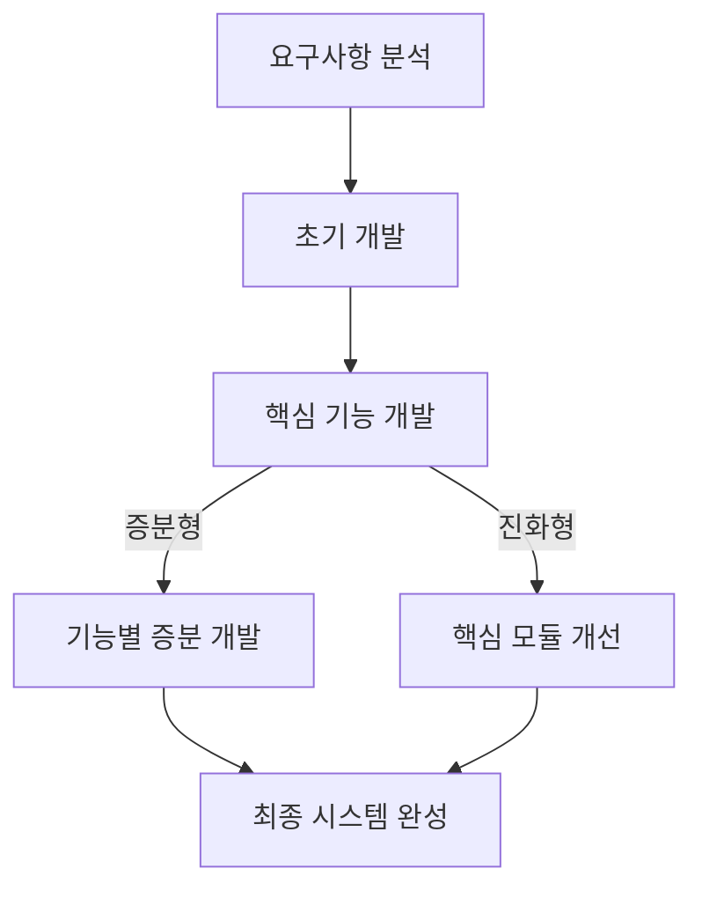
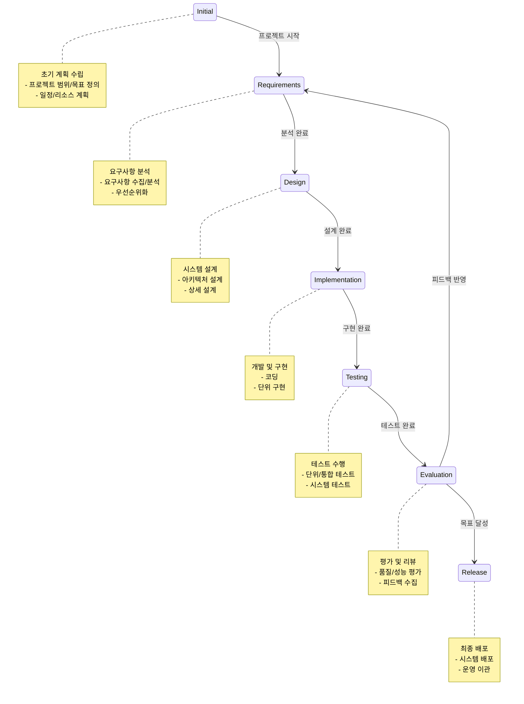

# SDLC > Iterative: 높은 품질의 SW를 위한 반복적 개발

<!-- mtoc-start -->

- [정의 및 개념](#정의-및-개념)
- [주요 특징](#주요-특징)
- [반복적 개발의 유형](#반복적-개발의-유형)
  - [증분형(Incremental Model)](#증분형incremental-model)
  - [진화형(Evolutionary Model)](#진화형evolutionary-model)
- [프로세스](#프로세스)
- [Iterative SDLC Process](#iterative-sdlc-process)
  - [1. 점진적 개발과 개선](#1-점진적-개발과-개선)
  - [2. 품질 중심 접근](#2-품질-중심-접근)
  - [3. 유연한 변경 관리](#3-유연한-변경-관리)
  - [4. 프로젝트 관리 효율화](#4-프로젝트-관리-효율화)
  - [5. 이해관계자 참여 강화](#5-이해관계자-참여-강화)
- [활용 사례](#활용-사례)
- [기대 효과 및 필요성](#기대-효과-및-필요성)
- [마무리](#마무리)
- [Keywords](#keywords)

<!-- mtoc-end -->

소프트웨어 개발 생명주기(SDLC) 중 반복적(Iterative) 개발 모형은 사용자의 요구사항 일부 혹은 제품의 일부분을 반복적으로 개발하여 최종 시스템을 완성하는 방식이다. 이 접근법은 초기 요구사항이 완벽하게 정의되지 않은 경우에도 효과적으로 개발을 진행할 수 있도록 하며, 지속적인 피드백과 개선을 통해 높은 품질의 소프트웨어를 보장한다.

## 정의 및 개념

- 반복적 개발 모형: 제품을 여러 개의 작은 부분으로 나누어 개발하고, 각 반복(Iteration)마다 기능을 추가 또는 개선하여 최종 제품을 완성하는 방식
- 특징: 재사용성 증가, RAD(Rapid Application Development) 기반

## 주요 특징

- 사용자 피드백을 기반으로 지속적인 개선 가능
- 위험 요소를 조기에 식별하고 해결 가능
- 각 반복마다 테스트와 검증을 통해 품질 향상
- 초기에 모든 요구사항을 정의하지 않아도 개발 가능
- 개발 완료 이전에도 부분적으로 배포 가능

## 반복적 개발의 유형

### 증분형(Incremental Model)

- 기능별로 증분하여 개발
- 폭포수 모형과 반복적 수행을 결합하여 각 단계별로 점진적 완성
- 기존 시스템과 병행 개발 가능
- 새로운 시스템 도입 시 사용자의 부담과 충격을 완화

### 진화형(Evolutionary Model)

- 핵심 기능을 먼저 개발한 후 점진적으로 확장 및 개선
- 주요 요구사항을 중심으로 개발을 진행하며, 이후 추가 요구사항을 반영
- 초기 요구사항이 명확할 때 적합한 방식
- 개발의 진화 과정에서 여러 단계의 릴리즈(Release) 계획이 필요

## 프로세스

초기 개발 후 핵심 기능을 개발하고, 증분형은 기능을 점진적으로 추가하며, 진화형은 핵심 모듈을 지속적으로 개선하여 최종 시스템을 완성한다.

## Iterative SDLC Process

**반복적 개발 모델의 핵심 특징과 장점:**

### 1. 점진적 개발과 개선

- 작은 단위로 기능을 개발하고 지속적으로 개선
- 각 반복마다 실행 가능한 제품 버전 제공
- 빠른 피드백을 통한 위험 감소

### 2. 품질 중심 접근

- 지속적인 테스트와 품질 관리
- 각 단계별 검증과 확인
- 사용자 피드백 기반의 품질 개선

### 3. 유연한 변경 관리

- 요구사항 변경에 효과적 대응
- 우선순위에 따른 기능 구현
- 점진적인 범위 조정 가능

### 4. 프로젝트 관리 효율화

- 명확한 마일스톤 설정
- 진행 상황의 가시성 확보
- 위험의 조기 식별과 대응

### 5. 이해관계자 참여 강화

- 정기적인 피드백 수집
- 사용자 요구사항의 지속적 반영
- 높은 사용자 만족도 달성

## 활용 사례

- 웹 애플리케이션 개발에서 MVP(Minimum Viable Product) 방식 적용
- Agile, Scrum 등의 개발 방법론에서 반복적 개발 방식 활용
- 금융, 의료, 전자상거래 시스템 등 지속적인 개선이 필요한 프로젝트

## 기대 효과 및 필요성

- 프로젝트 진행 중 변경되는 요구사항을 효과적으로 반영 가능
- 단계별 개발을 통해 위험 요소를 조기에 해결
- 사용자의 피드백을 빠르게 반영하여 품질 향상
- 개발 효율성 증대 및 비용 절감 효과

## 마무리

반복적 개발 모형은 유연성과 품질을 동시에 확보할 수 있는 효과적인 접근 방식이다. 특히, 변화하는 요구사항이 빈번한 프로젝트에서 유용하게 활용될 수 있으며, Agile 등의 방법론과 결합하여 더욱 효과적으로 운영할 수 있다. 높은 품질의 소프트웨어를 구축하기 위해 반복적 개발 모형의 도입을 고려해 볼 필요가 있다.

## Keywords

Iterative Model, 증분 개발, 진화 개발, 반복적 개발, Agile, Scrum, SDLC, Rapid Application Development, 소프트웨어 개발, 시스템 개선
