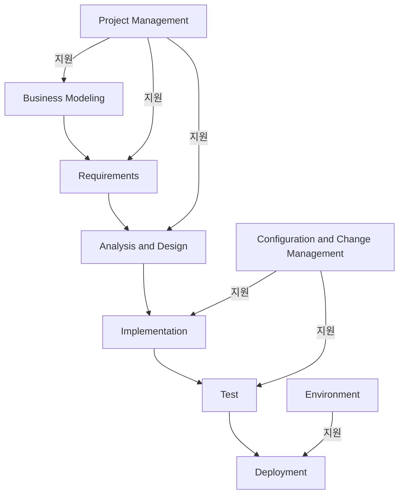
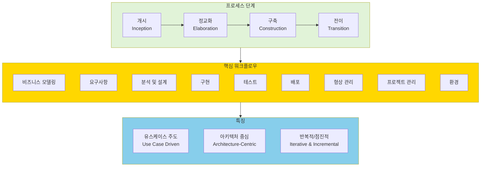

# RUP (Rational Unified Process): 체계적 접근을 통한 고품질 소프트웨어 개발

<!-- mtoc-start -->

- [정의 및 개념](#정의-및-개념)
- [주요 특징](#주요-특징)
- [RUP의 워크플로우](#rup의-워크플로우)
  - [Core Process Workflow](#core-process-workflow)
  - [Core Supporting Workflow](#core-supporting-workflow)
- [RUP 프로세스](#rup-프로세스)
- [RUP Overview](#rup-overview)
  - [1. Best Practice 기반의 개발 방법론](#1-best-practice-기반의-개발-방법론)
  - [2. 프로세스의 두 가지 차원](#2-프로세스의-두-가지-차원)
  - [3. 세 가지 핵심 특징](#3-세-가지-핵심-특징)
  - [RUP는 특히 다음과 같은 상황에서 효과적입니다:](#rup는-특히-다음과-같은-상황에서-효과적입니다)
- [활용 사례](#활용-사례)
- [기대 효과 및 필요성](#기대-효과-및-필요성)
- [마무리](#마무리)
- [Keywords](#keywords)

<!-- mtoc-end -->

Rational Unified Process(RUP)는 소프트웨어 개발 공정으로, 개발 조직 내에서 작업과 책임을 할당하기 위한 규칙을 제공하는 프로세스이다. 체계적인 개발 접근 방식을 통해 고품질의 소프트웨어를 효율적으로 개발할 수 있도록 지원한다.

## 정의 및 개념

- RUP(Rational Unified Process): 소프트웨어 개발 프로세스를 정의하는 프레임워크로, 개발지침, 샘플, 모범 사례를 제공하며 아키텍처 중심의 반복적이고 검증적인 프로세스를 지원
- 특징:
  - 각종 개발지침 및 샘플 제공
  - 아키텍처 중심의 프로세스
  - 반복적, 검증적 프로세스
  - Use Case 중심의 프로세스

## 주요 특징

- 개발 표준과 지침을 제공하여 개발 조직 내 협업을 강화
- 소프트웨어 품질 보장을 위한 검증적 접근 방식 적용
- 반복적 개발을 통해 지속적인 개선 가능
- 시스템 아키텍처를 중심으로 프로젝트를 구조화하여 확장성과 유지보수성을 향상
- Use Case 기반으로 요구사항을 정의하고 설계

## RUP의 워크플로우

### Core Process Workflow

- **Business Modeling**: 비즈니스 프로세스 및 도메인 분석을 통해 시스템의 개요 정의
- **Requirements**: 사용자 요구사항 수집 및 정리
- **Analysis and Design**: 시스템 아키텍처 및 설계 정의
- **Implementation**: 코드 개발 및 통합
- **Test**: 소프트웨어의 기능 및 성능 검증
- **Deployment**: 소프트웨어 배포 및 운영 지원

### Core Supporting Workflow

- **Project Management**: 프로젝트 일정, 자원 관리, 리스크 관리
- **Configuration and Change Management**: 변경 사항 추적 및 버전 관리
- **Environment**: 개발 환경 및 도구 지원

## RUP 프로세스

주요 개발 단계는 Business Modeling부터 Deployment까지 진행되며, \
Project Management, Configuration and Change Management, Environment는 개발 과정 전반을 지원.

## RUP Overview

### 1. Best Practice 기반의 개발 방법론

- 반복적이고 점진적인 개발
- 지속적인 품질 관리와 위험 관리
- 컴포넌트 기반 아키텍처
- 시각적 모델링(UML)
- 요구사항 관리
- 변경 통제

### 2. 프로세스의 두 가지 차원

- 수평축: 시간의 흐름에 따른 4가지 단계
  - 개시(Inception): 프로젝트 범위와 목표 정의
  - 정교화(Elaboration): 아키텍처 기반 수립
  - 구축(Construction): 제품 개발
  - 전이(Transition): 제품 인도
- 수직축: 9가지 핵심 분야의 워크플로우
  - 비즈니스 모델링부터 환경 관리까지의 체계적인 활동

### 3. 세 가지 핵심 특징

- 유스케이스 주도: 사용자 중심의 요구사항 도출
- 아키텍처 중심: 재사용 가능한 컴포넌트 기반 설계
- 반복적/점진적: 위험 감소와 품질 향상을 위한 접근

### RUP는 특히 다음과 같은 상황에서 효과적입니다:

- 대규모 프로젝트나 팀
- 지리적으로 분산된 개발 환경
- 복잡한 시스템 통합이 필요한 경우
- 높은 품질과 신뢰성이 요구되는 프로젝트

이러한 RUP의 체계적인 접근은 프로젝트의 예측 가능성을 높이고, 위험을 조기에 식별하며, 높은 품질의 소프트웨어를 개발하는 데 기여합니다.

## 활용 사례

- 대규모 엔터프라이즈 소프트웨어 개발 프로젝트
- 금융, 의료, 공공 부문의 복잡한 시스템 구축
- 소프트웨어 품질 보장이 중요한 프로젝트에서 활용
- Use Case 중심의 요구사항 정의가 필요한 프로젝트

## 기대 효과 및 필요성

- 개발 프로세스의 체계적 정립을 통해 프로젝트 관리 효율성 향상
- 반복적이고 검증적인 접근 방식을 통해 품질 보장
- Use Case 중심의 설계를 통해 사용자 요구사항을 효과적으로 반영
- 조직 내 지식 공유 및 개발 표준화 촉진

## 마무리

RUP는 소프트웨어 개발의 모든 측면을 포괄하는 체계적인 프로세스로, 대규모 프로젝트에서 특히 유용하게 활용된다. 아키텍처 중심의 반복적 개발 방식은 품질과 유지보수성을 보장하는 데 큰 역할을 한다. RUP를 적용하여 보다 체계적이고 효율적인 소프트웨어 개발을 수행할 수 있다.

## Keywords

Rational Unified Process, RUP, 반복적 개발, 아키텍처 중심 개발, Use Case 기반 개발, 소프트웨어 품질 보장, 프로젝트 관리, 변경 관리, 소프트웨어 개발 프로세스, SDLC
