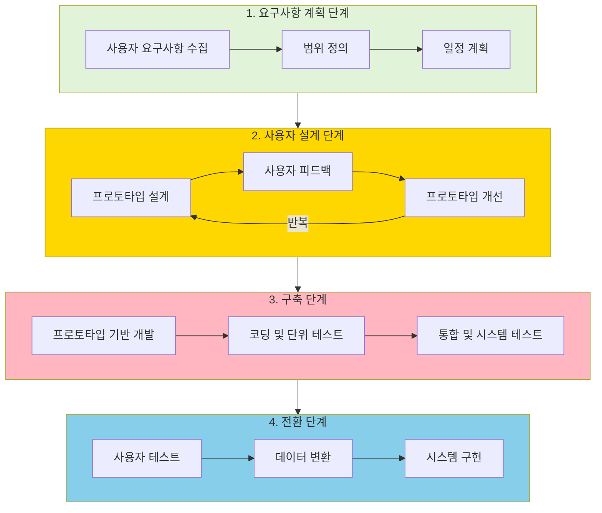

# RAD (Rapid Application Development): 신속한 소프트웨어 개발을 위한 프로토타입 중심 모델

<!-- mtoc-start -->

- [정의 및 개념](#정의-및-개념)
- [주요 특징](#주요-특징)
- [모형 프로세스](#모형-프로세스)
  - [JRP (Joint Requirement Planning)](#jrp-joint-requirement-planning)
  - [JAD (Joint Application Development)](#jad-joint-application-development)
  - [Cutover (구축/운영)](#cutover-구축운영)
- [RAD 모델 구성](#rad-모델-구성)
- [활용 사례](#활용-사례)
- [기대 효과 및 필요성](#기대-효과-및-필요성)
- [마무리](#마무리)
- [Keywords](#keywords)

<!-- mtoc-end -->

소프트웨어 개발 방법론 중 하나인 RAD(Rapid Application Development)는 짧은 주기(2~3개월) 내에 신속하게 애플리케이션을 개발하는 모델이다. 코드 생성 도구(Code Generator Tool)를 활용하여 개발 속도를 높이며, 고객의 적극적인 참여가 요구된다.

## 정의 및 개념

- Rapid Application Development: SW 개발을 2~3개월 짧은 주기에 Code Generator Tool을 활용하여 신속히 개발하는 모델
- 특징: 신속개발, 고객참여, 도구활용, 소요기간(60~90일)

## 주요 특징

- **신속 개발**: 짧은 개발 주기로 빠르게 제품을 출시
- **고객 참여**: 개발 초기부터 지속적인 피드백 제공
- **도구 활용**: 코드 생성 도구 등을 이용한 개발 효율성 향상
- **짧은 소요 기간**: 일반적으로 60~90일 내에 개발 완료

## 모형 프로세스

RAD는 크게 JRP, JAD, Cutover의 세 단계로 구성된다.

```mermaid
graph TD;
    A[JRP(계획/분석)] --> B[JAD(설계)];
    B --> C[Cutover(구축/운영)];

    A -->|Joint Requirement Planning| D[비즈니스 모델 검토/분석, 데이터 모델링];
    B -->|Joint Application Development| E[원형 모델 개발, 수정, 보완];
    C -->|운영 준비| F[운영 지침서 작성, 현업 이관];
```

### JRP (Joint Requirement Planning)

- **단계**: 계획/분석
- **활동**: 비즈니스 모델 검토 및 분석, 데이터 모델링 수행

### JAD (Joint Application Development)

- **단계**: 설계
- **활동**: 원형(프로토타입) 모델 개발 및 수정, 보완

### Cutover (구축/운영)

- **단계**: 구축 및 운영
- **활동**: 운영을 위한 지침서 작성, 현업무 이관 수행

## RAD 모델 구성



RAD 모델의 핵심 특징과 장점:

1. 반복적 프로토타이핑

- 초기부터 사용자와 긴밀한 협력을 통해 프로토타입을 개발
- 빠른 피드백 수집으로 요구사항을 정확하게 반영
- 지속적인 개선과 수정이 가능한 유연한 개발 방식

2. 시간 효율성

- 재사용 가능한 컴포넌트와 도구 활용
- 병렬적인 개발 작업 수행 가능
- 60-90일의 짧은 개발 주기

3. 품질 향상

- 지속적인 사용자 피드백으로 품질 보장
- 초기부터 오류 발견 및 수정 가능
- 사용자 만족도 향상

4. 위험 관리

- 초기 프로토타입으로 기술적 위험 조기 발견
- 요구사항 변경에 따른 위험 최소화
- 단계별 검증으로 project failure 위험 감소

적합한 프로젝트 유형:

- 3-6개월 내 완료 가능한 중소규모 프로젝트
- 명확한 비즈니스 요구사항이 있는 경우
- 사용자 인터페이스가 중요한 프로젝트
- 기술적 위험이 낮은 프로젝트

단, RAD 모델은 대규모 시스템이나 높은 기술적 위험이 있는 프로젝트, 또는 빈번한 사용자 참여가 어려운 경우에는 적합하지 않을 수 있습니다.

## 활용 사례

- 금융 및 보험 시스템의 신속한 구축
- 공공기관의 업무 프로세스 개선 프로젝트
- 스타트업 및 IT 서비스의 MVP(Minimum Viable Product) 개발

## 기대 효과 및 필요성

- 개발 속도 향상 및 비용 절감
- 고객 요구사항의 신속한 반영
- 유지보수 비용 절감 및 효율적인 운영 지원

## 마무리

RAD는 신속한 개발과 고객 참여를 통한 반복적인 개선이 가능한 모델로, 빠른 시장 출시가 중요한 프로젝트에서 유용하다. 조직의 요구 사항에 맞게 적절히 적용하면 효과적인 소프트웨어 개발이 가능하다.

## Keywords

Rapid Application Development, RAD 모델, JRP, JAD, Cutover, 신속 개발, 코드 생성 도구, 프로토타이핑, 고객 참여, 소프트웨어 개발 방법론, SDLC
