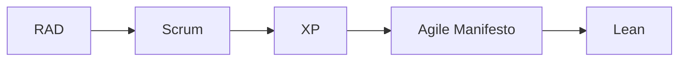
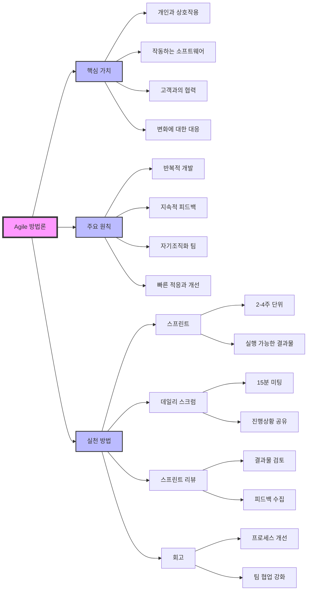

# Agile 방법론: 지속적인 요구변화에 적극적인 대응

<!-- mtoc-start -->

- [정의 및 개념](#정의-및-개념)
- [Agile 선언문 핵심 가치](#agile-선언문-핵심-가치)
- [주요 특징](#주요-특징)
- [Agile 발전 과정](#agile-발전-과정)
- [Agile 방법론의 핵심 구조](#agile-방법론의-핵심-구조)
  - [1. 핵심 가치](#1-핵심-가치)
  - [2. 주요 원칙](#2-주요-원칙)
  - [3. 실천 방법](#3-실천-방법)
- [단점 및 극복 방안](#단점-및-극복-방안)
  - [단점](#단점)
  - [극복 방안](#극복-방안)
- [기대 효과 및 필요성](#기대-효과-및-필요성)
- [마무리](#마무리)
- [Keywords](#keywords)

<!-- mtoc-end -->

소프트웨어 개발 환경은 끊임없이 변화하며, 기존의 전통적 방법론은 급변하는 요구사항을 수용하는 데 한계를 보였다. 이러한 한계를 극복하기 위해 등장한 Agile 방법론은 절차보다는 사람을 중심으로 유연하고 신속하게 변화에 적응하며 효율적으로 시스템을 개발하는 접근 방식이다.

## 정의 및 개념

- Agile 방법론: 요구사항의 지속적인 변화에 능동적으로 대응하며, 짧은 주기로 동작하는 소프트웨어를 반복적으로 제공하는 개발 방법론.
- 특징: 가변적 요구 대응, SB(Schedule Buffer) 감소, 요구 만족 (구동 SW 자주 전달) | [ 개변동고 ]
- 배경: 소프트웨어 환경 변화, 기존 방법론의 한계

## Agile 선언문 핵심 가치

1. 개인과의 상호작용이 프로세스와 도구보다 우선한다.
2. 변화에 대한 대응이 계획 준수보다 우선한다.
3. 동작하는 소프트웨어가 포괄적 문서화보다 우선한다.
4. 고객과의 협력이 계약 협상보다 우선한다.

## 주요 특징

- **적응성**: 변화하는 요구사항에 즉각적으로 대응할 수 있도록 개발 환경을 구성
- **짧은 반복주기**: 스프린트나 이터레이션을 통해 기능을 지속적으로 제공
- **고객 중심 개발**: 고객의 피드백을 즉각 반영하여 프로젝트 진행
- **자율적인 팀 운영**: 개발팀이 자율적으로 의사결정을 하고, 책임감을 갖고 프로젝트를 수행
- **지속적인 개선**: 회고를 통해 지속적으로 프로세스를 개선하며 품질 향상

## Agile 발전 과정

Agile 방법론은 Rapid Application Development (RAD)에서 시작하여, Scrum, XP(Extreme Programming) 등의 기법을 거쳐 Agile Manifesto가 정립되었으며, Lean 개발 방식으로 발전.

## Agile 방법론의 핵심 구조

### 1. 핵심 가치

- 프로세스나 도구보다 개인과 상호작용 중시
- 문서보다 작동하는 소프트웨어 중시
- 계약 협상보다 고객과의 협력 중시
- 계획 고수보다 변화에 대한 대응 중시

### 2. 주요 원칙

- 반복적이고 점진적인 개발
- 지속적인 피드백 수용과 반영
- 자기조직화된 팀 운영
- 빠른 적응과 지속적 개선

### 3. 실천 방법

- 스프린트: 2-4주 단위의 개발 주기
- 데일리 스크럼: 15분 일일 회의
- 스프린트 리뷰: 결과물 검토와 피드백
- 회고: 프로세스 개선과 팀 협업 강화

이러한 구조를 통해 지속적인 요구 변화에 유연하게 대응하면서도 효율적인 개발을 가능하게 합니다.

## 단점 및 극복 방안

### 단점

- 대형 프로젝트에 적용하기 어려움
- 감리에 대한 대응이 어려움

### 극복 방안

- 전통적 방법론과 Agile 방법론을 결합한 **하이브리드 방식** 적용
- 전체 프로젝트 흐름과 기본 틀은 전통적 방법론을 유지하면서 **파트별 또는 소규모 팀별 Agile 방식** 적용
- 프로젝트 초반부터 **고객의 적극적인 참여** 유도
- **구동하는 소프트웨어 시연**을 통해 지속적인 피드백 반영
- 고객 시연 전 철저한 내부 품질 점검을 수행하여 완성도 향상

## 기대 효과 및 필요성

- **빠른 요구사항 반영**: 변화하는 비즈니스 환경에 신속히 대응 가능
- **고객 만족도 향상**: 고객과 지속적인 협력을 통해 만족도를 극대화
- **품질 개선**: 반복적인 테스트 및 피드백을 통해 소프트웨어 품질을 지속적으로 향상
- **리스크 최소화**: 단기 목표 설정 및 지속적인 개선을 통해 프로젝트 리스크 감소

## 마무리

Agile 방법론은 현대 소프트웨어 개발 환경에서 필수적인 접근 방식으로 자리 잡았다. 지속적인 요구사항 변화에 적극적으로 대응하고, 고객과의 협력을 강화하며, 신속하고 유연한 개발을 가능하게 한다. 하지만 대형 프로젝트에서의 적용 한계를 극복하기 위해 하이브리드 접근법을 활용하는 것이 효과적이다. Agile 방법론을 적절히 도입하여 프로젝트의 성공 가능성을 극대화하자.

## Keywords

Agile, 애자일 방법론, Scrum, XP, Lean, RAD, 소프트웨어 개발 방법론, 고객 중심 개발, 지속적 통합, 반복적 개발
