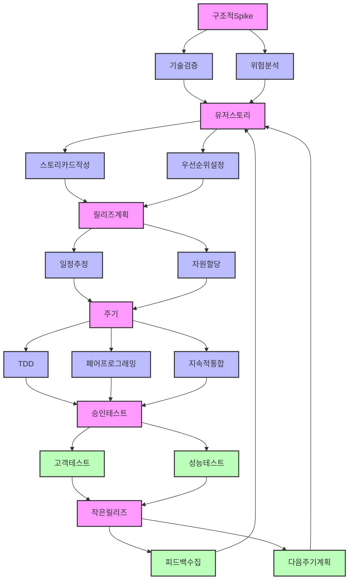

# XP(Extreme Programming): 신속한 요구사항 반영과 품질 향상

<!-- mtoc-start -->

- [정의 및 개념](#정의-및-개념)
- [XP의 12가지 실천 사항(페공지, 게작메, 간테리, 주고코)](#xp의-12가지-실천-사항페공지-게작메-간테리-주고코)
  - [1. 개발 원리](#1-개발-원리)
  - [2. 관리 원리](#2-관리-원리)
  - [3. 구현 원리](#3-구현-원리)
  - [4. 환경 및 기타](#4-환경-및-기타)
- [XP 개발 프로세스](#xp-개발-프로세스)
- [XP 주요 구성 요소](#xp-주요-구성-요소)
- [XP 상세 프로세스](#xp-상세-프로세스)
  - [1. 구조적 Spike](#1-구조적-spike)
  - [2. 유저 스토리](#2-유저-스토리)
  - [3. 릴리즈 계획](#3-릴리즈-계획)
  - [4. 개발 주기 (Iteration)](#4-개발-주기-iteration)
  - [5. 승인 테스트](#5-승인-테스트)
  - [6. 작은 릴리즈](#6-작은-릴리즈)
  - [프로세스 특징:](#프로세스-특징)
- [기대 효과 및 필요성](#기대-효과-및-필요성)
- [마무리](#마무리)
- [Keywords](#keywords)

<!-- mtoc-end -->

소프트웨어 개발의 민첩성을 극대화하는 XP(Extreme Programming)는 고객 요구사항을 신속하게 반영하고 지속적인 피드백을 통해 소프트웨어 품질을 높이는 Agile 방법론 중 하나이다.

## 정의 및 개념

- XP(Extreme Programming): 짧은 개발 주기와 협업을 통해 빠르게 요구사항을 반영하고 소프트웨어 품질을 향상하는 개발 방법론.
- 5가지 핵심 가치(용단커피존): **용기, 단순성, 커뮤니케이션, 피드백, 존중**

## XP의 12가지 실천 사항(페공지, 게작메, 간테리, 주고코)

### 1. 개발 원리

- **페어 프로그래밍**: 두 명의 개발자가 함께 작업하여 코드 품질을 향상
- **공동 책임**: 코드 및 개발 결과물에 대한 공동 소유
- **지속적 통합**: 변경 사항을 자주 통합하여 오류를 신속하게 발견

### 2. 관리 원리

- **게임 계획**: 반복적인 계획 수립 및 조정
- **작은 릴리즈**: 작은 단위로 소프트웨어를 배포하여 빠른 피드백 반영
- **메타포**: 개발팀이 공유하는 개념적인 모델을 사용하여 커뮤니케이션 향상

### 3. 구현 원리

- **간략한 디자인**: 최소한의 디자인으로 개발을 시작하고 지속적으로 개선
- **테스트**: 자동화된 테스트를 활용하여 품질을 유지
- **리팩토링**: 코드의 유지보수성을 높이기 위해 지속적인 개선

### 4. 환경 및 기타

- **주 40시간 작업**: 과도한 업무를 지양하고 생산성 극대화
- **고객 상주**: 고객이 개발팀과 지속적으로 협력
- **코드 표준**: 일관된 코드 스타일 유지

## XP 개발 프로세스

XP의 개발 프로세스는 구조적 Spike에서 시작하여 유저스토리 작성, 릴리즈 계획 수립, 개발 주기 운영, 승인 테스트 수행 후 작은 릴리즈를 제공하는 방식으로 진행된다.

## XP 주요 구성 요소

- **Spike**: 어려운 요구사항이나 기술적 솔루션을 검토하기 위한 간단한 프로토타입
- **유저 스토리**: UML의 Use Case와 유사한 역할을 하며, 릴리즈 계획과 테스트 시나리오 제공
- **릴리즈 계획**: 작은 단위의 프로그램을 출시하기 위한 계획 수립
- **주기(Iteration)**: 1~3주 동안 이루어지는 개발 주기로, 요구사항 변경 반영 및 릴리즈 계획 수정 가능
- **승인 테스트**: 고객이 직접 수행하는 테스트로 기능 검증
- **작은 릴리즈**: 빠른 피드백을 위해 소규모 단위로 프로그램 배포

## XP 상세 프로세스

### 1. 구조적 Spike

- 기술적 불확실성 검증
- 주요 위험 요소 사전 분석
- 아키텍처 방향성 수립

### 2. 유저 스토리

- 고객 관점의 기능 요구사항 정의
- 비즈니스 가치 기반 우선순위 설정
- 구현 범위 명확화

### 3. 릴리즈 계획

- 스토리별 구현 일정 추정
- 팀 역량 기반 자원 할당
- 마일스톤 설정

### 4. 개발 주기 (Iteration)

- TDD를 통한 품질 관리
- 페어 프로그래밍으로 지식 공유
- 지속적 통합으로 리스크 감소

### 5. 승인 테스트

- 고객 참여 테스트 수행
- 성능/부하 검증
- 품질 기준 충족 확인

### 6. 작은 릴리즈

- 빠른 가치 전달
- 사용자 피드백 수집
- 다음 주기 계획 수립

### 프로세스 특징:

- 반복적이고 점진적인 개발
- 지속적인 피드백 루프
- 고객 중심의 개발 방식
- 품질과 속도의 균형 추구

## 기대 효과 및 필요성

- **신속한 요구사항 반영**: Agile 환경에서 고객 요구사항을 빠르게 적용 가능
- **소프트웨어 품질 향상**: 지속적 통합과 테스트를 통해 품질 유지
- **개발 효율성 증대**: 협업과 피드백을 통해 코드의 유지보수성을 극대화
- **리스크 최소화**: 작은 단위의 릴리즈를 통해 문제 발생 시 신속한 대응 가능

## 마무리

XP는 Agile 방법론 중에서도 특히 개발자의 협업과 고객과의 긴밀한 소통을 강조하는 개발 방식이다. 지속적인 테스트, 짧은 개발 주기, 그리고 피드백 중심의 접근법을 통해 빠르게 변화하는 요구사항에 능동적으로 대응할 수 있다. XP를 적절히 도입하면 개발팀의 생산성을 높이고 소프트웨어 품질을 극대화할 수 있다.

## Keywords

XP, Extreme Programming, Agile, 페어 프로그래밍, 지속적 통합, 유저 스토리, 릴리즈 계획, 승인 테스트, 리팩토링, 소프트웨어 품질
