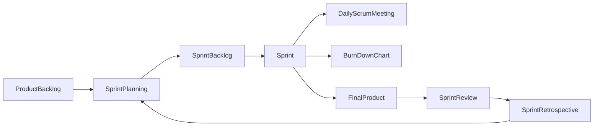
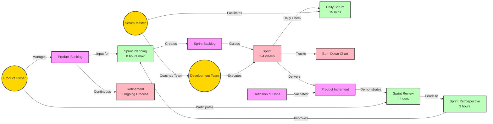

# Scrum: 팀워크 중심의 Agile 방법론

<!-- mtoc-start -->

- [정의 및 개념](#정의-및-개념)
- [Scrum의 주요 구성 요소](#scrum의-주요-구성-요소)
  - [1. Product Backlog](#1-product-backlog)
  - [2. Sprint Planning](#2-sprint-planning)
  - [3. Sprint Backlog](#3-sprint-backlog)
  - [4. Sprint (반복 개발 주기)](#4-sprint-반복-개발-주기)
  - [5. Final Product (Shippable Product)](#5-final-product-shippable-product)
  - [6. Sprint Review](#6-sprint-review)
  - [7. Sprint Retrospective](#7-sprint-retrospective)
- [Scrum 팀 구성원 역할](#scrum-팀-구성원-역할)
  - [1. Product Owner](#1-product-owner)
  - [2. Scrum Master](#2-scrum-master)
  - [3. Development Team](#3-development-team)
- [Story Point 개념](#story-point-개념)
- [Sprint 및 Epic 개념](#sprint-및-epic-개념)
- [Scrum 개발 프로세스](#scrum-개발-프로세스)
- [Scrum Process and Roles](#scrum-process-and-roles)
  - [1. **핵심 역할(Core Roles)**](#1-핵심-역할core-roles)
  - [2. **주요 이벤트(Events)의 세부 사항**](#2-주요-이벤트events의-세부-사항)
  - [3. **주요 산출물(Artifacts)**](#3-주요-산출물artifacts)
  - [4. **추가 프랙티스**](#4-추가-프랙티스)
  - [5. **스크럼 가치**](#5-스크럼-가치)
- [기대 효과 및 필요성](#기대-효과-및-필요성)
- [마무리](#마무리)
- [Keywords](#keywords)

<!-- mtoc-end -->

Scrum은 팀워크를 강조하며, Product Backlog를 기반으로 기술적으로 분할된 Sprint Backlog를 Scrum 팀을 통해 구현하는 Agile 방법론이다. 지속적인 협업과 반복적인 개발 주기를 통해 효율적으로 제품을 개발하고 개선하는 방식이다.

## 정의 및 개념

- **Scrum**: Agile 방법론 중 하나로, 팀워크를 중심으로 짧은 개발 주기(Sprint)를 반복하며 소프트웨어를 개발하는 방법론.
- **특징**: 협업 중심, 사회공학 기법, Sprint 수행, Daily Meeting

## Scrum의 주요 구성 요소

### 1. Product Backlog

- 제품의 기능 목록을 나열하고, 우선순위를 매긴 요구사항 목록
- 포함 요소: 순위, 기능, 사용자 스토리, 스토리 포인트, 중요도

### 2. Sprint Planning

- 각 Sprint에서 구현할 작업을 선정하는 계획 회의
- Sprint 개발 기간을 추정하고 작업량을 산정

### 3. Sprint Backlog

- Sprint 기간 동안 수행될 Task 목록을 정리한 계획서

### 4. Sprint (반복 개발 주기)

- 일반적으로 1~4주 동안 수행되는 반복 개발 주기
- Sprint 동안 수행되는 핵심 활동
  - **Daily Scrum Meeting**: 매일 진행 상황 점검 및 장애 요소 논의
  - **BurnDown Chart**: Sprint 진행 상황을 시각적으로 점검하는 차트

### 5. Final Product (Shippable Product)

- Sprint 완료 후 배포 가능한 최종 제품

### 6. Sprint Review

- Sprint 종료 시 산출물에 대한 검토 회의
- 개발된 기능 시연 및 피드백 반영

### 7. Sprint Retrospective

- Sprint 과정에서의 개선 사항을 검토하고, 다음 Sprint에서의 개선점을 도출하는 회고 회의

## Scrum 팀 구성원 역할

### 1. Product Owner

- 요구사항을 정의하고 **Product Backlog**를 관리
- Backlog 항목의 우선순위를 결정하여 팀의 개발 방향을 조율

### 2. Scrum Master

- 프로젝트 진행을 원활하게 하는 역할
- 팀원 코칭 및 프로젝트 내 장애 요소 해결

### 3. Development Team

- Sprint 구현을 담당하는 팀원
- 자율적으로 작업을 수행하고, Sprint 목표를 달성

## Story Point 개념

- **요구사항의 규모를 측정하는 단위**로, 업무량을 기반으로 산정
- **상대적 업무량 비교**를 통해 난이도 및 소요 시간을 예측
- 최소값을 **1**로 설정하고, 다른 Story 간 상대적 난이도를 비교하여 포인트를 부여

## Sprint 및 Epic 개념

- **Sprint**: 짧은 개발 주기로, 작업량이 많지 않으며 집중적으로 개발하는 반복 주기 (전력 질주)
- **Epic**: 여러 개의 작은 작업으로 나눌 수 있는 대규모 작업 단위

## Scrum 개발 프로세스

Scrum 프로세스는 **Product Backlog**에서 시작하여 Sprint를 계획하고 실행하며, 결과물을 검토하고 개선하는 반복적인 흐름을 따른다.

## Scrum Process and Roles

### 1. **핵심 역할(Core Roles)**

- **Product Owner**

  - 제품의 비전과 방향성 제시
  - Product Backlog 우선순위 결정
  - 이해관계자들과 소통
  - ROI(투자수익률) 최적화 책임

- **Scrum Master**

  - 스크럼 프로세스 가이드 및 촉진
  - 팀의 장애물 제거
  - 조직의 스크럼 도입 및 개선 지원
  - 팀 보호 및 생산성 향상 지원

- **Development Team**
  - 자기조직화된 cross-functional 팀
  - 실제 제품 개발 수행
  - Sprint Backlog 관리
  - 지속적인 품질 관리

### 2. **주요 이벤트(Events)의 세부 사항**

- **Sprint Planning (8시간 이내)**

  - Sprint Goal 설정
  - Sprint Backlog 항목 선정
  - 작업 추정 및 계획 수립

- **Daily Scrum (15분)**

  - 어제 한 일
  - 오늘 할 일
  - 장애물/어려움 공유

- **Sprint Review (4시간 이내)**

  - 완성된 기능 데모
  - 피드백 수집
  - Product Backlog 조정

- **Sprint Retrospective (3시간 이내)**
  - 프로세스 개선점 도출
  - 팀 협업 방식 개선
  - 다음 스프린트 적용할 Action Items 도출

### 3. **주요 산출물(Artifacts)**

- **Product Backlog**

  - 제품에 필요한 모든 요구사항
  - 지속적인 Refinement 진행
  - DEEP (Detailed, Estimated, Emergent, Prioritized)

- **Sprint Backlog**

  - 스프린트 동안 수행할 작업 목록
  - 태스크 레벨까지 세분화
  - 일일 업데이트

- **Increment**
  - 실제 작동하는 제품
  - Definition of Done 충족
  - 잠재적으로 출시 가능한 상태

### 4. **추가 프랙티스**

- **Backlog Refinement**

  - 지속적인 백로그 정제
  - 우선순위 조정
  - 추정 및 명확화

- **Definition of Done (DoD)**

  - 완료 정의의 명확한 기준
  - 품질 표준 정의
  - 모든 팀원의 합의

- **Burn Down Chart**
  - 진척도 시각화
  - 남은 작업량 추적
  - 리스크 조기 발견

### 5. **스크럼 가치**

- 용기 (Courage)
- 집중 (Focus)
- 헌신 (Commitment)
- 존중 (Respect)
- 개방성 (Openness)

이러한 요소들이 유기적으로 결합되어 효과적인 스크럼 프로세스를 구성하며, 각 조직의 상황에 맞게 유연하게 적용될 수 있습니다. 성공적인 스크럼 운영을 위해서는 모든 구성원의 적극적인 참여와 지속적인 개선 노력이 필요합니다.

## 기대 효과 및 필요성

- **효율적인 협업**: 팀원 간 원활한 커뮤니케이션을 촉진
- **빠른 피드백 반영**: 지속적인 개선을 통해 제품 품질 향상
- **유연한 개발 방식**: 요구사항 변경에 신속히 대응 가능
- **리스크 최소화**: 짧은 반복 주기로 오류를 빠르게 발견 및 수정

## 마무리

Scrum은 팀워크를 기반으로 반복적인 Sprint를 수행하며 빠르게 제품을 개선할 수 있는 효과적인 방법론이다. Product Owner, Scrum Master, 개발팀 간의 긴밀한 협력을 통해 효율적으로 프로젝트를 운영할 수 있으며, 지속적인 개선과 피드백을 통해 높은 품질의 제품을 개발할 수 있다.

## Keywords

Scrum, Agile, Sprint, Product Backlog, Sprint Backlog, Daily Scrum Meeting, BurnDown Chart, Story Point, Epic, Scrum Master
