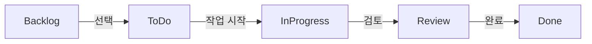
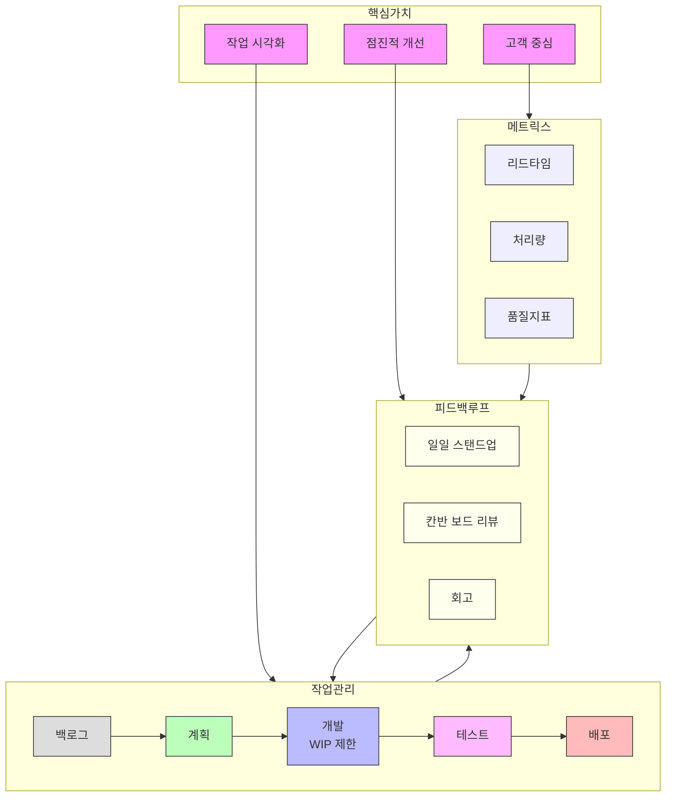

# Kanban: Agile 프로세스를 위한 적시 개발 방법론

<!-- mtoc-start -->

- [정의 및 개념](#정의-및-개념)
- [Kanban의 3가지 핵심 규칙](#kanban의-3가지-핵심-규칙)
  - [1. 워크플로우 가시화](#1-워크플로우-가시화)
  - [2. Work in Process (WIP) 제한](#2-work-in-process-wip-제한)
  - [3. 플로우의 측정 및 최적화](#3-플로우의-측정-및-최적화)
- [Kanban의 주요 구성 요소](#kanban의-주요-구성-요소)
  - [1. Kanban 보드](#1-kanban-보드)
  - [2. Kanban 카드](#2-kanban-카드)
  - [3. WIP 제한](#3-wip-제한)
  - [4. 지속적 개선 (Kaizen)](#4-지속적-개선-kaizen)
- [Kanban 프로세스](#kanban-프로세스)
- [Kanban System](#kanban-system)
  - [1. 칸반의 핵심가치](#1-칸반의-핵심가치)
  - [2. 작업 관리 프로세스](#2-작업-관리-프로세스)
  - [3. 지속적 개선을 위한 피드백 루프](#3-지속적-개선을-위한-피드백-루프)
  - [4. 성과 측정을 위한 메트릭스](#4-성과-측정을-위한-메트릭스)
- [기대 효과 및 필요성](#기대-효과-및-필요성)
- [마무리](#마무리)
- [Keywords](#keywords)

<!-- mtoc-end -->

Kanban은 Agile 프로세스 전반에 걸쳐 **적시 개발(Just in Time Development)**을 지원하는 방법론으로, 작업 흐름을 시각화하고 관리하는 데 초점을 둔다. 이를 통해 업무 진행 상황을 명확히 파악하고, 병목 현상을 줄이며, 효율적인 개발 프로세스를 유지할 수 있다.

## 정의 및 개념

- **Kanban**: 작업 항목을 시각화하고, 진행 중인 작업 수를 제한하며, 워크플로우를 지속적으로 개선하는 Agile 방법론.
- **핵심 개념**: 작업 카드 사용, 워크플로우 가시화, 프로세스 최적화

## Kanban의 3가지 핵심 규칙

### 1. 워크플로우 가시화

- 모든 작업을 카드 형태로 기록하여 Kanban 보드에 게시
- Backlog, 진행 중(In Progress), 완료(Done) 등의 상태로 나누어 표시
- 업무 진행 흐름을 명확히 보여줌으로써 병목 현상 감지 및 해결 가능

### 2. Work in Process (WIP) 제한

- 동시 진행 가능한 작업 항목의 수를 제한하여 과부하 방지
- WIP 제한을 통해 팀이 현재 진행 중인 작업에 집중
- 병목 구간을 조기에 발견하여 프로세스를 최적화

### 3. 플로우의 측정 및 최적화

- 전체 개발 과정의 예측 가능성을 높이고 소요 시간을 최소화
- 리드 타임(요청부터 완료까지 걸리는 시간) 및 사이클 타임(작업 착수부터 완료까지 걸리는 시간)을 지속적으로 측정
- 데이터를 기반으로 프로세스를 개선하고 최적화

## Kanban의 주요 구성 요소

### 1. Kanban 보드

- 작업 항목을 관리하는 시각적 도구
- 보통 **Backlog, To Do, In Progress, Done** 등의 컬럼으로 구성
- 팀의 작업 진행 상태를 실시간으로 확인 가능

### 2. Kanban 카드

- 개별 작업 항목을 나타내는 카드 형태의 태스크
- 작업 항목의 설명, 담당자, 우선순위, 예상 소요 시간 등의 정보 포함

### 3. WIP 제한

- 동시에 진행할 수 있는 작업의 개수를 제한하는 규칙
- 특정 단계에서의 병목 현상을 예방하고, 작업 완료 속도를 최적화

### 4. 지속적 개선 (Kaizen)

- 개발 프로세스를 지속적으로 평가하고 개선하는 방식
- 회고 및 피드백을 통해 워크플로우를 최적화

## Kanban 프로세스

Kanban 프로세스는 작업이 Backlog에서 시작하여 To Do, In Progress, Review 단계를 거쳐 Done 상태로 완료되는 흐름을 따른다. 각 단계에서 WIP 제한을 적용하여 병목 현상을 방지하고, 최적의 개발 속도를 유지할 수 있다.

## Kanban System

### 1. 칸반의 핵심가치

- 작업의 시각화를 통한 투명성 확보
- 점진적이고 진화적인 개선 추구
- 고객 가치 중심의 개발 프로세스

### 2. 작업 관리 프로세스

- 백로그 → 계획 → 개발 → 테스트 → 배포의 순차적 흐름
- 각 단계에서의 WIP 제한으로 효율성 확보
- 명확한 진입/진출 기준 설정

### 3. 지속적 개선을 위한 피드백 루프

- 일일 스탠드업 미팅을 통한 즉각적 소통
- 정기적인 칸반 보드 리뷰
- 프로세스 개선을 위한 회고

### 4. 성과 측정을 위한 메트릭스

- 리드타임 측정으로 작업 소요 시간 파악
- 처리량 분석을 통한 팀 생산성 평가
- 품질 지표를 통한 결과물 관리

## 기대 효과 및 필요성

- **작업 흐름의 최적화**: WIP 제한을 통해 과부하를 방지하고 효율적으로 작업 수행
- **팀의 생산성 향상**: 업무 진행 상황이 명확하여 우선순위 조정이 용이
- **예측 가능성 증가**: 플로우 측정을 통해 프로젝트 완료 시간을 예측 가능
- **유연한 업무 방식**: 새로운 작업이 추가될 때도 기존 작업 흐름을 방해하지 않음
- **지속적 개선**: Kaizen을 적용하여 프로세스를 지속적으로 최적화

## 마무리

Kanban은 Agile 프로세스에서 워크플로우를 시각적으로 관리하고 지속적으로 개선할 수 있는 강력한 도구이다. 이를 통해 팀은 작업 진행 상황을 명확히 파악하고, 병목 현상을 조기에 감지하며, 최적의 개발 프로세스를 유지할 수 있다. 적절한 WIP 제한과 지속적인 플로우 측정을 통해 개발 속도를 최적화하고, 품질을 향상할 수 있다.

## Keywords

Kanban, Agile, 적시 개발, WIP 제한, Kanban 보드, 작업 흐름 최적화, 플로우 측정, 지속적 개선, Kaizen, 워크플로우 가시화
