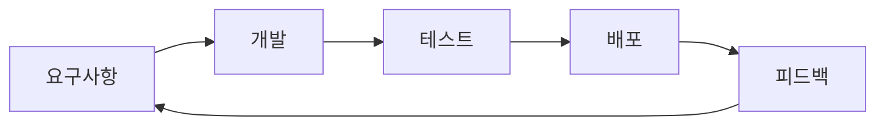
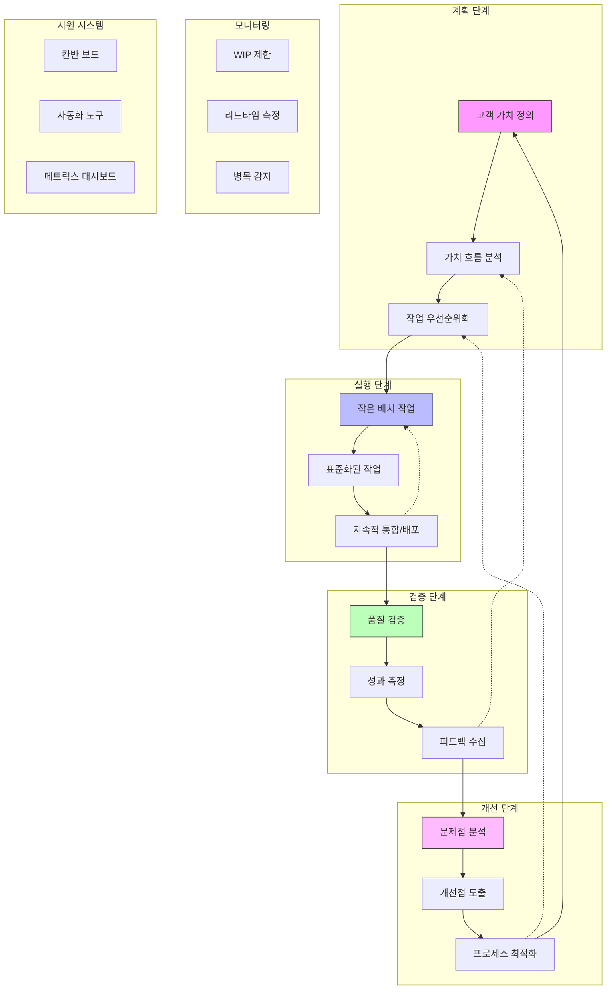

# Lean 방법론: 낭비 제거를 통한 품질 확보

<!-- mtoc-start -->

- [정의 및 개념](#정의-및-개념)
- [Lean 방법론의 7가지 원칙(낭품지늦빠사최)](#lean-방법론의-7가지-원칙낭품지늦빠사최)
- [Lean 방법론의 7대 낭비 요소(결미가재이작지)](#lean-방법론의-7대-낭비-요소결미가재이작지)
- [Lean 개발 프로세스](#lean-개발-프로세스)
- [Lean 개발 프로세스 통합](#lean-개발-프로세스-통합)
  - [1. 계획 단계](#1-계획-단계)
  - [2. 실행 단계](#2-실행-단계)
  - [3. 검증 단계](#3-검증-단계)
  - [4. 개선 단계](#4-개선-단계)
  - [핵심 운영 요소:](#핵심-운영-요소)
- [기대 효과 및 필요성](#기대-효과-및-필요성)
- [마무리](#마무리)
- [Keywords](#keywords)

<!-- mtoc-end -->

Lean 방법론은 Toyota Production System(TPS)을 벤치마킹하여 소프트웨어 개발에 적용한 방식으로, 낭비를 제거하고 품질을 확보하는 데 중점을 둔다. 최소한의 리소스로 최대의 가치를 창출하며, 지속적인 개선을 통해 개발 프로세스를 최적화한다.

## 정의 및 개념

- **Lean 방법론**: 낭비를 제거하고 품질을 내재화하여 소프트웨어 개발의 효율성을 극대화하는 방법론.
- **특징**: 낭비 제거, 품질 집중

## Lean 방법론의 7가지 원칙(낭품지늦빠사최)

1. **낭비 제거**: 불필요한 활동을 제거하여 효율성 극대화
2. **품질 내재화**: 개발 프로세스 자체에 품질을 포함시켜 결함 방지
3. **지식 증폭**: 지속적인 학습과 개선을 통해 품질 향상
4. **늦은 결정**: 충분한 정보가 확보될 때까지 결정을 미룸
5. **빠른 인도**: 가치를 신속하게 제공하여 고객 만족도 증가
6. **사람 존중**: 팀원들의 자율성과 창의성을 존중하여 동기 부여
7. **전체 최적화**: 시스템 전체를 고려하여 최적의 성과 도출

## Lean 방법론의 7대 낭비 요소(결미가재이작지)

Lean 방법론은 TPS에서 정의한 **7대 낭비 요소**를 소프트웨어 개발에 맞춰 적용하여 불필요한 작업을 줄인다.

| 낭비 요소     | 제조업 (TPS) | 소프트웨어 개발                     |
| ------------- | ------------ | ----------------------------------- |
| **결함**      | 결함         | 버그 및 오류                        |
| **미완 작업** | 재공재고     | 불완전한 코드, 문서 누락            |
| **가외 기능** | 과잉 생산    | 필요 없는 기능 개발                 |
| **재학습**    | 과잉 가공    | 불필요한 반복 작업, 문서화 부족     |
| **이관**      | 이동         | 잦은 팀 간 업무 이동                |
| **작업 전환** | 동작         | 컨텍스트 스위칭, 잦은 우선순위 변경 |
| **지연**      | 대기         | 승인 대기, 병목 현상                |

## Lean 개발 프로세스

Lean 방법론은 짧은 피드백 루프를 통해 지속적인 개선을 수행하며, 고객 가치 중심의 개발 방식을 유지한다.

## Lean 개발 프로세스 통합

### 1. 계획 단계

- 고객의 실제 니즈와 가치를 명확히 정의
- 전체 가치 흐름을 분석하여 낭비 요소 식별
- 가치 기반으로 작업 우선순위 설정

### 2. 실행 단계

- 작은 단위의 배치로 작업 진행
- 표준화된 작업 방식 적용
- 지속적 통합과 배포로 빠른 피드백 확보

### 3. 검증 단계

- 내재화된 품질 검증 진행
- 정량적 성과 지표 측정
- 다양한 이해관계자로부터 피드백 수집

### 4. 개선 단계

- 데이터 기반 문제점 분석
- 구체적 개선점 도출
- 전체 프로세스 최적화

### 핵심 운영 요소:

- 시각적 관리: 칸반 보드를 통한 작업 흐름 시각화
- 제약 관리: WIP 제한을 통한 병목 현상 방지
- 지속적 측정: 리드타임, 품질 등 핵심 지표 모니터링
- 빠른 피드백: 각 단계별 피드백 루프 구축
- 자동화: 반복 작업의 자동화로 효율성 확보

이러한 통합적 접근을 통해 지속적인 가치 전달과 프로세스 개선이 가능해집니다.

## 기대 효과 및 필요성

- **비효율 제거**: 불필요한 작업을 줄여 개발 속도 향상
- **품질 강화**: 결함을 최소화하여 신뢰성 높은 제품 제공
- **고객 만족도 증가**: 빠른 인도를 통해 요구사항을 신속하게 반영
- **팀 생산성 향상**: 불필요한 업무를 줄여 개발자의 창의적 활동 증대

## 마무리

Lean 방법론은 낭비 제거를 통한 품질 확보를 목표로 하며, 지속적인 개선을 통해 효율적인 개발을 가능하게 한다. 소프트웨어 개발에 Lean 원칙을 적용하면 불필요한 요소를 줄이고, 품질 높은 제품을 빠르게 제공할 수 있다. 이를 통해 기업은 경쟁력을 확보하고 고객 만족도를 극대화할 수 있다.

## Keywords

Lean, 린 개발, 낭비 제거, 품질 내재화, 빠른 인도, 지속적 개선, Agile, Toyota Production System, 소프트웨어 개발 최적화
