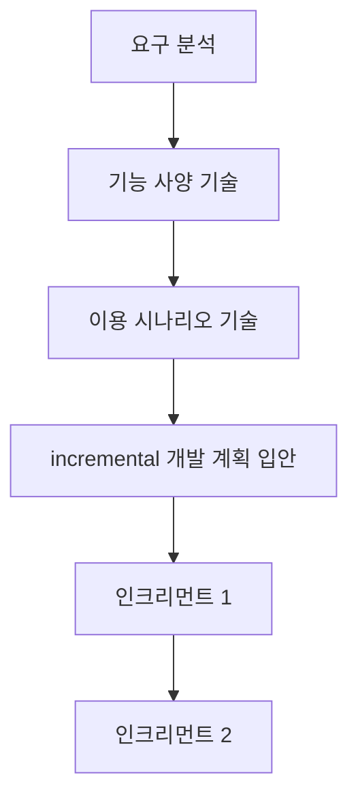

# Clean Room Model: 완전 무결한 소프트웨어 지향

<!-- mtoc-start -->

- [정의 및 개념](#정의-및-개념)
- [주요 특징](#주요-특징)
- [박스 구조](#박스-구조)
- [클린룸 모델에 의한 개발 프로세스](#클린룸-모델에-의한-개발-프로세스)
- [활용 사례](#활용-사례)
- [기대 효과 및 필요성](#기대-효과-및-필요성)
- [마무리](#마무리)
- [Keywords](#keywords)

<!-- mtoc-end -->

소프트웨어 개발에서 오류를 최소화하고 높은 신뢰성을 확보하기 위해 클린룸 모델(Clean Room Model)이 활용된다. 이 모델은 수학적, 통계적 기법을 적용하여 결함 없는 소프트웨어를 개발하는 것을 목표로 한다. 반복적이고 증분적인 개발 방식을 채택하며, 신뢰성 높은 소프트웨어를 보장하는 데 초점을 맞춘다.

## 정의 및 개념

- 클린룸 모델: 수학적, 통계적 이론에 기반한 Box 구조 기법을 사용하여 무결한 소프트웨어 개발을 지향하는 반복/증분 방법론
- 특징:
  - 통계적 시험: 통합된 소프트웨어의 신뢰도를 판단하기 위한 기법
  - 수학적 검증: 수학적 기반의 정확성 검증
  - 반복 개발: 핵심 부위를 먼저 개발한 후 점진적으로 기능을 추가하는 방식

## 주요 특징

1. **통계적 시험 기법 적용**: 개발된 소프트웨어의 신뢰성을 판단하기 위해 통계적 기법을 적용하여 테스트 수행
2. **수학적 검증 기법 활용**: 소프트웨어의 정확성을 검증하기 위해 수학적 방법론 적용
3. **반복적 개발 프로세스**: 작은 단위(인크리먼트)로 개발을 진행하여 점진적인 기능 확장
4. **결함 예방 중심 개발**: 오류 수정보다는 사전 예방에 초점을 맞춘 개발 방식
5. **고품질 소프트웨어 보장**: 철저한 검증과 반복적인 품질 평가로 높은 신뢰성의 소프트웨어 개발 가능

## 박스 구조

클린룸 모델에서는 소프트웨어의 구조를 3가지 박스(Box) 형태로 구분하여 관리한다.

- **Black Box**: 사용자 관점에서 입출력만을 고려하여 테스트 수행
- **State Box**: 자료 구조는 공개하지만 알고리즘은 비공개
- **Clear Box**: 자료 구조와 알고리즘을 모두 공개하여 철저한 검증 가능

## 클린룸 모델에 의한 개발 프로세스

요구 분석부터 기능 사양, 이용 시나리오 기술을 거쳐 증분 방식으로 개발이 진행된다. 각 인크리먼트는 독립적으로 개발되고 점진적으로 기능을 추가하면서 완전성을 확보한다.

## 활용 사례

- **안전-critical 시스템**: 항공, 원자력, 의료 기기 등 오류가 치명적인 영향을 미치는 시스템 개발
- **임베디드 소프트웨어 개발**: 높은 신뢰성이 요구되는 자동차, 산업 자동화 장비 등의 소프트웨어
- **금융 및 보안 소프트웨어**: 오류 발생 시 큰 손실이 발생할 가능성이 높은 금융 및 보안 시스템

## 기대 효과 및 필요성

- 소프트웨어의 신뢰성과 무결성을 극대화하여 오류를 최소화
- 개발 초기부터 철저한 검증을 통해 유지보수 비용 절감
- 반복적이고 점진적인 개발 방식으로 프로젝트 리스크 감소
- 통계적 시험 기법을 활용하여 품질 높은 소프트웨어 제공

## 마무리

클린룸 모델은 소프트웨어의 신뢰성을 극대화하는 데 초점을 맞춘 개발 방법론으로, 특히 오류가 치명적인 영향을 미치는 시스템에서 강력한 장점을 가진다. 반복적이고 증분적인 개발 방식을 통해 점진적으로 품질을 높이며, 수학적 검증과 통계적 시험 기법을 활용하여 무결한 소프트웨어를 보장한다.

## Keywords

Clean Room Model, 클린룸 모델, 통계적 시험, 수학적 검증, 반복적 개발, 신뢰성 높은 소프트웨어, Black Box, State Box, Clear Box, Incremental Development, Software Quality
