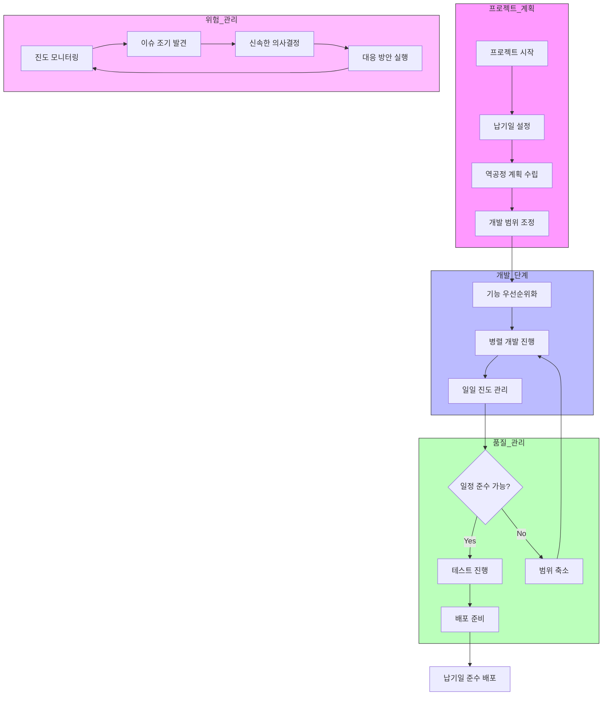

# 일정중시 모델: 납기일을 최우선하는 소프트웨어 개발 모델

<!-- mtoc-start -->

- [정의 및 개념](#정의-및-개념)
- [주요 특징](#주요-특징)
- [프로세스](#프로세스)
- [일정 중시 SW 개발 모델](#일정-중시-sw-개발-모델)
- [활용 사례](#활용-사례)
- [기대 효과 및 필요성](#기대-효과-및-필요성)
- [마무리](#마무리)
- [Keywords](#keywords)

<!-- mtoc-end -->

소프트웨어 개발에서 일정 준수가 가장 중요한 요소로 작용하는 경우, 일정중시 모델(Schedule-Driven Model)이 효과적인 방법이 될 수 있다. 이 모델은 사용자 요구사항을 우선순위에 따라 분류하고, 각 사이클에서 상세 설계, 코딩, 테스트를 반복하며 개발을 진행하는 방식이다.

## 정의 및 개념

- 일정중시 모델: 납기일을 최우선 순위로 고려하여 소프트웨어 개발을 진행하는 방법론
- 특징:
  - 핵심 기능: 초기 단계부터 집중하여 기본 골격을 신속히 생산
  - 부가 기능: 주요 기능이 아닌 항목은 나중에 개발하며 일정 조정 가능

## 주요 특징

1. **납기 우선 개발**: 일정 준수가 최우선 목표이며, 기능 추가보다 기한 내 출시가 중요
2. **핵심 기능 집중**: 주요 기능을 초기 단계에서 개발하여 기본 골격을 신속하게 완성
3. **반복적 개발**: 각 개발 사이클에서 상세 설계, 개발, 테스트를 반복
4. **유연한 기능 배치**: 필수 기능은 초기에, 부가 기능은 후반부 또는 이후 업데이트
5. **출시 가능성 극대화**: 일정 내 출시할 수 있도록 필수 기능을 중심으로 프로젝트 관리

## 프로세스

일정 준수를 위해 우선순위가 높은 기능을 먼저 개발하고, 이후 추가 기능을 점진적으로 반영하는 방식으로 진행.

## 일정 중시 SW 개발 모델

1. 납기일 우선: 정해진 납기일을 절대 조건으로 설정하고, 이를 기준으로 모든 개발 활동을 조정.
2. 역공정 계획: 납기일로부터 역으로 계획을 수립하여 각 단계별 마감일을 설정.
3. 범위 유연성: 일정 준수를 위해 개발 범위를 탄력적으로 조정.
   - 우선순위가 낮은 기능은 후순위로 조정
   - 필요시 기능 축소나 단순화 결정
4. 병렬 개발: 시간 단축을 위해 여러 기능을 동시에 개발.
5. 엄격한 진도관리:
   - 일일 진도 체크
   - 이슈 발생 시 즉각 대응
   - 지속적인 위험 모니터링
6. 신속한 의사결정:
   - 문제 발생 시 빠른 의사결정으로 일정 지연 최소화
   - 품질과 일정 사이의 균형점 찾기

> 이 모델은 시장 출시 시기가 중요하거나, 법적/계약적 deadline이 있는 프로젝트에 적합. \
> 다만, 품질이나 완성도보다 일정을 우선시하므로 이에 따른 리스크 관리가 매우 중요.

## 활용 사례

- **스타트업 제품 출시**: 최소 기능 제품(MVP)을 일정 내에 출시하고, 이후 기능을 확장하는 방식
- **게임 개발**: 필수적인 게임 플레이 요소를 먼저 개발하고, 이후 추가 콘텐츠를 패치로 제공
- **기업용 소프트웨어**: 핵심 업무 기능을 먼저 배포하고, 이후 고객 요구에 따라 개선

## 기대 효과 및 필요성

- 일정 내 제품 출시 가능성 극대화
- 프로젝트 진행 상황을 명확하게 관리 가능
- 초기부터 핵심 기능이 구현되어 시장 반응을 조기에 확인 가능
- 부가 기능을 유연하게 조정하여 프로젝트 리스크 최소화

## 마무리

일정중시 모델은 빠른 시장 출시가 필요한 프로젝트에서 효과적인 접근 방식이다. 일정 준수가 중요한 경우, 핵심 기능에 집중하여 필수 요소를 먼저 개발한 후, 부가 기능을 차차 추가하는 방식이 유리하다. 이를 통해 프로젝트 리스크를 최소화하고, 제품을 시장에 신속하게 선보일 수 있다.

## Keywords

Schedule-Driven Model, 소프트웨어 개발 방법론, 일정 우선 개발, 반복적 개발, 핵심 기능 우선, 프로젝트 관리, MVP, 애자일, 제품 출시 전략, 소프트웨어 일정 관리
