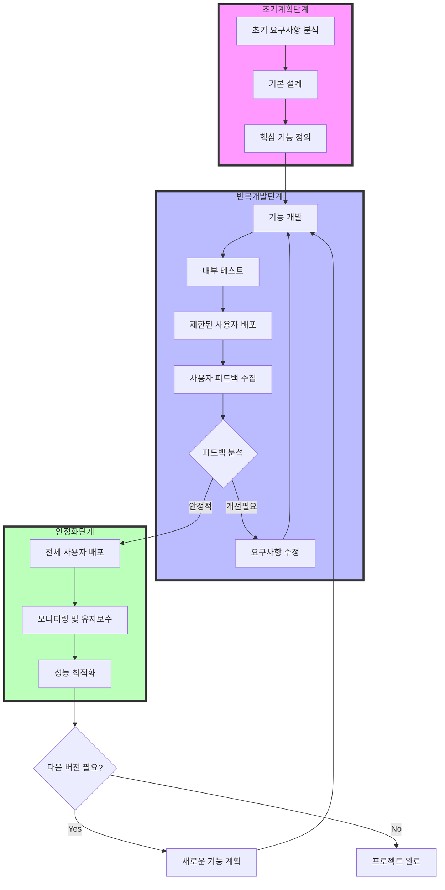

# 진화적 출시모형: 고객 피드백을 반영한 점진적 소프트웨어 개발

<!-- mtoc-start -->

- [정의 및 개념](#정의-및-개념)
- [주요 특징](#주요-특징)
- [프로세스](#프로세스)
- [진화적 출시 모형 상세 프로세스](#진화적-출시-모형-상세-프로세스)
  - [1. 개발 철학](#1-개발-철학)
  - [2. 주요 특징](#2-주요-특징)
  - [3. 장점](#3-장점)
- [활용 사례](#활용-사례)
- [기대 효과 및 필요성](#기대-효과-및-필요성)
- [마무리](#마무리)
- [Keywords](#keywords)

<!-- mtoc-end -->

진화적 출시모형(Evolutionary Delivery)은 소프트웨어 개발 과정에서 고객의 요구를 여러 사이클을 거쳐 반복적으로 반영하는 방식이다. 초기 버전을 개발하여 고객에게 제공한 후, 피드백을 바탕으로 제품을 점진적으로 개선하고 발전시키는 것이 특징이다.

## 정의 및 개념

- 진화적 출시모형: 고객 요구사항을 반영하여 점진적으로 제품을 개선하며 여러 번에 걸쳐 출시하는 소프트웨어 개발 방식
- 특징:
  - 부분 수용: 고객 요구사항을 부분적으로 수용하고, 우선순위에 따라 기능을 추가
  - 반응형 개발: 초기 버전 출시 후 고객 피드백을 바탕으로 지속적인 개선

## 주요 특징

1. **단계적 출시**: 초기 최소 기능 제품(MVP)을 배포하고, 점진적으로 개선
2. **고객 중심 개발**: 고객의 피드백을 기반으로 기능을 추가하거나 수정
3. **유연한 변경 대응**: 요구사항 변화에 따라 기능과 설계를 조정 가능
4. **위험 분산**: 제품 개발을 한 번에 완성하는 것이 아니라 점진적으로 개선하며 리스크를 줄임
5. **지속적 개선**: 각 버전별로 성능과 기능을 향상시켜 최적의 제품을 제공

## 프로세스

초기 제품을 빠르게 출시한 후, 고객의 피드백을 받아 지속적으로 발전시키는 과정을 반복.

## 진화적 출시 모형 상세 프로세스

### 1. 개발 철학

- 소프트웨어를 한 번에 완성하지 않고 점진적으로 발전시키는 방식
- 실제 사용자의 피드백을 지속적으로 반영하여 제품을 개선
- 위험을 최소화하고 시장 적합성을 높이는 접근법

### 2. 주요 특징

- 초기 계획 단계에서는 핵심 기능만을 정의
- 작은 단위로 개발하고 빠르게 피드백을 받는 순환적 프로세스
- 실제 사용자 데이터를 기반으로 한 의사결정
- 지속적인 모니터링과 개선이 핵심

### 3. 장점

- 시장 요구사항에 신속하게 대응 가능
- 개발 리스크 감소
- 사용자 만족도 향상
- 자원의 효율적 활용

특히 시장 환경이 빠르게 변화하는 현대 소프트웨어 개발에서 매우 효과적인 방법론으로 평가.

## 활용 사례

- **스타트업의 MVP 개발**: 핵심 기능을 갖춘 초기 버전을 배포하고 고객 반응을 반영하여 추가 기능 개발
- **웹 애플리케이션 개발**: 초기 기능을 제공한 후, 사용자 요구에 따라 UI 및 성능 개선
- **게임 개발**: 베타 버전을 배포하고 유저 피드백을 받아 패치 및 업데이트 진행

## 기대 효과 및 필요성

- 고객 요구를 반영하여 제품 만족도를 극대화
- 초기 시장 검증을 통해 실패 가능성을 줄임
- 요구사항 변경에 유연하게 대응 가능
- 점진적인 개선을 통해 높은 품질의 제품 제공

## 마무리

진화적 출시모형은 빠른 시장 진입이 필요하고, 고객 피드백이 중요한 소프트웨어 개발 프로젝트에서 효과적인 접근 방식이다. 초기 버전을 신속하게 배포하고 지속적으로 개선하는 방식으로, 고객 중심의 제품을 개발할 수 있다.

## Keywords

Evolutionary Delivery, 진화적 출시, 소프트웨어 개발, 반복적 개발, MVP, 고객 피드백, 지속적 개선, 애자일 개발, 제품 개선, 프로토타이핑
