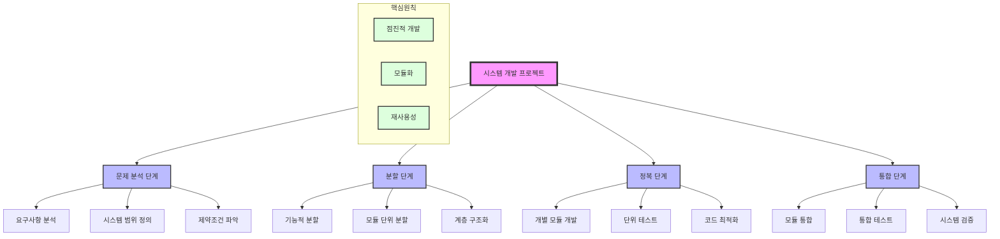

# 구조적 방법론: Divide & Conquer를 활용한 시스템 개발

<!-- mtoc-start -->

- [정의 및 개념](#정의-및-개념)
- [주요 특징](#주요-특징)
- [구조적 방법론 절차](#구조적-방법론-절차)
- [Divide and Conquer 시스템 개발 방법론](#divide-and-conquer-시스템-개발-방법론)
  - [1. 문제 분석 단계](#1-문제-분석-단계)
  - [2. 분할 단계](#2-분할-단계)
  - [3. 정복 단계](#3-정복-단계)
  - [4. 통합 단계](#4-통합-단계)
- [활용 사례](#활용-사례)
- [기대 효과 및 필요성](#기대-효과-및-필요성)
- [마무리](#마무리)
- [Keywords](#keywords)

<!-- mtoc-end -->

구조적 방법론은 전체 시스템을 기능에 따라 분할하고 개발한 후 이를 통합하는 Divide & Conquer 방식의 개발 방법론이다. 이 접근법은 시스템을 체계적으로 구성하고 유지보수성을 높이는 데 유용하다.

## 정의 및 개념

- 구조적 방법론: 기능을 기준으로 시스템을 분할하고, 이를 계층적으로 설계 및 개발하는 소프트웨어 개발 방법론
- 원리:
  - **추상화**: 문제를 이해하고 개념화하여 핵심 요소를 도출
  - **구조화**: 기능을 계층적으로 분류하여 체계적으로 설계
  - **모듈화**: Divide & Conquer 방식으로 시스템을 독립적인 모듈로 나눔
  - **단계적 상세화**: Top-Down 방식으로 점진적으로 구체화하며 개발

## 주요 특징

1. **계층적 설계**: 상위 수준에서 개념을 정의한 후 점진적으로 세부 구현
2. **기능 기반 분할**: 시스템을 논리적인 기능 단위로 나누어 개발
3. **모듈 독립성 강화**: 각 모듈을 독립적으로 개발하고 통합하여 유지보수 용이
4. **Top-Down 접근법**: 큰 개념에서 세부 사항으로 구체화하는 방식
5. **재사용성 증가**: 모듈 단위 개발을 통해 코드의 재사용성 향상

## 구조적 방법론 절차

시스템을 체계적으로 분할하여 점진적으로 개발하고, 최종적으로 통합하는 방식.

## Divide and Conquer 시스템 개발 방법론

### 1. 문제 분석 단계

- 시스템의 요구사항을 명확히 정의하고 범위를 설정
- 기술적, 비즈니스적 제약조건을 파악
- 전체 문제의 특성과 해결 방향 수립

### 2. 분할 단계

- 큰 문제를 관리 가능한 작은 단위로 분할
- 기능적 책임에 따른 모듈화 진행
- 계층 구조를 통한 의존성 관리

### 3. 정복 단계

- 분할된 각 모듈을 독립적으로 개발
- 단위 테스트를 통한 품질 확보
- 개별 모듈 단위의 최적화 수행

### 4. 통합 단계

- 개발된 모듈들을 단계적으로 통합
- 통합 테스트를 통한 상호작용 검증
- 전체 시스템 관점의 검증 수행

> 핵심 원칙은 점진적 개발, 모듈화, 재사용성. \
> 각 단계는 독립적으로 수행되면서도 유기적으로 연결되어 전체 시스템의 품질을 보장.

## 활용 사례

- **대규모 소프트웨어 프로젝트**: 기능별로 나누어 병렬 개발 후 통합하는 방식
- **기업용 정보 시스템**: 부서별 기능을 독립적으로 개발하고 전체 시스템과 연동
- **임베디드 시스템 개발**: 기능 모듈별 개발 후 전체 시스템에 적용

## 기대 효과 및 필요성

- 체계적인 개발을 통해 유지보수성을 향상
- 논리적 구조를 기반으로 설계하여 복잡도를 줄임
- 모듈화된 설계를 통해 확장성 및 재사용성 증가
- 기능 기반 분할로 개발 효율성 극대화

## 마무리

구조적 방법론은 체계적이고 논리적인 접근 방식을 통해 소프트웨어 개발의 효율성을 높이는 중요한 기법이다. Divide & Conquer 방식을 적용하여 복잡한 시스템을 기능적으로 분할하고, 이를 모듈화하여 개발하는 것은 유지보수성과 확장성을 고려한 효과적인 방법이다.

## Keywords

Structured Methodology, Divide & Conquer, 소프트웨어 개발, 기능 분할, 계층적 설계, 모듈화, 단계적 상세화, Top-Down 설계, 시스템 통합, 유지보수성
