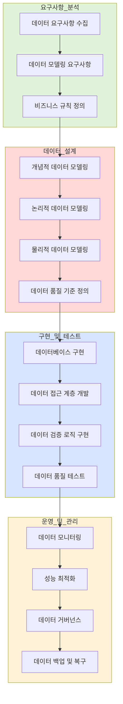

# 정보공학방법론: 데이터 중심의 개발 접근법

<!-- mtoc-start -->

- [정의 및 개념](#정의-및-개념)
- [주요 특징](#주요-특징)
- [절차](#절차)
- [데이터 중심 개발 방법론 상세 절차](#데이터-중심-개발-방법론-상세-절차)
  - [1. 데이터 중심 개발의 4대 핵심 단계:](#1-데이터-중심-개발의-4대-핵심-단계)
  - [2. 주요 특징:](#2-주요-특징)
  - [3. 장점:](#3-장점)
- [활용 사례](#활용-사례)
- [기대 효과 및 필요성](#기대-효과-및-필요성)
- [마무리](#마무리)
- [Keywords](#keywords)

<!-- mtoc-end -->

정보공학방법론(Information Engineering Methodology)은 기업의 핵심 영역을 분석 및 설계하고, 정형화된 기법들을 통합 적용하는 데이터 중심의 소프트웨어 개발 방법론이다. 프로세스와 데이터를 분리하여 접근하며, 기업의 경영 전략을 효과적으로 지원하는 데 초점을 맞춘다.

## 정의 및 개념

- 정보공학방법론: 기업의 핵심 데이터를 중심으로 분석, 설계, 개발하는 데이터 중심 개발 방법론
- 특징:
  - **기업 중심**: 기업의 경영 전략을 효과적으로 지원
  - **데이터 중심**: 프로세스와 데이터를 분리하여 독립적으로 설계
  - **ISP 중심**: 기업의 경쟁 우위를 달성하기 위한 정보 전략 계획(ISP) 기반
  - **공학적 접근**: CASE Tool 활용, 모듈화 적용 등 체계적인 개발 기법 적용

## 주요 특징

1. **데이터 중심 설계**: 데이터와 프로세스를 독립적으로 분석하고 관리
2. **기업 경영 전략과 연계**: 정보 시스템이 기업 전략을 지원하도록 설계
3. **정형화된 절차 적용**: 단계별 명확한 절차에 따라 개발 진행
4. **CASE Tool 활용**: 개발의 자동화 및 효율성을 위한 도구 사용
5. **모듈화된 접근 방식**: 시스템을 구성 요소 단위로 분할하여 유지보수성 향상

## 절차

이 모델은 기업의 정보 전략을 수립한 후, 업무 영역을 분석하고 시스템을 설계 및 구축하는 순서로 진행된다.

## 데이터 중심 개발 방법론 상세 절차

### 1. 데이터 중심 개발의 4대 핵심 단계:

- 요구사항 분석: 데이터 관련 요구사항을 수집하고 비즈니스 규칙을 정의
- 데이터 설계: 개념적/논리적/물리적 데이터 모델링을 순차적으로 수행
- 구현 및 테스트: 데이터베이스 구현부터 품질 테스트까지 실제 개발 수행
- 운영 및 관리: 지속적인 모니터링과 최적화를 통한 데이터 관리

### 2. 주요 특징:

- 데이터 품질이 핵심 고려사항
- 단계별 산출물이 다음 단계의 입력으로 사용됨
- 비즈니스 규칙이 데이터 모델링의 기초가 됨
- 지속적인 데이터 거버넌스 강조

### 3. 장점:

- 데이터 일관성 보장
- 품질 관리 용이
- 확장성과 유지보수성 향상
- 체계적인 데이터 관리 가능

## 활용 사례

- **대규모 기업 시스템 개발**: ERP, CRM 등 기업 정보 시스템 구축 시 활용
- **정부 및 공공기관 IT 프로젝트**: 데이터 중심의 체계적인 정보 시스템 개발
- **금융 및 제조업**: 데이터 기반의 업무 프로세스 최적화 및 정보 시스템 연계

## 기대 효과 및 필요성

- 기업의 전략적 목표를 효과적으로 지원하는 정보 시스템 개발
- 데이터 중심의 접근 방식으로 시스템의 일관성과 유지보수성 강화
- 정형화된 절차를 통해 개발 효율성을 극대화
- CASE Tool 활용으로 개발 자동화 및 품질 향상

## 마무리

정보공학방법론은 데이터 중심으로 기업 정보 시스템을 설계하고 구축하는 체계적인 접근 방식이다. 기업 경영 전략을 지원하고, 효율적인 데이터 관리를 가능하게 하는 이 방법론은 대규모 정보 시스템 개발에서 중요한 역할을 한다.

## Keywords

Information Engineering Methodology, 정보공학방법론, 데이터 중심 개발, 정보 전략 계획, ISP, BAA, BSD, SC, CASE Tool, 기업 정보 시스템
