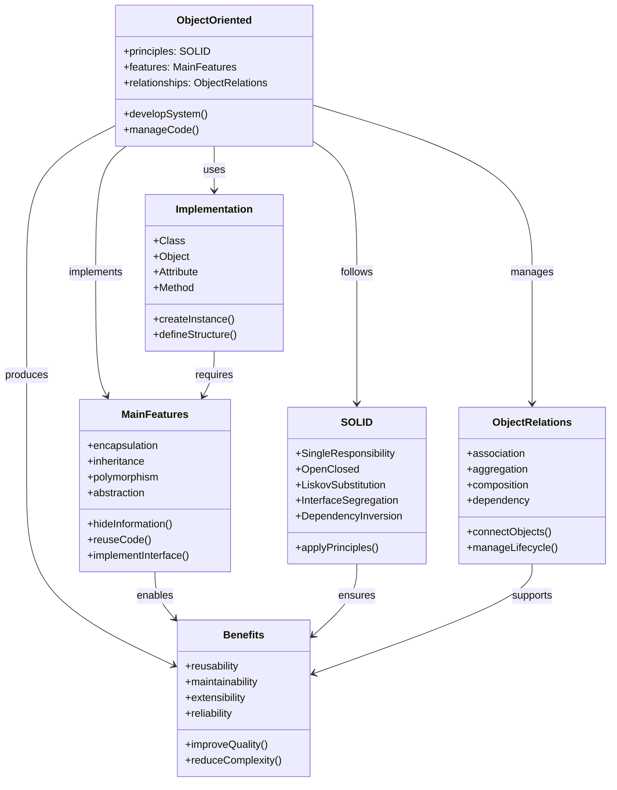

# 객체지향방법론: 실세계와 유사한 소프트웨어 개발 접근법

<!-- mtoc-start -->

- [정의 및 개념](#정의-및-개념)
- [주요 특징](#주요-특징)
- [절차](#절차)
- [객체지향 방법론의 구조와 관계도](#객체지향-방법론의-구조와-관계도)
  - [1. 중심 개념(ObjectOriented)](#1-중심-개념objectoriented)
  - [2. 주요 특성(MainFeatures)](#2-주요-특성mainfeatures)
  - [3. SOLID 원칙](#3-solid-원칙)
  - [4. 객체 관계(ObjectRelations)](#4-객체-관계objectrelations)
  - [5. 구현(Implementation)](#5-구현implementation)
  - [6. 이점(Benefits)](#6-이점benefits)
- [객체지향 방법론의 종류](#객체지향-방법론의-종류)
  - [1. OOSE (Object-Oriented Software Engineering) - Jacobson](#1-oose-object-oriented-software-engineering---jacobson)
  - [2. OOD (Object-Oriented Design) - Booch](#2-ood-object-oriented-design---booch)
  - [3. OMT (Object Modeling Technology) - Rumbaugh](#3-omt-object-modeling-technology---rumbaugh)
- [활용 사례](#활용-사례)
- [기대 효과 및 필요성](#기대-효과-및-필요성)
- [마무리](#마무리)
- [Keywords](#keywords)

<!-- mtoc-end -->

객체지향방법론(Object-Oriented Methodology)은 실세계의 개념을 소프트웨어 개발에 반영하여 보다 자연스럽고 효율적인 시스템을 구축하는 방법이다. 이 방법론은 소프트웨어 개발 생명주기(SDLC)의 전 과정에서 객체지향 개념을 일관되게 적용하여 유지보수성과 재사용성을 극대화한다.

## 정의 및 개념

- 객체지향방법론: 객체지향 개념을 기반으로 소프트웨어 개발의 전 과정(SDLC)을 일관된 모델로 수행하는 방법론
- 특징:
  - **모형의 적합성**: 실세계 개념을 모델링하여 직관적이고 이해하기 쉬운 시스템 설계 가능
  - **재사용 용이**: 객체 및 클래스의 재사용성을 높여 개발 생산성 향상
  - **Time to Market**: 개발 시간을 단축하고 시장 출시 속도를 향상
  - **설계와 프로그래밍 매핑**: 설계 모델과 구현 코드 간의 자연스러운 연결

## 주요 특징

1. **실세계 모델링**: 객체지향 개념(클래스, 상속, 다형성 등)을 활용하여 실세계 개념을 소프트웨어에 반영
2. **일관된 설계 접근**: 분석, 설계, 구현, 테스트 등 모든 단계에서 객체지향 개념 유지
3. **재사용성과 확장성**: 모듈화된 설계를 통해 코드 재사용 및 유지보수 용이
4. **소프트웨어 품질 향상**: 코드 중복을 줄이고 구조적으로 정리된 아키텍처 제공
5. **개발 생산성 향상**: 기존 객체 및 설계를 활용하여 개발 속도를 단축

## 절차

> 객체지향 개념을 바탕으로 요구사항 분석에서부터 배포까지 일관되게 적용.

## 객체지향 방법론의 구조와 관계도

### 1. 중심 개념(ObjectOriented)

- 핵심 기능과 원칙들을 통합적으로 관리
- 시스템 개발과 코드 관리의 중심축 역할

### 2. 주요 특성(MainFeatures)

- 캡슐화, 상속성, 다형성, 추상화의 구현
- 정보 은닉과 코드 재사용 메커니즘 제공

### 3. SOLID 원칙

- 다섯 가지 핵심 설계 원칙을 체계화
- 견고하고 유연한 시스템 설계 지원

### 4. 객체 관계(ObjectRelations)

- 다양한 객체 간 관계 유형 정의
- 객체 생명주기와 상호작용 관리

### 5. 구현(Implementation)

- 클래스와 객체의 실제 구현 구조
- 속성과 메서드를 통한 기능 구현

### 6. 이점(Benefits)

- 재사용성, 유지보수성, 확장성, 신뢰성 향상
- 전반적인 품질 개선과 복잡성 감소

## 객체지향 방법론의 종류

### 1. OOSE (Object-Oriented Software Engineering) - Jacobson

- **특징**: Use Case 기반 접근 방식
- **초점**: 기능적 요구사항 중심의 분석 및 설계
- **적용 사례**: 사용자 중심 시스템, UI/UX 설계

### 2. OOD (Object-Oriented Design) - Booch

- **특징**: 설계 문서화 강조 (디자인 부분만 존재)
- **초점**: 소프트웨어 구조 및 디자인 패턴 적용
- **적용 사례**: 복잡한 소프트웨어 아키텍처 설계

### 3. OMT (Object Modeling Technology) - Rumbaugh

- **특징**: 객체모델링, 동적모델링, 제어모델링의 세 가지 측면 고려
- **초점**: 객체지향 분석 → 시스템 설계 → 객체 설계/구현
- **적용 사례**: 대규모 시스템, 엔터프라이즈 애플리케이션

## 활용 사례

- **대규모 정보 시스템**: ERP, CRM 등 엔터프라이즈 애플리케이션 개발
- **게임 개발**: 객체 간 상호작용이 중요한 게임 로직 개발
- **임베디드 시스템**: 하드웨어와 소프트웨어 간 인터페이스가 필요한 시스템
- **웹 애플리케이션**: 재사용성과 유지보수성을 높이기 위한 객체지향 기반 웹 개발

## 기대 효과 및 필요성

- 유지보수성과 확장성이 뛰어난 소프트웨어 개발 가능
- 코드의 재사용성 증가로 개발 비용 절감
- 소프트웨어의 품질 향상 및 개발 시간 단축
- 실세계 개념을 직접 반영하여 직관적인 시스템 구축 가능

## 마무리

객체지향방법론은 소프트웨어 개발의 효율성을 극대화하고 유지보수성을 향상시키는 중요한 접근법이다. 실세계 개념을 기반으로 시스템을 설계하고 구현하는 방식은 복잡한 소프트웨어 개발에서 특히 유용하다. 이를 통해 기업은 보다 안정적이고 확장 가능한 소프트웨어를 개발할 수 있다.

## Keywords

Object-Oriented Methodology, 객체지향방법론, OOSE, OOD, OMT, 객체지향 분석, 객체지향 설계, 객체지향 프로그래밍, 소프트웨어 재사용성, 소프트웨어 개발 생명주기
