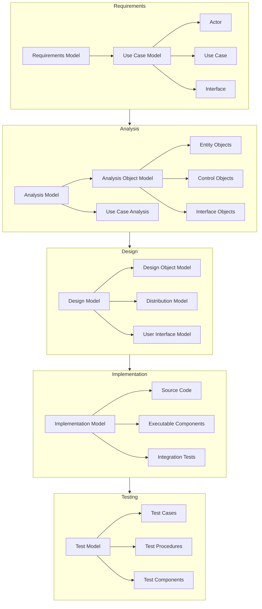

# OOSE (Object-Oriented Software Engineering) - Jacobson

<!-- mtoc-start -->

- [정의 및 개념](#정의-및-개념)
- [주요 특징](#주요-특징)
- [OOSE의 개발 절차](#oose의-개발-절차)
- [OOSE Process and Components](#oose-process-and-components)
  - [1. **프로세스 중심점**](#1-프로세스-중심점)
  - [2. **주요 모델**](#2-주요-모델)
  - [3. **핵심 특징**](#3-핵심-특징)
  - [4. **개발 프로세스**](#4-개발-프로세스)
  - [5. **장점**](#5-장점)
- [활용 사례](#활용-사례)
- [기대 효과 및 필요성](#기대-효과-및-필요성)
- [마무리](#마무리)
- [Keywords](#keywords)

<!-- mtoc-end -->

객체지향 소프트웨어 엔지니어링(Object-Oriented Software Engineering, OOSE)은 Ivar Jacobson에 의해 개발된 객체지향 소프트웨어 개발 방법론으로, 객체지향 개념과 유스케이스(Use Case)를 기반으로 시스템을 분석하고 설계하는 접근 방식이다. 이는 소프트웨어 개발의 모든 과정에서 객체지향 개념을 일관되게 적용하여 개발의 효율성과 유지보수성을 높이는 데 중점을 둔다.

## 정의 및 개념

- **OOSE(Object-Oriented Software Engineering)**: 유스케이스를 중심으로 객체지향 분석 및 설계를 수행하는 소프트웨어 개발 방법론
- **주요 개념**:
  - **유스케이스(Use Case)**: 시스템이 사용자와 상호작용하는 방식을 정의하는 모델
  - **객체 모델(Object Model)**: 시스템을 객체와 그 관계로 표현
  - **동적 모델(Dynamic Model)**: 객체 간의 상호작용을 시퀀스 다이어그램 등으로 표현
  - **기능 모델(Functional Model)**: 데이터 흐름 및 시스템의 기능을 정의

## 주요 특징

1. **유스케이스 중심 개발**: 사용자 요구사항을 유스케이스로 정의하고 이를 기반으로 시스템 설계
2. **객체지향 개념의 일관된 적용**: 분석, 설계, 구현의 전 과정에서 객체지향 원칙 활용
3. **확장성과 재사용성 향상**: 객체 기반 설계로 모듈화 및 재사용 가능
4. **시스템의 사용자 관점 반영**: 사용자의 요구와 기대를 직접 설계에 반영
5. **구조화된 개발 절차**: 정형화된 접근 방식을 통해 체계적인 소프트웨어 개발 가능

## OOSE의 개발 절차

> 시스템을 사용자 중심으로 정의하고, 객체지향 개념을 활용하여 효과적으로 구현.

## OOSE Process and Components

### 1. **프로세스 중심점**

- 유스케이스 기반 개발 방법론
- 반복적이고 점증적인 개발 프로세스
- 객체지향 기술을 전체 개발 생명주기에 적용

### 2. **주요 모델**

- 요구사항 모델: 유스케이스 모델을 통해 시스템 요구사항 정의
- 분석 모델: 시스템의 논리적 구조를 객체로 표현
- 설계 모델: 실제 구현을 위한 상세 설계
- 구현 모델: 실행 가능한 컴포넌트 개발
- 테스트 모델: 품질 검증

### 3. **핵심 특징**

- 객체 분류: Entity(실체), Control(제어), Interface(경계) 객체로 구분
- 아키텍처 중심: 견고한 아키텍처 기반의 개발 강조
- 추적성: 요구사항부터 구현까지 일관된 추적 가능

### 4. **개발 프로세스**

- 요구사항 분석 → 분석 → 설계 → 구현 → 테스트의 반복적 수행
- 각 단계마다 객체지향 개념 적용
- 점진적인 세부화와 정제 과정

### 5. **장점**

- 사용자 중심의 개발 방법론
- 재사용성과 확장성이 높은 설계 가능
- 체계적인 품질 관리
- 명확한 의사소통 도구 제공

Jacobson의 OOSE는 객체지향 개발의 전체 생명주기를 다루는 체계적인 방법론으로, 특히 유스케이스를 통한 요구사항 분석과 객체 모델링에 중점을 둡니다. 이는 현대 소프트웨어 개발에서도 여전히 중요한 기초를 제공하고 있습니다.

## 활용 사례

- **대규모 엔터프라이즈 애플리케이션**: 복잡한 업무 프로세스를 유스케이스 기반으로 정의하여 설계
- **웹 및 모바일 애플리케이션 개발**: 사용자 중심의 기능 정의 및 시스템 설계
- **게임 개발**: 캐릭터, 이벤트 등의 객체 간 상호작용 모델링
- **임베디드 시스템**: 하드웨어와 소프트웨어 간의 인터페이스 설계

## 기대 효과 및 필요성

- 사용자 중심의 소프트웨어 개발로 요구사항 반영 용이
- 객체 재사용을 통한 개발 생산성 및 유지보수성 향상
- 복잡한 시스템을 구조적으로 설계하여 확장성과 안정성 확보
- 소프트웨어 개발 과정의 체계화로 품질 향상

## 마무리

OOSE는 객체지향 개념을 기반으로 유스케이스 중심의 개발을 수행하는 강력한 방법론이다. 사용자 요구를 효과적으로 반영하고, 재사용성과 확장성을 높여 소프트웨어 개발의 효율성을 극대화할 수 있다. 특히 대규모 시스템이나 복잡한 비즈니스 로직을 포함하는 프로젝트에서 유용하게 활용된다.

## Keywords

OOSE, Object-Oriented Software Engineering, 객체지향 소프트웨어 엔지니어링, 유스케이스, 객체 모델링, 동적 모델링, 기능 모델링, 소프트웨어 개발 방법론, 재사용성, 확장성
