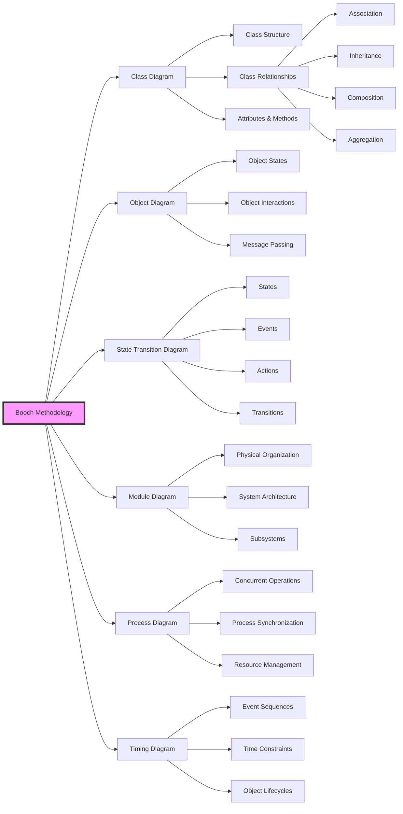

# OOD (Object-Oriented Design) - Booch

<!-- mtoc-start -->

- [정의 및 개념](#정의-및-개념)
- [주요 특징](#주요-특징)
- [OOD 개발 절차](#ood-개발-절차)
- [OOD 방법론의 핵심 요소](#ood-방법론의-핵심-요소)
  - [1. 객체 모델링 (Object Modeling)](#1-객체-모델링-object-modeling)
  - [2. 클래스 설계 (Class Design)](#2-클래스-설계-class-design)
  - [3. 모듈 설계 (Module Design)](#3-모듈-설계-module-design)
  - [4. 인터페이스 정의 (Interface Definition)](#4-인터페이스-정의-interface-definition)
  - [5. 설계 패턴 활용](#5-설계-패턴-활용)
- [OOD 방법론 핵심 구조](#ood-방법론-핵심-구조)
  - [1. 핵심 다이어그램 구성](#1-핵심-다이어그램-구성)
  - [2. 주요 특징](#2-주요-특징)
  - [3. 장점](#3-장점)
  - [4. 프로세스](#4-프로세스)
- [활용 사례](#활용-사례)
- [기대 효과 및 필요성](#기대-효과-및-필요성)
- [마무리](#마무리)
- [Keywords](#keywords)

<!-- mtoc-end -->

객체지향 설계(Object-Oriented Design, OOD)는 객체지향 개념을 활용하여 소프트웨어의 구조와 설계를 체계적으로 문서화하는 방법론이다. Grady Booch에 의해 개발된 OOD 방법론은 소프트웨어 설계를 문서화하고 디자인 패턴을 강조하며, 유지보수성과 확장성을 고려한 아키텍처를 구축하는 데 중점을 둔다.

## 정의 및 개념

- **OOD (Object-Oriented Design)**: 객체지향 개념을 기반으로 소프트웨어 시스템을 구조화하고 설계하는 방법론
- **주요 개념**:
  - **설계 문서화 강조**: 소프트웨어 디자인 부분에 초점을 맞추어 체계적으로 문서화
  - **객체 모델링(Object Modeling)**: 시스템을 객체와 객체 간의 관계로 정의
  - **클래스 및 모듈 구조화**: 코드의 재사용성을 높이고 유지보수를 용이하게 함
  - **설계 패턴 적용**: 효과적인 디자인을 위해 다양한 패턴을 활용

## 주요 특징

1. **설계 문서화 중심**: 소프트웨어 설계 과정을 상세하게 문서화하여 체계적인 개발 가능
2. **객체 중심 접근**: 객체 간 관계와 역할을 명확하게 정의하여 구조화
3. **설계 패턴 활용**: 효율적이고 유지보수 가능한 시스템 구축을 위해 디자인 패턴 적용
4. **추상화 및 캡슐화**: 코드의 복잡도를 줄이고 재사용성을 높이는 원칙 적용
5. **모듈화 및 계층화**: 시스템을 작은 단위로 나누어 개발 및 유지보수 용이

## OOD 개발 절차

소프트웨어 설계를 체계적으로 정리하고, 유지보수성과 확장성을 고려하여 개발.

## OOD 방법론의 핵심 요소

### 1. 객체 모델링 (Object Modeling)

- 시스템을 구성하는 객체와 객체 간 관계를 도출
- 다이어그램을 활용하여 구조적 설계 수행

### 2. 클래스 설계 (Class Design)

- 객체를 클래스로 정의하고 속성 및 동작을 명확히 설계
- 상속, 다형성, 캡슐화 등의 객체지향 개념 적용

### 3. 모듈 설계 (Module Design)

- 소프트웨어를 기능별로 분리하여 유지보수성을 향상
- 독립적인 모듈 설계를 통해 확장성 확보

### 4. 인터페이스 정의 (Interface Definition)

- 시스템 내 모듈 및 객체 간의 상호작용을 정의
- API 및 메시지 교환 방식 설정

### 5. 설계 패턴 활용

- 싱글턴 패턴, 팩토리 패턴, MVC 패턴 등 다양한 디자인 패턴 적용
- 재사용성과 유지보수성을 고려한 최적의 구조 설계

## OOD 방법론 핵심 구조

### 1. 핵심 다이어그램 구성

- Class Diagram: 시스템의 정적 구조를 표현
- Object Diagram: 런타임 시의 객체 관계를 표현
- State Transition Diagram: 객체의 동적 행위를 표현
- Module Diagram: 시스템의 물리적 구조화를 표현
- Process Diagram: 병행 처리와 동기화를 표현
- Timing Diagram: 시간 제약과 객체 수명주기를 표현

### 2. 주요 특징

- 점진적이고 반복적인 개발 프로세스 지원
- 다양한 관점에서 시스템을 모델링
- 객체 간의 관계를 상세히 표현 (상속, 집합, 연관 등)
- 동적/정적 측면을 모두 고려한 완성도 높은 설계 방법론

### 3. 장점

- 상세한 표기법으로 정확한 설계 가능
- 다양한 다이어그램으로 시스템을 종합적으로 이해
- 객체지향 개념을 충실히 반영
- 대규모 시스템 설계에 적합

### 4. 프로세스

- 요구사항 분석
- 클래스와 객체 식별
- 관계 정의
- 인터페이스 설계
- 구현 세부사항 정의
- 반복적 개선

Booch 방법론은 객체지향 설계의 기초가 되는 방법론으로, 현대의 UML(Unified Modeling Language)에도 큰 영향을 미쳤습니다.

## 활용 사례

- **대규모 소프트웨어 아키텍처 설계**: 복잡한 시스템을 모듈화하여 개발 및 유지보수 용이
- **엔터프라이즈 애플리케이션 개발**: 기업 시스템의 확장성과 안정성을 고려한 설계 적용
- **임베디드 시스템 개발**: 제한된 환경에서 효율적으로 동작하는 소프트웨어 설계
- **게임 개발**: 객체 간 상호작용을 설계하고, 디자인 패턴을 적용하여 유지보수성 확보

## 기대 효과 및 필요성

- 체계적인 설계를 통해 유지보수성과 확장성 강화
- 코드 재사용을 통한 개발 생산성 향상
- 소프트웨어 품질을 개선하고 설계 표준화 가능
- 설계 문서화를 통해 개발자 간 협업 용이

## 마무리

OOD(Object-Oriented Design)는 객체지향 개념을 기반으로 소프트웨어 설계를 체계적으로 수행하는 방법론이다. Booch의 방법론은 설계 문서화를 강조하며, 재사용성과 유지보수성을 고려한 소프트웨어 아키텍처 구축을 가능하게 한다. 다양한 설계 패턴과 계층적 모듈 설계를 활용하여, 효과적이고 확장 가능한 시스템을 개발할 수 있다.

## Keywords

Object-Oriented Design, OOD, 객체지향 설계, 설계 문서화, Booch, 객체 모델링, 클래스 설계, 모듈 설계, 디자인 패턴, 소프트웨어 아키텍처
