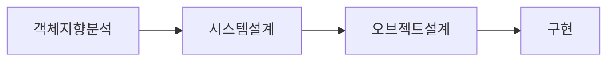
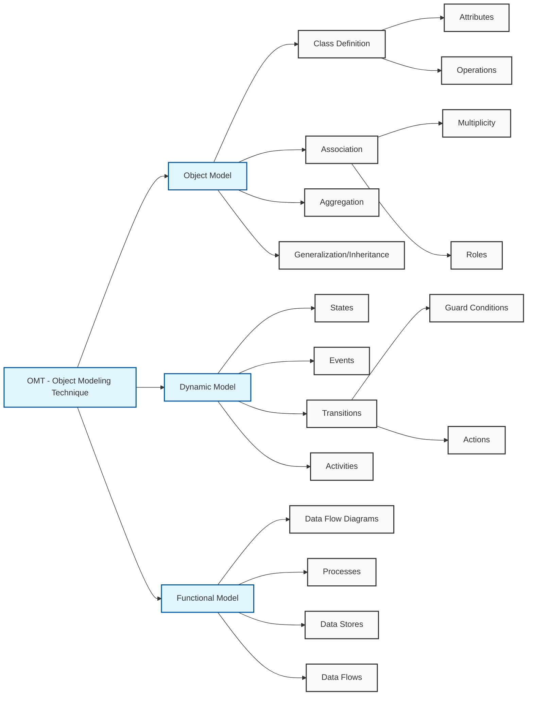

# OMT (Object Modeling Technology) - Rumbaugh

<!-- mtoc-start -->

- [정의 및 개념](#정의-및-개념)
- [주요 특징](#주요-특징)
- [OMT 개발 절차](#omt-개발-절차)
- [OMT 방법론의 주요 구성 요소](#omt-방법론의-주요-구성-요소)
  - [1. 객체 모델링 (Object Modeling)](#1-객체-모델링-object-modeling)
  - [2. 동적 모델링 (Dynamic Modeling)](#2-동적-모델링-dynamic-modeling)
  - [3. 제어 모델링 (Control Modeling)](#3-제어-모델링-control-modeling)
- [OMT 방법론 핵심 요소 구성도](#omt-방법론-핵심-요소-구성도)
  - [1. 세 가지 주요 모델](#1-세-가지-주요-모델)
  - [2. 주요 특징](#2-주요-특징)
  - [3. 장점](#3-장점)
- [활용 사례](#활용-사례)
- [기대 효과 및 필요성](#기대-효과-및-필요성)
- [마무리](#마무리)
- [Keywords](#keywords)

<!-- mtoc-end -->

OMT(Object Modeling Technology)는 James Rumbaugh가 개발한 객체지향 분석 및 설계 방법론으로, 객체 모델링을 기반으로 시스템을 분석, 설계, 구현하는 체계적인 접근법이다. OMT는 객체 모델(Object Model), 동적 모델(Dynamic Model), 제어 모델(Functional Model)의 세 가지 측면에서 소프트웨어를 모델링하여, 복잡한 시스템을 효과적으로 설계하고 개발하는 데 초점을 둔다.

## 정의 및 개념

- **OMT(Object Modeling Technology)**: 객체 모델링 기법을 기반으로 소프트웨어를 분석, 설계 및 구현하는 객체지향 방법론
- **주요 개념**:
  - **객체 모델링(Object Modeling)**: 시스템의 정적인 구조를 표현
  - **동적 모델링(Dynamic Modeling)**: 객체 간의 상호작용과 상태 변화를 표현
  - **제어 모델링(Control Modeling)**: 시스템의 이벤트 흐름과 제어 로직을 모델링

## 주요 특징

1. **객체 중심의 분석과 설계**: 시스템을 객체 단위로 분해하여 관리
2. **정적 모델과 동적 모델의 분리**: 구조적 모델과 행위 모델을 별도로 정의하여 설계 명확화
3. **제어 흐름 모델링 지원**: 이벤트 중심 설계를 통해 복잡한 흐름을 효과적으로 표현
4. **시각적 표현 강조**: 다양한 다이어그램을 활용하여 직관적인 모델링 가능
5. **단계적 개발 지원**: 분석, 설계, 구현의 전 단계에서 일관된 객체 모델 유지

## OMT 개발 절차

이 절차를 통해 시스템을 구조적으로 설계하고, 객체지향 개념을 활용하여 효과적으로 구현할 수 있다.

## OMT 방법론의 주요 구성 요소

### 1. 객체 모델링 (Object Modeling)

- 시스템의 정적인 구조를 표현
- 객체, 클래스, 속성, 관계, 상속 등을 정의
- ER(Entity-Relationship) 다이어그램과 유사한 구조

### 2. 동적 모델링 (Dynamic Modeling)

- 객체 간의 상태 변화 및 상호작용 모델링
- 상태 다이어그램(State Diagram), 이벤트 흐름을 정의
- 시간에 따른 객체 동작을 표현

### 3. 제어 모델링 (Control Modeling)

- 이벤트 흐름과 시스템 제어 로직 정의
- 프로세스 흐름을 다이어그램으로 시각화
- 복잡한 제어 구조를 체계적으로 정리

## OMT 방법론 핵심 요소 구성도

### 1. 세 가지 주요 모델

- Object Model (객체 모델): 시스템의 정적 구조를 표현

  - 클래스, 속성, 연관관계, 집합관계, 일반화(상속) 관계 정의
  - 실제 세계의 객체들을 추상화하여 표현

- Dynamic Model (동적 모델): 시스템의 시간적 행위와 제어 흐름을 표현

  - 상태 다이어그램을 사용하여 객체의 상태 변화를 표현
  - 이벤트, 상태 전이, 활동들을 정의

- Functional Model (기능적 모델): 시스템의 데이터 변환을 표현
  - 데이터 흐름 다이어그램(DFD)을 사용
  - 프로세스, 데이터 저장소, 데이터 흐름을 정의

### 2. 주요 특징

- 객체지향 분석/설계를 위한 체계적인 방법론 제공
- 세 가지 모델이 상호 보완적으로 시스템을 완전하게 표현
- 현실 세계의 문제를 객체지향적 관점에서 모델링
- UML의 기초가 되는 중요한 방법론

### 3. 장점

- 명확한 표기법으로 의사소통 용이
- 각 모델이 시스템의 서로 다른 관점을 표현
- 단계적 세분화를 통한 복잡성 관리
- 재사용성과 확장성이 높은 설계 가능

## 활용 사례

- **대규모 정보 시스템 개발**: 복잡한 엔터프라이즈 애플리케이션 설계
- **실시간 시스템**: 임베디드 시스템, 제어 시스템 설계
- **네트워크 및 분산 시스템**: 객체 간 메시지 및 상태 관리가 중요한 시스템
- **금융 및 제조업 시스템**: 복잡한 비즈니스 로직을 갖춘 애플리케이션

## 기대 효과 및 필요성

- **체계적인 분석 및 설계 지원**: 소프트웨어 개발 전 과정에서 일관된 모델 유지
- **시각적 모델링을 통한 이해도 향상**: 복잡한 시스템을 쉽게 표현 가능
- **객체 재사용을 통한 생산성 향상**: 기존 객체를 재활용하여 개발 시간 단축
- **유지보수성과 확장성 확보**: 구조적 설계를 통해 시스템 변경에 유연하게 대응 가능

## 마무리

OMT는 객체지향 분석 및 설계를 체계적으로 수행하기 위한 강력한 방법론이다. 객체 모델, 동적 모델, 제어 모델을 활용하여 시스템을 분석하고 설계함으로써, 복잡한 소프트웨어 개발을 효과적으로 수행할 수 있다. 특히, 유지보수성과 확장성이 중요한 대규모 시스템에서 유용하게 적용될 수 있다.

## Keywords

OMT, Object Modeling Technology, 객체 모델링, 동적 모델링, 제어 모델링, 객체지향 설계, 시스템 분석, UML, Rumbaugh, 소프트웨어 아키텍처
