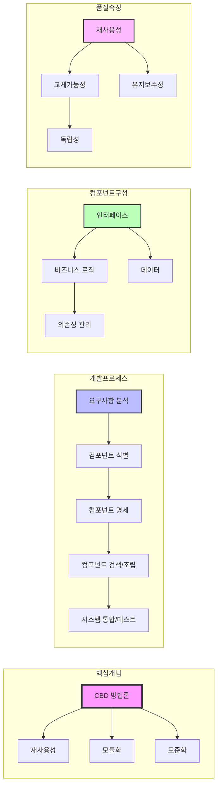

# CBD 방법론: 소프트웨어의 부품과 조립을 통한 개발 방식

<!-- mtoc-start -->

- [정의 및 개념](#정의-및-개념)
- [주요 특징 (재생기관변고)](#주요-특징-재생기관변고)
- [CBD 프로세스 및 구성요소](#cbd-프로세스-및-구성요소)
  - [1. 기본 원리](#1-기본-원리)
  - [2. 주요 특징](#2-주요-특징)
  - [3. 개발 프로세스](#3-개발-프로세스)
  - [4. 장점](#4-장점)
- [CBD 개발 절차](#cbd-개발-절차)
- [활용 사례](#활용-사례)
- [기대 효과 및 필요성](#기대-효과-및-필요성)
- [마무리](#마무리)
- [Keywords](#keywords)

<!-- mtoc-end -->

CBD(Component-Based Development) 방법론은 기 개발된 소프트웨어 컴포넌트를 조립하여 새로운 시스템을 구축하는 방식으로, 소프트웨어 개발의 효율성을 극대화하고 유지보수를 용이하게 하는 접근법이다. 이 방법론은 재사용성을 높여 개발 생산성을 향상시키며, 시스템의 품질을 보장하는 데 중점을 둔다.

## 정의 및 개념

- **CBD(Component-Based Development)**: 기존에 개발된 소프트웨어 컴포넌트를 조립하여 새로운 시스템을 구축하는 소프트웨어 개발 방법론
- **주요 개념**:
  - **컴포넌트(Component)**: 독립적으로 개발된 재사용 가능한 소프트웨어 단위
  - **컴포넌트 조립(Composition)**: 여러 컴포넌트를 결합하여 하나의 시스템을 구성
  - **인터페이스(Interface)**: 컴포넌트 간의 상호작용을 정의하는 표준화된 접점

## 주요 특징 (재생기관변고)

1. **재사용성 (Reusability)**: 기존 컴포넌트를 활용하여 개발 속도를 높이고 비용 절감
2. **생산성 (Productivity)**: 반복 개발을 줄여 소프트웨어 개발 기간 단축
3. **기술집약성 (Technology Intensiveness)**: 최신 기술을 컴포넌트 형태로 모듈화하여 활용 가능
4. **관리 용이성 (Manageability)**: 모듈화된 구조로 시스템 유지보수와 확장이 쉬움
5. **변경 용이성 (Modifiability)**: 특정 기능의 변경이 전체 시스템에 미치는 영향을 최소화
6. **고품질 (High Quality)**: 검증된 컴포넌트를 활용하여 신뢰성과 안정성이 높은 시스템 구축

## CBD 프로세스 및 구성요소

### 1. 기본 원리

- 소프트웨어를 독립적인 컴포넌트 단위로 개발
- 컴포넌트의 조립을 통해 완성된 시스템 구축
- 재사용 가능한 컴포넌트 라이브러리 구축 및 활용

### 2. 주요 특징

- 표준화된 인터페이스를 통한 컴포넌트 간 통신
- 높은 재사용성과 유지보수성
- 개발 시간 및 비용 절감 효과
- 컴포넌트 단위의 품질 관리 가능

### 3. 개발 프로세스

- 요구사항 분석을 통한 컴포넌트 식별
- 컴포넌트 설계 및 명세 작성
- 기존 컴포넌트 검색 또는 신규 개발
- 컴포넌트 조립 및 통합 테스트

### 4. 장점

- 개발 생산성 향상
- 품질 보증 용이
- 시스템 유연성 확보
- 유지보수 비용 절감

## CBD 개발 절차

1. **요구사항 분석**: 필요한 기능을 정의하고, 기존 컴포넌트 활용 가능성을 평가
2. **컴포넌트 선정 및 설계**: 적합한 컴포넌트를 찾거나 신규 개발
3. **컴포넌트 조립 및 통합**: 선정된 컴포넌트를 조합하여 전체 시스템 구축
4. **테스트 및 검증**: 컴포넌트 간의 상호작용 및 시스템 전체의 기능 검증
5. **배포 및 유지보수**: 시스템 운영 후 성능 모니터링 및 추가 변경 관리

## 활용 사례

- **기업용 ERP 시스템**: 다양한 모듈(재무, 회계, 인사 등)을 조합하여 구성
- **웹 애플리케이션 개발**: UI, 데이터 처리, 보안 등 다양한 컴포넌트를 활용한 개발
- **임베디드 시스템**: 하드웨어 및 소프트웨어 모듈을 조합하여 특정 기능 구현
- **클라우드 기반 서비스**: 마이크로서비스 아키텍처와 결합하여 독립적인 기능 개발

## 기대 효과 및 필요성

- 개발 비용 절감 및 기간 단축
- 유지보수 및 확장성 용이
- 코드 중복 최소화로 소프트웨어 품질 향상
- 최신 기술을 손쉽게 적용 가능

## 마무리

CBD 방법론은 기존에 개발된 소프트웨어 컴포넌트를 재사용하여 새로운 시스템을 구축하는 효율적인 개발 방식이다. 모듈화된 구조 덕분에 유지보수성과 확장성이 뛰어나며, 기업 환경 및 대규모 소프트웨어 개발 프로젝트에서 특히 유용하게 적용된다.

## Keywords

CBD, Component-Based Development, 컴포넌트 기반 개발, 소프트웨어 재사용, 생산성 향상, 유지보수성, 모듈화, 소프트웨어 품질, 시스템 통합, 마이크로서비스
