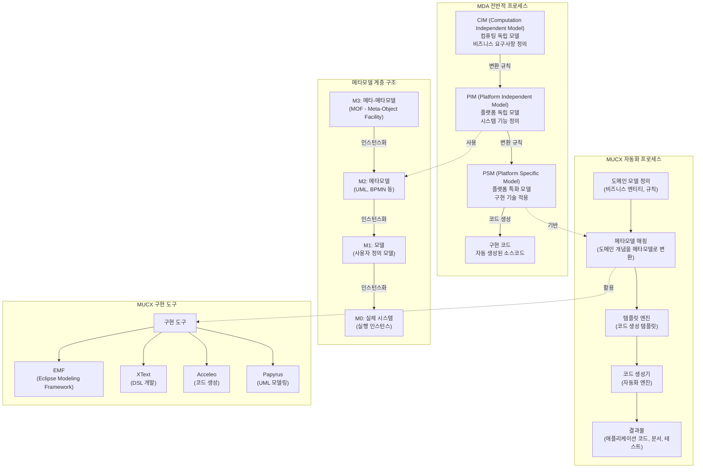

# MDA: 메타모델 기반의 구현 자동화 (MUCX)

<!-- mtoc-start -->

- [정의 및 개념](#정의-및-개념)
- [주요 특징](#주요-특징)
- [핵심 기술](#핵심-기술)
  - [UML](#uml)
  - [MOF (Meta-Object Facility)](#mof-meta-object-facility)
  - [XMI (XML Metadata Interchange)](#xmi-xml-metadata-interchange)
  - [CWM (Common Warehouse Metamodel)](#cwm-common-warehouse-metamodel)
- [MDA 개발 프로세스](#mda-개발-프로세스)
- [MDA 기반 애플리케이션 개발 절차](#mda-기반-애플리케이션-개발-절차)
- [MDA 기반 구축 프로세스](#mda-기반-구축-프로세스)
- [MDD의 모델 변환 방법](#mdd의-모델-변환-방법)
- [MDA: 메타모델 기반의 구현 자동화(MUCX) 메카니즘](#mda-메타모델-기반의-구현-자동화mucx-메카니즘)
  - [1. **모델 변환 프로세스**:](#1-모델-변환-프로세스)
  - [2. **메타모델 계층**:](#2-메타모델-계층)
  - [3. **자동화 프로세스**:](#3-자동화-프로세스)
  - [4. **주요 도구**:](#4-주요-도구)
- [기대 효과 및 필요성](#기대-효과-및-필요성)
- [마무리](#마무리)
- [Keywords](#keywords)

<!-- mtoc-end -->

메타모델 기반의 구현 자동화(MUCX)는 MOF(Meta-Object Facility)를 기반으로 구현환경 독립적인 시스템을 설계하고, 자동화된 구현을 통해 생산성을 향상시키는 아키텍처이다.

## 정의 및 개념

- **MDA(Model-Driven Architecture)**: 모델 중심 개발 방식으로, 플랫폼 독립적인 모델(PIM)과 플랫폼 종속적인 모델(PSM)을 이용하여 시스템을 설계하고 구현하는 방법론.
- **특징**:
  - 구현 자동화: 메타모델을 이용하여 구현 공정을 자동화 (Code Generator)
  - 재사용성 및 이식성 향상
  - UML 2.0 기반으로 설계

## 주요 특징

1. **구현 자동화**: 메타모델을 활용하여 코드 생성 자동화 (Code Generator) 수행.
2. **재사용성 및 이식성 향상**: 다양한 플랫폼에서 모델의 일관성을 유지하며 적용 가능.
3. **UML 2.0 기반**: 시스템을 모델링하고 설계하는 표준 모델링 언어 활용.
4. **MOF 기반 메타모델 구조**: 모델을 저장 및 관리하는 메타-메타모델 역할 수행.
5. **XMI 활용**: 모델을 XML로 변환하여 데이터 교환을 용이하게 처리.

## 핵심 기술

### UML

- 시스템을 모델링하는 표준화된 모델링 언어.

### MOF (Meta-Object Facility)

- 다른 메타모델을 정의하기 위한 메타-메타모델로, 모델 저장소 역할 수행.

### XMI (XML Metadata Interchange)

- MOF 기반 모델을 XML로 매핑하기 위한 표준, XML 기반 데이터 관리에 활용.

### CWM (Common Warehouse Metamodel)

- 데이터 저장소의 표준으로, OLAP 및 데이터 마이닝 모델을 지원하며 데이터 소스, 타겟, 변환을 위한 표준 모델을 제공.

## MDA 개발 프로세스

1. **타겟 플랫폼 식별**
2. **메타모델 식별 및 정의 (CWM 활용)**
3. **매핑 기법 정의 및 구현 (UML 프로파일 활용)**

## MDA 기반 애플리케이션 개발 절차

1. **PIM 모델 작성**
2. **MOF → XMI 매핑 (비즈니스 모델 변환)**
3. **PSM 모델 작성**
4. **애플리케이션 완성**

## MDA 기반 구축 프로세스

1. **CIM (Computation Independent Model)** → 개념적 모델 작성
2. **PIM (Platform Independent Model)** → 플랫폼 독립적인 모델 작성
3. **UML Profile 적용** → 모델 변환
4. **PSM (Platform Specific Model)** → 플랫폼에 맞춘 모델 변환
5. **Code Generation** → 소스코드 자동 생성

## MDD의 모델 변환 방법

- **PIM to PIM**: 개발 단계에서 PIM을 상세화하는 모델 Refinement 과정.
- **PIM to PSM**: 기술 종속적인 정보를 추가하여 모델 변환 수행.
- **PSM to PSM**: 실제 구현 정보 추가하여 최종 PSM 생성 (모델 Refinement).
- **PSM to PIM**: 기존 시스템을 Re-engineering하여 다시 PIM으로 변환.

## MDA: 메타모델 기반의 구현 자동화(MUCX) 메카니즘

### 1. **모델 변환 프로세스**:

- CIM(Computation Independent Model): 비즈니스 요구사항을 컴퓨팅 관점과 독립적으로 정의
- PIM(Platform Independent Model): 특정 플랫폼과 독립적인 시스템 기능 정의
- PSM(Platform Specific Model): 특정 기술 플랫폼에 맞춘 모델 구체화
- 코드: 최종 구현 코드 자동 생성

### 2. **메타모델 계층**:

- M3(메타-메타모델): MOF(Meta-Object Facility) - 메타모델을 정의하는 모델
- M2(메타모델): UML, BPMN 등 모델링 언어 자체
- M1(모델): 실제 애플리케이션의 모델 (클래스 다이어그램 등)
- M0(인스턴스): 실행 시스템의 실제 객체들

### 3. **자동화 프로세스**:

- 도메인 모델 정의 → 메타모델 매핑 → 템플릿 적용 → 코드 생성

### 4. **주요 도구**:

- EMF(Eclipse Modeling Framework): 메타모델 기반 개발 프레임워크
- XText: 도메인 특화 언어(DSL) 개발 도구
- Acceleo: 모델에서 코드 생성 도구
- Papyrus: UML 모델링 도구

이 접근 방식의 가장 큰 장점은 높은 수준의 추상화를 통해 비즈니스 로직에 집중할 수 있고, 반복적인 코드 작성을 자동화하여 개발 생산성을 크게 향상시키며, 일관된 품질의 코드를 생성할 수 있다는 점입니다.

## 기대 효과 및 필요성

- 메타모델을 활용한 구현 과정 자동화.
- 분석/설계 결과의 재사용을 통한 생산성 향상.
- 테스트 비용 절감 및 기능 변화에 대한 신속한 대응.
- 플랫폼 독립적 개발로 인해 다양한 환경에서의 애플리케이션 이식성 증가.

## 마무리

MDA는 모델 중심 개발을 통해 소프트웨어 생산성을 향상시키고 유지보수를 용이하게 만드는 아키텍처이다. MOF, UML, XMI 등의 핵심 기술을 활용하여 구현 자동화를 가능하게 하며, 기존 시스템의 Re-engineering도 지원한다. 이를 통해 IT 프로젝트의 비용 절감과 효율성을 극대화할 수 있다.

## Keywords

MDA, 모델 기반 개발, MOF, XMI, UML 2.0, Code Generation, CWM, PIM, PSM, 자동 코드 생성
