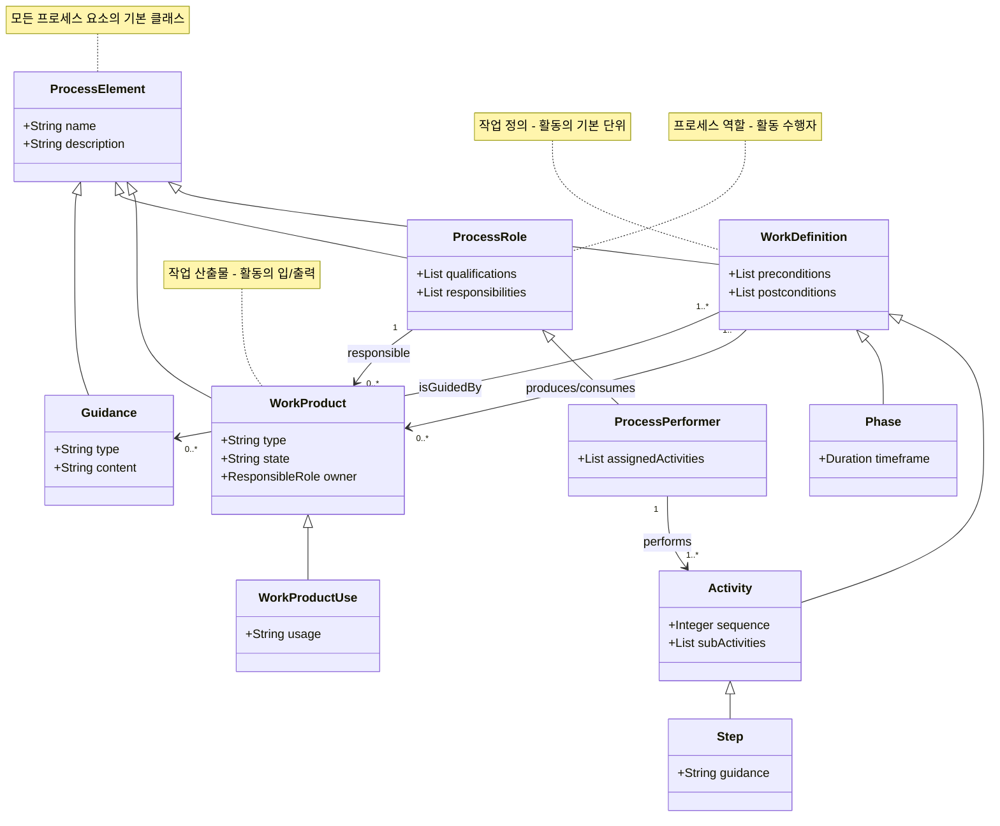
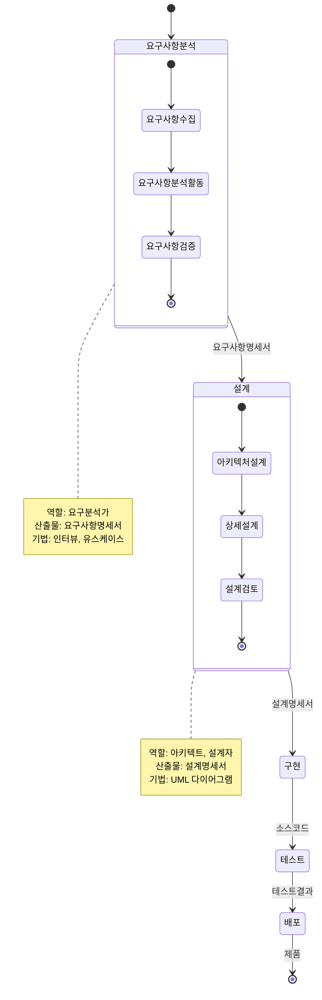

# SPEM: UML을 이용한 프로세스 모델링 표준

<!-- mtoc-start -->

- [정의 및 개념](#정의-및-개념)
- [주요 특징](#주요-특징)
- [SPEM 메타모델 구조](#spem-메타모델-구조)
- [SPEM 프로세스](#spem-프로세스)
  - [1. **목적**:](#1-목적)
  - [2. **주요 구성요소**:](#2-주요-구성요소)
  - [3. **특징**:](#3-특징)
  - [4. **적용 영역**:](#4-적용-영역)
  - [5. **장점**:](#5-장점)
- [활용 사례](#활용-사례)
- [기대 효과 및 필요성](#기대-효과-및-필요성)
- [마무리](#마무리)
- [Keywords](#keywords)

<!-- mtoc-end -->

소프트웨어 개발 프로세스와 관련된 사항(용어, 개념, 관계)을 정의하기 위해 OMG(Object Management Group)에서 개발한 메타모델. UML을 기반으로 프로세스 모델링을 표준화하여 개발 프로세스의 일관성과 효율성을 향상시킨다.

## 정의 및 개념

- **SPEM (Software & Systems Process Engineering Metamodel)**: 소프트웨어 개발 프로세스를 모델링하기 위한 UML 기반 표준 메타모델.
- **목적**: 개발 프로세스를 체계적으로 정의하고, 다양한 프로세스 간 일관성을 유지하며, 재사용 가능한 프로세스 모델을 제공.

## 주요 특징

1. **캡슐화 원리 실현**: 재사용 가능한 프로세스 컴포넌트를 제공하여 효율적인 프로세스 관리 가능.
2. **플러그인 메커니즘**: 프로세스의 유연한 가변성과 확장성을 지원하여 다양한 개발 환경에 적용 가능.
3. **일관된 유지보수**: 다양한 개발 프로세스의 일관성을 제공하여 표준화된 프로세스 유지보수 가능.

## SPEM 메타모델 구조

## SPEM 프로세스

SPEM(Software Process Engineering Metamodel)은 소프트웨어 개발 프로세스를 모델링하기 위한 OMG(Object Management Group)의 표준입니다. UML을 기반으로 하여 소프트웨어 개발 방법론, 프로세스, 기법 등을 정의하고 문서화하는 데 사용.

### 1. **목적**:

- 소프트웨어 개발 프로세스를 표현하기 위한 표준 메타모델 제공
- 프로세스 모델의 재사용성과 교환 가능성 향상

### 2. **주요 구성요소**:

- **WorkDefinition(작업 정의)**: 활동(Activity), 단계(Phase) 등 작업 단위
- **WorkProduct(작업 산출물)**: 활동의 입력과 출력물(문서, 코드, 모델 등)
- **ProcessRole(프로세스 역할)**: 활동을 수행하는 책임자 또는 담당자
- **Guidance(지침)**: 활동 수행 방법, 템플릿, 체크리스트 등

### 3. **특징**:

- UML 프로파일 기반으로 표준 UML 표기법 활용
- 개발 방법론과 프로세스의 분리 지원
- 메타모델을 통한 확장성 제공
- 프로세스 컴포넌트의 재사용 촉진

### 4. **적용 영역**:

- 소프트웨어 개발 방법론 정의
- 조직 프로세스 표준화
- 프로젝트 계획 및 실행
- 프로세스 평가 및 개선

### 5. **장점**:

- 프로세스의 일관된 정의와 문서화
- 조직 간 프로세스 지식 공유 용이
- 자동화 도구와의 통합 지원
- 프로세스 모델의 재사용성 향상

SPEM은 소프트웨어 엔지니어링 프로세스를 구조화하고 표준화함으로써 효율적인 개발 관리와 품질 향상에 기여합니다.

## 활용 사례

- 소프트웨어 개발 방법론 정의 및 개선
- 애자일, RUP, CMMI 등 다양한 프로세스 모델링 및 적용
- 개발 프로세스 문서화 및 표준화

## 기대 효과 및 필요성

- 개발 프로세스의 표준화 및 효율성 향상
- 프로세스 변경 및 확장 용이성 제공
- 유지보수 비용 절감 및 개발 생산성 증가

## 마무리

SPEM은 UML을 활용하여 소프트웨어 개발 프로세스를 표준화하는 강력한 도구이다. 이를 통해 프로세스를 체계적으로 정의하고, 재사용성을 높이며, 유지보수의 일관성을 제공할 수 있다. 다양한 개발 방법론과 결합하여 조직의 생산성을 극대화할 수 있다.

## Keywords

SPEM, UML 프로세스 모델링, 소프트웨어 프로세스, OMG, 캡슐화 원리, 플러그인 메커니즘, 개발 프로세스 표준화, RUP, CMMI, 애자일
