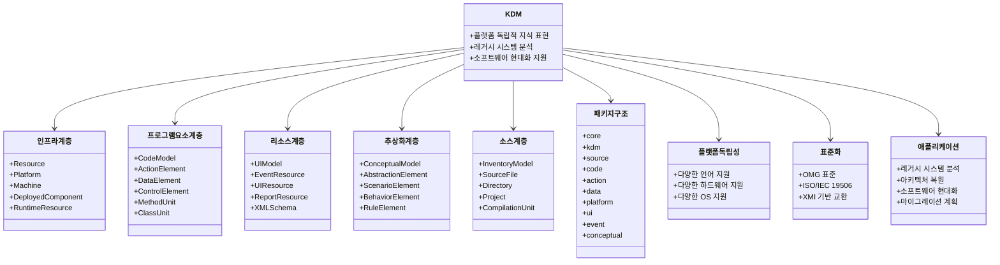

# KDM: 표준화와 플랫폼 독립성을 위한 지식 발견 메타모델

<!-- mtoc-start -->

- [정의 및 개념](#정의-및-개념)
- [주요 특징](#주요-특징)
- [KDM의 주요 구성 요소](#kdm의-주요-구성-요소)
- [KDM(지식발견 메타모델) 구조도](#kdm지식발견-메타모델-구조도)
  - [1. **플랫폼 독립성**:](#1-플랫폼-독립성)
  - [2. **계층적 구조**:](#2-계층적-구조)
  - [3. **표준화**:](#3-표준화)
  - [4. **주요 활용 분야**:](#4-주요-활용-분야)
- [활용 사례](#활용-사례)
- [기대 효과 및 필요성](#기대-효과-및-필요성)
- [마무리](#마무리)
- [Keywords](#keywords)

<!-- mtoc-end -->

소프트웨어 분석 및 마이그레이션을 위한 표준화된 접근법이 필요한 현대 소프트웨어 환경에서 KDM(Knowledge Discovery Metamodel)은 중요한 역할을 한다. KDM은 소프트웨어 결과물을 표준화하여 검색 및 접근을 용이하게 하고, 언어 및 플랫폼에 독립적인 도구를 제공하여 소프트웨어 유지보수와 재사용성을 높이는 메타모델이다.

## 정의 및 개념

- **KDM (Knowledge Discovery Metamodel)**: OMG(Object Management Group)에서 제정한 표준 메타모델, 기존 소프트웨어 시스템의 구조와 동작을 분석하고 모델링하기 위한 목적으로 개발됨.
- **목적**: 소프트웨어 산출물을 표준화된 형식으로 저장하고, 플랫폼과 언어에 독립적인 방식으로 접근할 수 있도록 지원.

## 주요 특징

1. **표준화된 접근방식 제공**: 다양한 개발 도구에서 동일한 형식으로 소프트웨어 데이터를 저장하고 검색할 수 있도록 지원.
2. **플랫폼 독립성 보장**: 특정 언어나 환경에 종속되지 않으며, 다양한 기술 스택에서 활용 가능.
3. **소프트웨어 리버스 엔지니어링 지원**: 기존 소프트웨어를 분석하고 재구성하는 과정에서 활용 가능.
4. **소프트웨어 유지보수 및 마이그레이션 용이**: 기존 시스템을 새로운 기술로 전환하는 과정에서 표준화된 데이터 제공.
5. **자동화된 분석 지원**: 소프트웨어의 구조와 동작을 자동으로 분석하여 지식을 추출하는 기능 제공.

## KDM의 주요 구성 요소

1. **코드 모델(Code Model)**: 소스 코드의 구조와 문법 요소를 표현.
2. **컴파일 모델(Compilation Model)**: 코드의 빌드 및 컴파일 과정의 정보를 포함.
3. **배포 모델(Deployment Model)**: 실행 환경 및 배포 아티팩트를 표현.
4. **실행 모델(Run-time Model)**: 애플리케이션의 실행 중 동작을 분석하여 반영.
5. **데이터 모델(Data Model)**: 데이터베이스 및 데이터 흐름을 모델링.
6. **비즈니스 모델(Business Model)**: 소프트웨어와 연관된 비즈니스 규칙과 개념을 설명.

## KDM(지식발견 메타모델) 구조도

KDM(지식 발견 메타모델)은 소프트웨어 시스템을 표현하기 위한 표준화된 메타모델

### 1. **플랫폼 독립성**:

특정 프로그래밍 언어, 하드웨어, 운영체제에 종속되지 않는 표현 방식을 제공하여 다양한 환경에서의 지식 표현 가능.

### 2. **계층적 구조**:

- 인프라 계층: 시스템의 물리적 자원과 배포 환경을 모델링
- 프로그램 요소 계층: 코드와 관련된 구조적 요소 표현
- 리소스 계층: UI, 이벤트, 보고서 등 비코드 자원 표현
- 추상화 계층: 비즈니스 규칙과 개념적 요소 모델링
- 소스 계층: 코드의 물리적 조직과 프로젝트 구조 표현

### 3. **표준화**:

OMG(Object Management Group)에서 관리하는 국제 표준(ISO/IEC 19506)으로, XMI 기반 형식을 통한 도구 간 상호 운용성 제공.

### 4. **주요 활용 분야**:

- 레거시 시스템 분석 및 이해
- 소프트웨어 아키텍처 복원(역공학)
- 시스템 현대화 및 마이그레이션 계획 수립
- 서로 다른 기술 기반 시스템 간의 통합 지원

KDM은 소프트웨어 시스템의 구조와 의미를 플랫폼에 독립적인 방식으로 표현함으로써, 복잡한 레거시 시스템의 이해와 현대화를 위한 표준화된 프레임워크를 제공합니다.

## 활용 사례

- **레거시 시스템 분석 및 현대화**: 기존 시스템을 이해하고 새로운 환경으로 이전하기 위한 분석 도구로 활용.
- **소프트웨어 품질 관리 및 최적화**: 코드 구조 및 성능을 분석하여 품질을 개선하는 데 기여.
- **자동화된 코드 마이그레이션**: 언어 및 플랫폼 간 자동 변환을 지원하여 개발 비용 절감.
- **기술 스택 변경 지원**: 특정 기술에 종속되지 않는 데이터 모델을 활용하여 유연한 시스템 변경 가능.

## 기대 효과 및 필요성

- **소프트웨어 분석 및 유지보수 비용 절감**: 표준화된 접근 방식으로 분석을 자동화하여 비용 절감.
- **기술 변화에 대한 유연한 대응**: 언어와 플랫폼 독립적 특성을 활용하여 빠르게 새로운 기술을 적용 가능.
- **프로젝트 간 지식 공유 및 재사용성 향상**: 개발된 모델과 데이터가 표준화되어 여러 프로젝트에서 활용 가능.
- **애플리케이션의 확장성과 이식성 강화**: 특정 플랫폼에 종속되지 않아 다양한 환경에서 애플리케이션을 운영 가능.

## 마무리

KDM은 현대 소프트웨어 개발에서 필수적인 표준 메타모델로, 표준화된 접근 방식을 통해 소프트웨어의 유지보수와 마이그레이션을 지원한다. 플랫폼 독립성과 자동화된 분석 기능을 제공함으로써 개발자의 생산성을 향상시키고, 지속 가능한 소프트웨어 운영 환경을 구축할 수 있다. 이러한 장점으로 인해 KDM은 대규모 시스템 분석 및 변환 프로젝트에서 중요한 역할을 수행하고 있다.

## Keywords

KDM, Knowledge Discovery Metamodel, 소프트웨어 표준화, 플랫폼 독립성, 리버스 엔지니어링, 코드 마이그레이션, 소프트웨어 유지보수, 기술 스택 변경, 자동화된 분석
