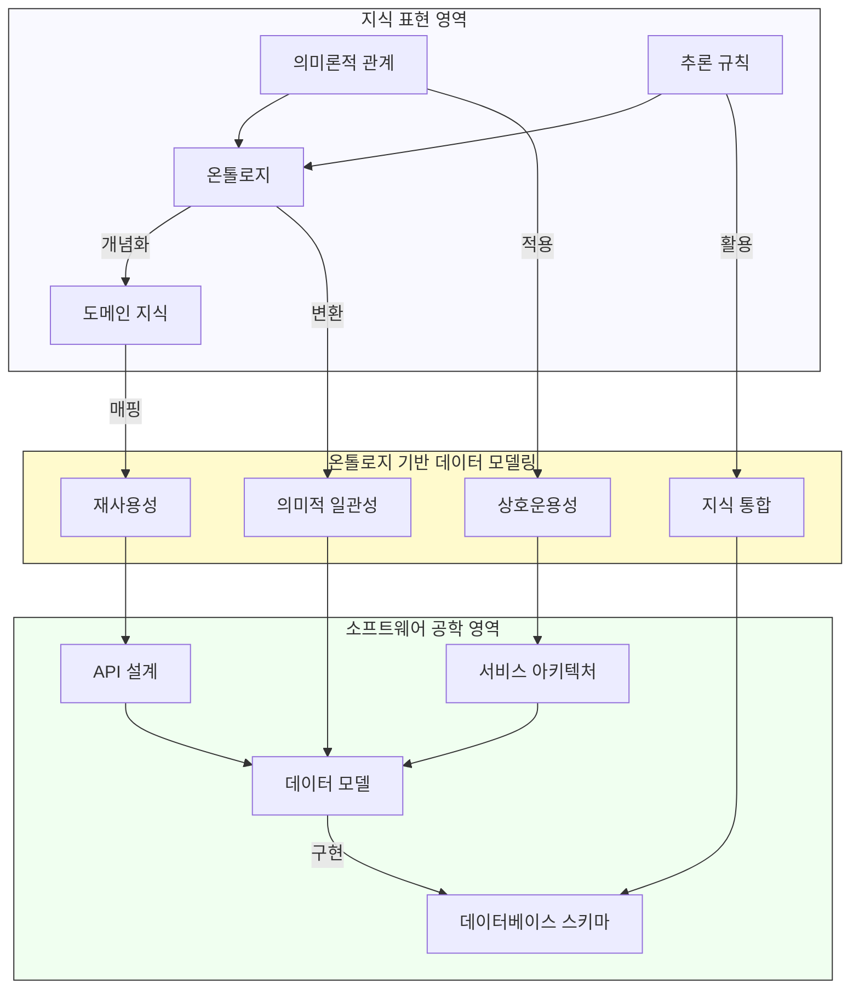

# ODM: 지식 표현과 소프트웨어 공학의 가교 역할

<!-- mtoc-start -->

- [정의 및 개념](#정의-및-개념)
- [주요 특징](#주요-특징)
- [기능 메커니즘](#기능-메커니즘)
- [ODM의 역할](#odm의-역할)
- [ODM 매핑](#odm-매핑)
- [ODM 개념도](#odm-개념도)
- [기대 효과 및 필요성](#기대-효과-및-필요성)
- [마무리](#마무리)
- [Keywords](#keywords)

<!-- mtoc-end -->

Ontology Definition Metamodel(ODM)은 지식 표현과 소프트웨어 공학을 연결하는 중요한 메타모델이다. MDA(Model Driven Architecture) 관점에서 시맨틱 웹과 온톨로지 언어를 정의하고 매핑을 지원하는 언어로, 온톨로지 기반의 모델링을 가능하게 한다.

## 정의 및 개념

- **ODM (Ontology Definition Metamodel)**: OMG(Object Management Group)에서 정의한 메타모델로, 온톨로지 모델링을 위한 표준을 제공하고 UML 및 OWL과의 매핑을 지원.
- **목적**: MDA 환경에서 온톨로지 언어와의 매핑을 제공하여 지식 기반 시스템의 설계 및 개발을 용이하게 함.

## 주요 특징

1. **상호작용 지원**: MDA 내에서 폭넓은 상호작용을 제공하며, 모델 기반 개발 환경과 온톨로지를 통합 가능.
2. **추론 기능 제공**: 온톨로지 기반의 추론 기능을 활용하여 MDA 도구에서 보다 강력한 의미론적 분석을 수행 가능.
3. **표준화된 온톨로지 모델링**: UML 2.0 프로파일과의 호환성을 통해 온톨로지 모델링을 표준화하고, 다양한 도메인에서 활용 가능.
4. **다양한 매핑 지원**: UML 및 OWL과의 매핑을 지원하여, 온톨로지를 다양한 모델링 환경에서 활용 가능.

## 기능 메커니즘

ODM은 온톨로지와 MDA 환경을 연결하는 기능을 수행하며, 주요 메커니즘은 다음과 같다.

1. **메타모델 제공**: 온톨로지 모델링을 위한 표준 메타모델을 정의하여 UML 및 OWL과의 매핑을 가능하게 함.
2. **UML 2.0 프로파일 지원**: UML 2.0 프로파일을 사용하여 온톨로지를 UML 환경에서도 표현할 수 있도록 지원.
3. **자동 매핑 기능**: UML과 OWL 간의 변환을 자동화하여, 개발자가 온톨로지 모델을 보다 쉽게 활용할 수 있도록 함.

## ODM의 역할

ODM은 온톨로지와 MDA 간의 매핑을 통해 소프트웨어 모델링의 효율성을 높인다. 주요 역할은 다음과 같다.

1. **메타모델 제공**: 온톨로지 모델링을 위한 표준화된 메타모델 정의.
2. **UML 2.0 프로파일 지원**: 온톨로지를 UML 기반 모델에서 활용할 수 있도록 UML 2.0 프로파일 제공.
3. **매핑 기능**: UML 및 OWL과의 매핑을 통해 온톨로지 모델링을 보다 효율적으로 수행할 수 있도록 지원.

## ODM 매핑

ODM은 다양한 모델링 언어와의 매핑을 통해 온톨로지 모델링을 강화한다. 주요 매핑 방식은 다음과 같다.

1. **ODM과 UML 간의 매핑**: UML 프로파일과 ODM 간의 매핑을 통해 온톨로지를 UML 기반 개발 환경에서 활용 가능.
2. **ODM과 W3C OWL/DL 간의 매핑**: W3C에서 정의한 OWL/DL과의 매핑을 지원하여, 온톨로지 기반의 의미론적 웹 개발 가능.

## ODM 개념도

1. **지식의 형식화**: 온톨로지를 통해 도메인 지식을 명시적으로 정의하고 의미론적 관계를 표현

2. **소프트웨어 구현 향상**:

   - 의미적 일관성을 통한 견고한 데이터 모델 설계
   - 도메인 지식의 재사용성 향상
   - 다양한 시스템 간 상호운용성 증진
   - 추론 규칙을 활용한 지식 통합 능력

3. **응용 분야**:
   - 지능형 시스템 개발
   - 빅데이터 통합 및 분석
   - 의미 웹(Semantic Web) 구현
   - 지식 그래프 구축

ODM은 복잡한 도메인 지식을 소프트웨어 시스템에 효과적으로 통합하여 보다 지능적이고 유연한 애플리케이션 개발 가능.

## 기대 효과 및 필요성

- **온톨로지 모델링의 표준화**: UML과의 통합을 통해 온톨로지 모델링을 표준화하여, 다양한 개발 환경에서 활용 가능.
- **지식 표현과 소프트웨어 공학의 연결**: 소프트웨어 공학과 시맨틱 웹을 연결하는 가교 역할 수행.
- **자동화된 변환 지원**: UML 및 OWL 간의 자동 변환을 지원하여 개발 생산성 향상.
- **추론 기능 활용**: 온톨로지 기반의 추론 기능을 통해 보다 정교한 모델링과 분석 가능.

## 마무리

ODM은 온톨로지 모델링과 MDA 환경을 연결하는 중요한 표준으로, UML 및 OWL과의 매핑을 통해 소프트웨어 개발의 효율성을 높인다. 이를 통해 지식 기반 시스템을 보다 체계적으로 설계할 수 있으며, 소프트웨어 모델링의 유연성과 확장성을 향상시킬 수 있다.

## Keywords

ODM, Ontology Definition Metamodel, UML 프로파일, OWL 매핑, 시맨틱 웹, 지식 표현, 모델 기반 아키텍처, 온톨로지 모델링, 메타모델, 추론 기능
