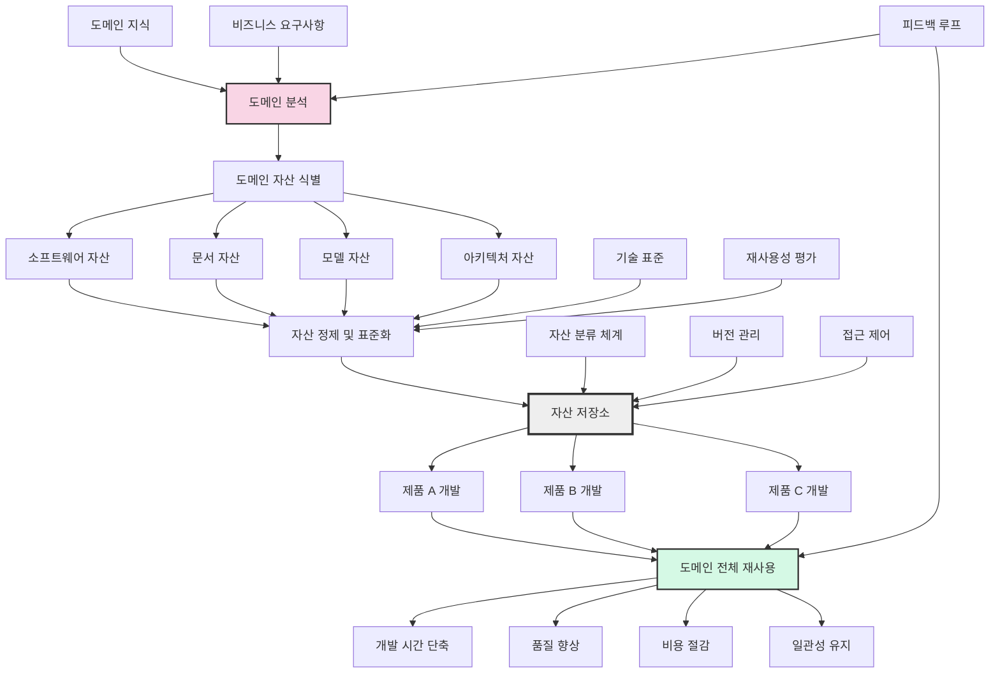

# Product Line: 도메인 전체 산출물 재사용

<!-- mtoc-start -->

- [정의 및 개념](#정의-및-개념)
- [주요 특징](#주요-특징)
- [Product Line 개발 방식](#product-line-개발-방식)
- [Product Line 개발 절차](#product-line-개발-절차)
- [Product Line 도메인 전체 산출물 Reuse](#product-line-도메인-전체-산출물-reuse)
- [Product Line과 기존 개발 방법론 비교](#product-line과-기존-개발-방법론-비교)
- [활용 사례](#활용-사례)
- [기대 효과 및 필요성](#기대-효과-및-필요성)
- [마무리](#마무리)
- [Keywords](#keywords)

<!-- mtoc-end -->

소프트웨어 공학에서 재사용성을 극대화하는 방법 중 하나로, Product Line 개념이 주목받고 있다. Product Line은 특정 도메인 내에서 반복적으로 사용될 수 있는 핵심 자산(Core Asset)을 미리 개발하고, 이를 활용하여 다양한 제품(Product)을 효율적으로 개발하는 접근 방식이다. 이를 통해 개발 비용 절감, 품질 향상, 시장 출시 시간 단축 등의 이점을 얻을 수 있다.

## 정의 및 개념

- **Product Line**: 특정 도메인에서 여러 제품을 개발하기 위해 공통 자산(Core Asset)을 사전에 구축하고 이를 기반으로 제품을 개발하는 방법론.
- **Core Asset**: 도메인 내에서 재사용될 수 있도록 미리 개발된 소프트웨어 구성 요소, 문서, 설계 모델 등의 자산.
- **Product Development**: Core Asset을 활용하여 개별 제품을 개발하는 과정.
- **Management**: Core Asset과 Product Development의 체계적 운영 및 관리를 포함하는 활동.

## 주요 특징

- **도메인 기반 개발**: CBD(Component-Based Development)의 확장선에 있으며, 비즈니스 도메인을 확대하여 적용 가능.
- **재사용 극대화**: 코드 및 컴포넌트뿐만 아니라 요구사항, 설계, 테스트 케이스 등 모든 산출물 재사용.
- **효율적인 개발 프로세스**: 사전 구축된 Core Asset을 활용하여 개발 비용과 시간을 단축.
- **유연한 확장성**: 도메인 내에서 다양한 제품군을 효율적으로 확장 가능.
- **조직적 관리 필요**: Core Asset 및 Product 개발을 체계적으로 관리하는 조직적, 기술적 접근 필요.

## Product Line 개발 방식

- **Proactive**: Core Asset을 먼저 개발한 후, 이를 기반으로 Product를 개발.
- **Reactive**: 여러 개의 Product를 개발한 후, 공통된 요소를 도출하여 Core Asset을 생성.
- **Incremental**: Core Asset 개발과 Product 개발을 병행하며 점진적으로 발전.

## Product Line 개발 절차

- **도메인 공학**: 제품 계열 분석과 제품 Family 분석을 통해 Core Asset 도출.
- **Core Asset 개발**: 도메인 공학 결과를 기반으로 공통적으로 사용할 핵심 자산을 개발.
- **Application 공학**: 요구 정의 후 Core Asset을 활용하여 제품을 개발하고 테스트 수행.

## Product Line 도메인 전체 산출물 Reuse

1. **도메인 분석 및 자산 식별**: 도메인 지식과 비즈니스 요구사항을 기반으로 소프트웨어, 문서, 모델, 아키텍처 등 재사용 가능한 자산을 식별합니다.
2. **자산 정제 및 표준화**: 식별된 자산을 기술 표준에 맞게 정제하고 재사용성을 평가하여 표준화합니다.
3. **자산 저장소 구축**: 분류 체계, 버전 관리, 접근 제어를 갖춘 중앙 저장소에 자산을 체계적으로 관리합니다.
4. **제품 개발에 자산 활용**: 여러 제품 개발 과정에서 저장소의 자산을 재사용합니다.
5. **도메인 전체 재사용 효과**: 개발 시간 단축, 품질 향상, 비용 절감, 제품 간 일관성 유지 등의 효과를 얻습니다.
6. **지속적 개선**: 제품 개발 경험에서 얻은 피드백을 통해 도메인 분석과 자산 관리를 지속적으로 개선합니다.

이 접근 방식은 도메인 내 지식과 산출물을 체계적으로 관리하고 재사용함으로써 소프트웨어 제품 라인 전체의 효율성과 품질을 향상시킵니다.

## Product Line과 기존 개발 방법론 비교

Product Line은 기존 개발 방법론 대비 재사용성이 높은 구조를 가지며, 여러 제품군을 빠르게 개발할 수 있도록 지원한다. 아래 표는 Product Line과 기존 개발 방법론의 차이를 비교한 것이다.

| 항목      | Product Line                                           | 기존 개발 방법론                 |
| --------- | ------------------------------------------------------ | -------------------------------- |
| 개발 방식 | Core Asset을 기반으로 다수의 제품 개발                 | 개별 제품을 독립적으로 개발      |
| 재사용성  | 코드뿐만 아니라 요구사항, 설계, 테스트 케이스까지 포함 | 일부 코드 및 모듈 단위 재사용    |
| 개발 비용 | 초기 투자 필요하지만 장기적으로 절감 효과              | 개별 개발로 인해 높은 비용 발생  |
| 개발 속도 | 공통 요소를 활용하여 빠른 제품 출시 가능               | 제품마다 처음부터 개발 필요      |
| 품질 관리 | 검증된 Core Asset 사용으로 품질 향상                   | 제품마다 개별적인 품질 검토 필요 |
| 확장성    | 새로운 제품 추가가 용이                                | 기존 제품과의 연계성이 낮음      |

특히, Payoff Point(투자 대비 이득을 얻을 수 있는 지점)를 분석하여 적용 시점을 결정하는 것이 중요하다.

## 활용 사례

- **자동차 산업**: 차량 내 소프트웨어 시스템(엔진 제어, 내비게이션 등)을 Product Line 방식으로 개발하여 재사용성 극대화.
- **가전 제품**: 스마트 TV, 냉장고 등의 공통 OS 및 기능을 Product Line으로 구축.
- **기업 소프트웨어**: ERP, CRM 시스템을 모듈화하여 여러 산업군에서 활용 가능하도록 설계.

## 기대 효과 및 필요성

- **비용 절감**: 개발 비용을 획기적으로 줄일 수 있음.
- **개발 시간 단축**: 사전 구축된 Core Asset을 활용하여 신속한 제품 개발 가능.
- **품질 향상**: 검증된 Core Asset을 활용하여 품질 및 안정성 강화.
- **시장 대응력 향상**: 새로운 요구사항을 빠르게 반영하여 제품 개발 가능.
- **조직의 기술 자산화**: 핵심 기술을 조직 내 자산으로 축적하여 경쟁력 강화.

## 마무리

Product Line은 단순한 코드 재사용을 넘어, 소프트웨어 개발의 전반적인 생산성을 향상시키는 강력한 방법론이다. 도메인 공학을 통해 핵심 자산을 미리 구축하고 이를 효율적으로 관리함으로써, 기업은 개발 비용 절감과 품질 향상이라는 두 가지 목표를 동시에 달성할 수 있다. 다양한 산업에서 Product Line을 활용하는 사례가 증가하는 만큼, 조직적 차원의 도입과 지속적인 관리가 필수적이다.

## Keywords

Product Line, Core Asset, Software Reuse, 도메인 공학, 소프트웨어 제품 계열, Proactive Development, Reactive Development, Incremental Development, 소프트웨어 아키텍처, 재사용성 극대화
