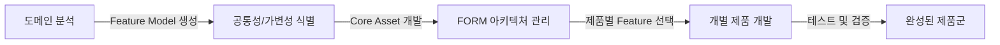
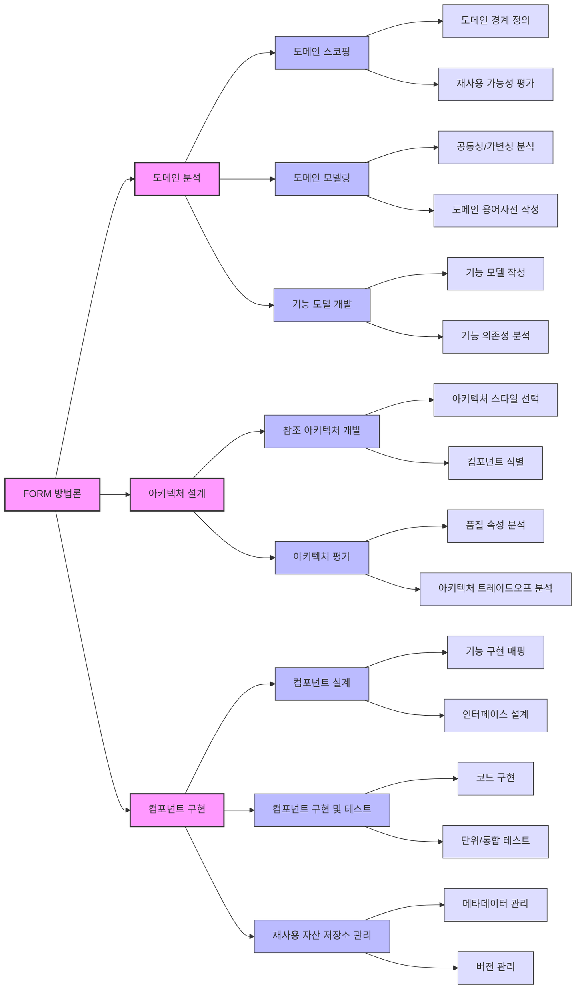

# FORM 방법론: 도메인 내 Feature Model을 활용한 체계적인 가변성 관리

<!-- mtoc-start -->

- [정의 및 개념](#정의-및-개념)
- [주요 특징](#주요-특징)
- [FORM 방법론의 핵심 개념](#form-방법론의-핵심-개념)
- [FORM 단계별 절차](#form-단계별-절차)
  - [1. 도메인 분석](#1-도메인-분석)
  - [2. 아키텍처 설계](#2-아키텍처-설계)
  - [3. 컴포넌트 구현](#3-컴포넌트-구현)
- [활용 사례](#활용-사례)
- [기대 효과 및 필요성](#기대-효과-및-필요성)
- [마무리](#마무리)
- [Keywords](#keywords)

<!-- mtoc-end -->

FORM(Method for Feature-Oriented Reuse Method) 방법론은 대표적인 PLE(Product Line Engineering) 방법론으로, 도메인 내 Feature Model을 이용하여 공통의 핵심 자산(Core Asset)을 개발하고, 가변성을 체계적으로 관리하는 방법론이다. 이를 통해 소프트웨어의 재사용성을 극대화하고, 개발 생산성을 향상시키는 것이 목표이다.

## 정의 및 개념

- **FORM 방법론**: Feature Model을 활용하여 공통 자산을 개발하고, 가변성을 체계적으로 관리하는 소프트웨어 공학 방법론.
- **Feature Model**: 제품 계열 내에서 공통성과 가변성을 명확하게 표현하는 모델링 기법.
- **가변성 관리**: 다양한 제품에서 요구되는 차이점을 구조적으로 관리하는 기법.
- **FORM 아키텍처 관리**: Feature Model 기반으로 시스템 아키텍처를 정의하고, 피처(Feature)와 대응하여 관리하는 방식.

## 주요 특징

- **정형적인 분석**: 안정성과 신뢰성을 보장하기 위해 체계적인 분석 기법을 적용.
- **재사용성 극대화**: 기존 소프트웨어 컴포넌트와 아키텍처를 재사용하여 생산성을 향상.
- **가변성 관리 지원**: Feature Model을 이용하여 다양한 제품군을 효과적으로 관리.
- **선행적 개발 방식**: Core Asset을 먼저 개발하고 이후 다양한 제품을 개발하는 방식(Proactive Approach).

## FORM 방법론의 핵심 개념

- **도메인 분석**: 제품 계열 내 공통성과 가변성을 정의하기 위한 Feature Model 생성.
- **Core Asset 개발**: 도출된 Feature Model을 기반으로 공통 자산을 설계 및 개발.
- **FORM 아키텍처 관리**: 개발된 Core Asset을 Feature와 연계하여 체계적으로 관리.
- **제품 개발 및 검증**: Feature 선택을 통해 개별 제품을 개발하고, 테스트를 통해 검증.

## FORM 단계별 절차

FORM 방법론은 소프트웨어 제품군(Software Product Line)을 개발하기 위한 체계적인 재사용 방법론으로, 기능 중심의 접근 방식.

### 1. 도메인 분석

- **도메인 스코핑**: 도메인의 경계를 정의하고 재사용 가능성을 평가
- **도메인 모델링**: 공통성과 가변성을 분석하고 도메인 용어사전 작성
- **기능 모델 개발**: 기능 모델을 작성하고 기능 간 의존성 분석

### 2. 아키텍처 설계

- **참조 아키텍처 개발**: 적절한 아키텍처 스타일을 선택하고 핵심 컴포넌트 식별
- **아키텍처 평가**: 품질 속성을 분석하고 아키텍처 트레이드오프 검토

### 3. 컴포넌트 구현

- **컴포넌트 설계**: 기능을 구현 요소에 매핑하고 인터페이스 설계
- **컴포넌트 구현 및 테스트**: 코드 구현 및 단위/통합 테스트 수행
- **재사용 자산 저장소 관리**: 컴포넌트 메타데이터 및 버전 관리

FORM 방법론은 기능(Feature)을 중심으로 소프트웨어의 공통점과 차이점을 체계적으로 분석하고, 이를 바탕으로 재사용 가능한 컴포넌트를 개발하는 데 초점을 맞춥니다.

## 활용 사례

- **자동차 소프트웨어**: 다양한 차량 모델에서 공통 기능과 가변 기능을 체계적으로 관리.
- **가전제품**: 스마트 가전(냉장고, 세탁기 등)의 공통 OS 및 기능을 모듈화하여 활용.
- **기업 솔루션**: ERP 및 CRM 시스템에서 제품 계열별 차이점을 Feature Model로 관리.

## 기대 효과 및 필요성

- **비용 절감**: 재사용 가능한 Core Asset을 활용하여 개발 비용 절감.
- **개발 생산성 향상**: 기존 컴포넌트와 아키텍처를 활용하여 빠른 개발 가능.
- **품질 개선**: 검증된 Feature Model을 활용하여 소프트웨어 품질을 보장.
- **시장 대응력 강화**: 다양한 요구사항을 빠르게 반영하여 제품을 출시 가능.

## 마무리

FORM 방법론은 Feature Model을 기반으로 소프트웨어 제품 계열을 체계적으로 관리하고, 재사용성을 극대화하는 대표적인 PLE 방법론이다. 이를 도입하면 개발 비용 절감, 품질 향상, 시장 대응력 강화 등의 효과를 기대할 수 있다. 특히, 가변성 관리를 효율적으로 수행할 수 있어 다양한 산업 분야에서 적용되고 있다.

## Keywords

FORM, Feature Model, Product Line Engineering, 소프트웨어 재사용, 가변성 관리, 도메인 분석, Core Asset, 아키텍처 관리, 소프트웨어 제품 계열, PLE 방법론
