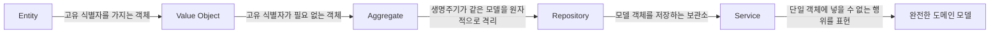
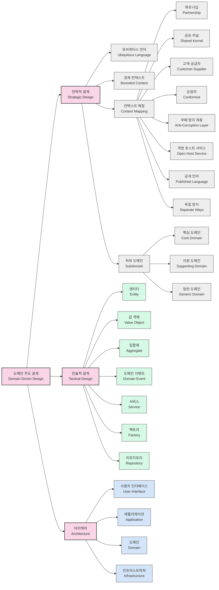

# DDD: 프로세스와 무관한 패턴과 원칙

<!-- mtoc-start -->

- [필요성](#필요성)
- [기본 요소](#기본-요소)
- [DDD의 핵심 구성 요소](#ddd의-핵심-구성-요소)
- [DDD 개념도](#ddd-개념도)
- [DDD의 전제 사항](#ddd의-전제-사항)
- [DDD 개발 프로세스](#ddd-개발-프로세스)
- [기대 효과 및 필요성](#기대-효과-및-필요성)
- [마무리](#마무리)
- [Keywords](#keywords)

<!-- mtoc-end -->

DDD(Domain Driven Design)는 기업의 유사한 업무를 집합한 비즈니스 도메인별 설계 및 개발 방법론이다. 이는 도메인 모델과 소프트웨어 모델, 즉 코드 간의 표현적 차이를 최소화하기 위한 접근 방법으로, 복잡한 도메인을 효과적으로 다룰 수 있도록 한다.

## 필요성

- **MVC 패턴의 한계**: MVC 패턴의 과도한 역할 분담으로 인해 직관적 설계(1, 2 Tier 장점 상실) 어려움.
- **대용량 처리 문제**: MVC 패턴에서는 대용량 데이터 처리가 집중되며, 디테일한 상태 변화를 관리하기 어려움.
- **비즈니스 로직의 집중**: 도메인 모델을 중심으로 설계함으로써 복잡한 비즈니스 로직을 효과적으로 관리 가능.

## 기본 요소

- **Model Driven Design**: 모델 기반 분석 및 설계를 통해 지속적인 피드백을 반영하는 방식.
- **Ubiquitous Language**: 모든 이해관계자가 이해할 수 있는 공통 언어를 사용하여 도메인과 코드 간의 불일치를 최소화.

## DDD의 핵심 구성 요소

- **Entity**: 고유 식별자를 가지는 도메인 모델 객체.
- **Value Object**: 고유 식별자가 필요 없는 불변 객체.
- **Aggregate**: 생명 주기가 동일한 모델을 원자적으로 관리하는 단위.
- **Repository**: 도메인 모델 객체를 저장하고 관리하는 보관소.
- **Service**: 특정 객체에 속하지 않는 행위를 표현하는 역할 수행.

## DDD 개념도

1. **전략적 설계(Strategic Design)**

   - **유비쿼터스 언어**: 개발자와 도메인 전문가가 공통으로 사용하는 언어로, 소통의 명확성을 확보
   - **경계 컨텍스트**: 특정 도메인 모델이 적용되는 명확한 경계를 정의
   - **컨텍스트 매핑**: 여러 경계 컨텍스트 간의 관계를 정의하는 방법 (파트너십, 공유 커널, ACL 등)
   - **하위 도메인**: 핵심, 지원, 일반 도메인으로 구분하여 비즈니스 가치에 따라 집중

2. **전술적 설계(Tactical Design)**

   - **엔티티**: 고유 식별자를 가지는 객체
   - **값 객체**: 속성으로만 식별되는 불변 객체
   - **집합체**: 일관성 경계를 형성하는 엔티티와 값 객체의 클러스터
   - **도메인 이벤트**: 도메인에서 발생한 중요한 사건
   - **서비스**: 자연스럽게 엔티티나 값 객체에 속하지 않는 도메인 로직
   - **팩토리 & 리포지토리**: 객체 생성과 지속성 관리를 담당

3. **아키텍처 레이어**
   - 사용자 인터페이스, 애플리케이션, 도메인, 인프라스트럭처 계층으로 구성
   - 도메인 계층이 핵심이며, 다른 계층은 이를 지원하는 구조

DDD는 복잡한 도메인을 효과적으로 모델링하여 비즈니스 요구사항을 소프트웨어로 정확하게 구현하는 데 중점을 두는 접근 방식입니다. 핵심은 비즈니스 도메인에 대한 깊은 이해와 이를 코드로 명확하게 표현하는 것입니다.

## DDD의 전제 사항

- **점진적 개발**: 도메인 이해를 기반으로 지속적인 개선과 반복 개발.
- **도메인 전문가와의 협력**: 개발자와 도메인 전문가 간 긴밀한 협력 필수.
- **Agile 방법론과의 시너지**: 반복적 개발 프로세스와 DDD의 조화로운 활용 가능.

## DDD 개발 프로세스

1. **비즈니스 도메인 분석**: 요구 사항 분석을 통해 핵심 도메인을 정의.
2. **모델 설계**: Ubiquitous Language를 기반으로 도메인 모델을 설계.
3. **소스 개발**: 설계된 모델을 코드로 구현.
4. **소스 리뷰**: 코드 품질을 유지하고 도메인 모델과의 일치 여부 검토.
5. **유연하고 확장성 있는 소프트웨어 구축**: 점진적 개선을 통해 최적화된 도메인 모델 완성.

## 기대 효과 및 필요성

- **비즈니스 로직 중심의 개발**: 도메인에 집중하여 실질적인 비즈니스 가치를 높임.
- **확장성과 유지보수성 향상**: 모델 중심 설계로 인해 시스템 변경과 확장이 용이함.
- **팀 간 원활한 커뮤니케이션**: 공통 언어(Ubiquitous Language)를 통해 개발팀과 비즈니스 팀 간의 이해도 증대.

## 마무리

DDD는 복잡한 비즈니스 도메인을 효과적으로 모델링하고 유지보수성을 향상시키는 강력한 방법론이다. 점진적인 개발과 도메인 전문가와의 협력을 통해 비즈니스 요구 사항을 유연하게 반영할 수 있으며, 특히 Agile 방법론과 결합하면 큰 시너지를 발휘할 수 있다.

## Keywords

DDD, Domain Driven Design, 도메인 중심 설계, Ubiquitous Language, Entity, Value Object, Aggregate, Repository, Service, Model Driven Design, Agile 방법론
