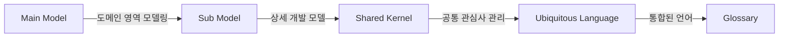
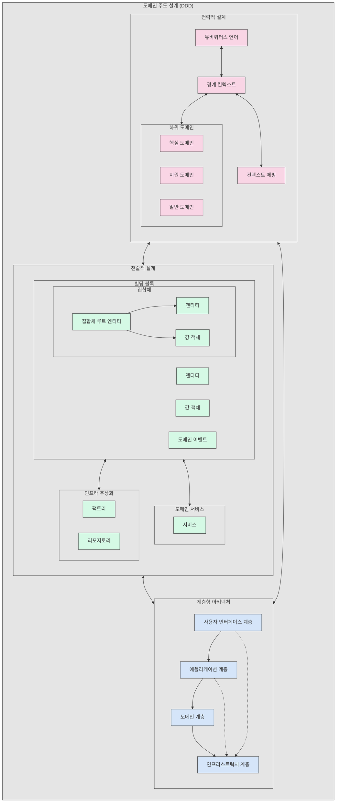

# DDD (Domain Driven Development): 도메인 중심의 소프트웨어 설계와 구현

<!-- mtoc-start -->

- [DDD의 필요성 및 주목 배경](#ddd의-필요성-및-주목-배경)
- [DDD의 주요 구성 요소](#ddd의-주요-구성-요소)
- [DDD 핵심 메카니즘](#ddd-핵심-메카니즘)
- [DDD 적용을 위한 주요 활동 요소](#ddd-적용을-위한-주요-활동-요소)
- [기대 효과 및 필요성](#기대-효과-및-필요성)
- [마무리](#마무리)
- [Keywords](#keywords)

<!-- mtoc-end -->

DDD(Domain Driven Development)는 객체지향적 개발을 기반으로 특정 도메인의 요구 정의, 분석 기법, 방법론, 절차를 체계적으로 정의한 개발 기법이다. 이는 도메인 중심의 개발 방식을 통해 요구사항과 구현 간의 차이를 줄이고, 유지보수성과 확장성을 높이는 데 초점을 맞춘다.

## DDD의 필요성 및 주목 배경

- **객체지향의 한계**: 객체지향 언어를 절차적으로 구현하는 데 한계가 존재.
- **요구사항과 구현의 차이**: 비즈니스 요구사항을 충실하게 반영하기 어려운 문제 발생.
- **소프트웨어의 복잡성 증가**: 도메인 중심 설계를 통해 복잡한 비즈니스 로직을 체계적으로 관리 필요.

## DDD의 주요 구성 요소

- **Main Model**: 도메인 영역을 모델링 언어로 사용자 관점에서 정의.
- **Sub Model**: 메인 모델에서 특정 부분을 상세화한 개발 모델.
- **Shared Kernel**: AOP(Cross Cutting) 관점에서 공통 관심사를 관리.
- **Ubiquitous Language**: SOA 및 UML에서 통합된 언어를 사용하여 이해관계자 간 원활한 소통 지원.
- **Glossary**: 통일된 언어 사용을 위한 용어 정리(Vocabulary).

## DDD 핵심 메카니즘

복잡한 비즈니스 도메인을 소프트웨어로 효과적으로 모델링하기 위한 접근 방식

## DDD 적용을 위한 주요 활동 요소

- **AOP(Aspect-Oriented Programming)**: 관심사의 분리로 코드의 유지보수성과 재사용성 향상.
- **DI/IoC(Dependency Injection/Inversion of Control)**: 객체 간 종속성을 제거하여 유연한 구조 유지.
- **컨테이너 기반 종속 구조**: Spring과 같은 프레임워크에서의 효율적인 객체 관리.
- **디자인 패턴 활용**: 전략 패턴, 팩토리 패턴 등을 통한 설계 최적화.
- **UML 모델링**: 구조적 모델링을 통해 요구사항과 설계를 일관되게 정리.

## 기대 효과 및 필요성

- **비즈니스 로직과 구현 간의 정합성 강화**: 도메인 전문가와 개발자가 공동으로 사용하는 언어(Ubiquitous Language)를 활용하여 요구사항을 정확히 반영.
- **소프트웨어의 유지보수성 향상**: 도메인 모델을 중심으로 한 설계를 통해 코드 수정 시 영향 범위를 최소화.
- **확장성과 재사용성 증대**: 공유 커널(Shared Kernel)을 통해 여러 프로젝트에서 재사용 가능.
- **객체지향 설계의 실질적 구현**: 설계와 구현 간 일관성을 유지하고, 절차적 코드 작성을 방지.

## 마무리

DDD는 도메인 중심의 개발 방식을 적용하여 복잡한 비즈니스 요구사항을 효과적으로 해결하는 방법론이다. 객체지향 설계의 한계를 보완하고, 유지보수성을 높이며, 요구사항과 구현 간의 일관성을 확보할 수 있는 강력한 접근 방식이다.

## Keywords

DDD, Domain Driven Development, 객체지향 설계, 도메인 모델링, AOP, DI, IoC, UML, 디자인 패턴, Shared Kernel, Ubiquitous Language
