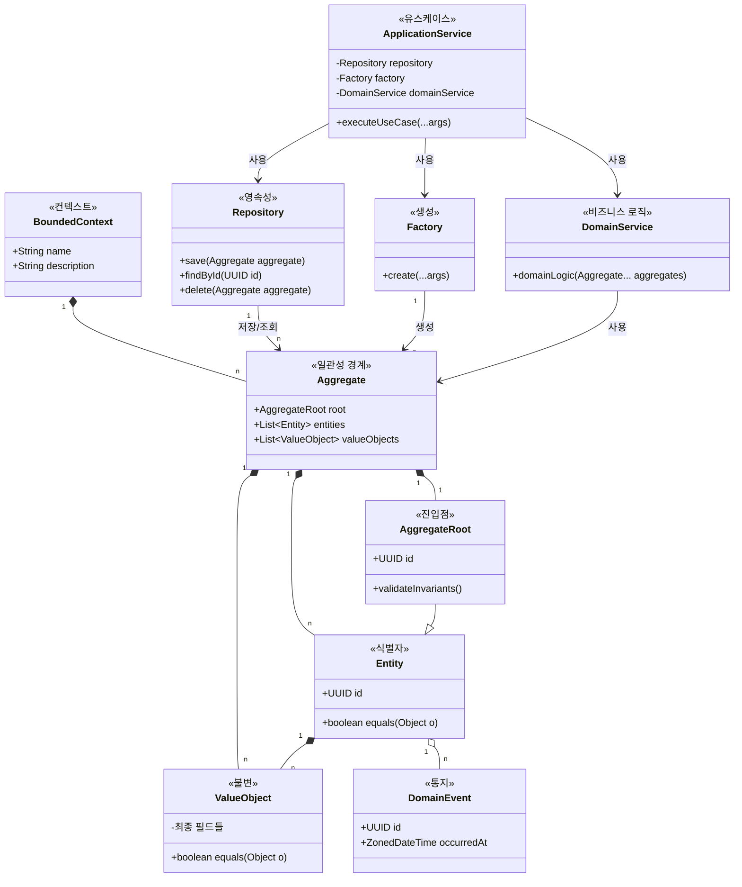
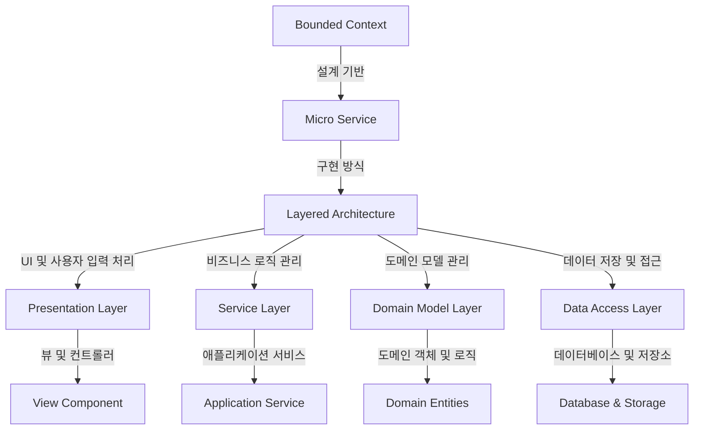

# DDD (Domain Driven Design): 전략 및 전술 설계

<!-- mtoc-start -->

- [Domain: 유사한 업무의 집합](#domain-유사한-업무의-집합)
- [Context: 도메인의 사용자, 프로세스, 정책](#context-도메인의-사용자-프로세스-정책)
- [Bounded Context: 비즈니스 목적별로 Context 그룹핑](#bounded-context-비즈니스-목적별로-context-그룹핑)
- [DDD의 주요 구성](#ddd의-주요-구성)
  - [1. 전략적 설계 (Strategic Design)](#1-전략적-설계-strategic-design)
    - [Event Storming 기반 Bounded Context 식별](#event-storming-기반-bounded-context-식별)
  - [2. 전술적 설계 (Tactical Design)](#2-전술적-설계-tactical-design)
    - [핵심 구성 요소](#핵심-구성-요소)
    - [Tactical Design의 주요 결과물](#tactical-design의-주요-결과물)
- [DDD 구현 패턴](#ddd-구현-패턴)
- [Bounded Context와 Micro Service 연계](#bounded-context와-micro-service-연계)
- [Design Thinking과 DDD의 연계](#design-thinking과-ddd의-연계)
- [마무리](#마무리)
- [Keywords](#keywords)

<!-- mtoc-end -->

DDD(Domain Driven Design)는 특정 도메인의 요구 정의, 분석 기법, 방법론, 절차를 체계적으로 정의하는 개발 기법으로, 비즈니스 도메인별로 분할된 설계를 통해 소프트웨어의 유지보수성과 확장성을 높이는 것을 목표로 한다.

## Domain: 유사한 업무의 집합

- **MPRS**: 마케팅, 구매, 연구, 영업 등 기업 내 유사 업무 집합.
- **Ubiquitous Language**: 공통 이해를 위한 통일된 언어 사용.

## Context: 도메인의 사용자, 프로세스, 정책

- 특정 도메인의 요구사항을 반영한 환경과 규칙 정의.

## Bounded Context: 비즈니스 목적별로 Context 그룹핑

- 도메인 내 고유한 비즈니스 목적을 가지는 영역을 독립적으로 분리하여 관리.

## DDD의 주요 구성

### 1. 전략적 설계 (Strategic Design)

- **Domain Model** = **Domain 분해도(Problem Space) + Context Map(Solution Space)**
- **Domain 분해도**: 최상위 도메인을 서브 도메인으로 분할 후, 각 서브 도메인의 역할을 Core, Support, Generic으로 분류.
- **Context Map**: Bounded Context 간 관계 도식화.

#### Event Storming 기반 Bounded Context 식별

1. **Domain Event 정의**
2. **Tell the Story** (스토리텔링 방식으로 도메인 이벤트 설명)
3. **Process Grouping** (관련 프로세스 그룹화)
4. **Command 정의** (명령 정의)
5. **Trigger 정의** (이벤트 트리거 설정)
6. **Aggregate 정의** (도메인 객체 집합 정의)
7. **Bounded Context 정의** (비즈니스 목적별 컨텍스트 그룹화)
8. **Context Map 작성** (전체적인 관계 도식화)

### 2. 전술적 설계 (Tactical Design)

- **개발을 위한 구체적인 설계 기법 적용**

#### 핵심 구성 요소

- **Model Driven Design**: Context Map 중심 설계
- **Layered Architecture**:
  - Presentation → Service(Flow Control) → Domain Objects(Biz Logic) ← Data Mapper ← Data Access
- **Entity & Value Object**: 식별성과 가변성을 기준으로 분류
- **Aggregate & Factory**: 객체 집합 및 생성 관리
- **Repository**: 데이터 저장소 및 조회 관리

#### Tactical Design의 주요 결과물

1. **User Story**
2. **Sequence Diagram**
3. **Class Diagram**
4. **Data Diagram**
5. **Storyboard (화면 설계서)**
6. **API 설계서 (Micro Service API 명세서)**
7. **Message 설계서**
8. **마이크로 서비스 패턴 적용 설계서**

## DDD 구현 패턴

도메인 주도 설계(DDD)는 복잡한 비즈니스 도메인을 소프트웨어로 효과적으로 모델링하기 위한 접근 방식:

1. **도메인 중심 사고**: 기술보다 비즈니스 도메인에 집중하여 모델링
2. **유비쿼터스 언어**: 개발자와 도메인 전문가가 공통 언어로 소통
3. **경계 컨텍스트**: 모델이 적용되는 명확한 경계를 정의하여 복잡성 관리
4. **집합체와 엔티티**: 비즈니스 객체를 일관성 있게 모델링
5. **계층형 아키텍처**: 도메인 로직을 기술적 구현으로부터 분리

DDD는 특히 복잡한 비즈니스 도메인을 가진 대규모 시스템에서 유용하며, 도메인 지식을 코드에 효과적으로 반영하여 비즈니스 가치에 집중할 수 있게 합니다.

## Bounded Context와 Micro Service 연계

- Bounded Context → Micro Service → Layered Architecture (Presentation, Service, Domain Model, Data Access) 활용.

## Design Thinking과 DDD의 연계

- **Design Thinking**: 사용자에 대한 공감과 이해를 기반으로 사용자 경험을 향상시킬 아이디어 도출.
- **Ideation**: 도출된 아이디어를 기반으로 DDD를 통해 구체화.

## 마무리

DDD는 전략적 설계와 전술적 설계를 결합하여 소프트웨어 개발을 효과적으로 수행하는 방법론이다. 이를 활용하면 대규모 시스템의 복잡성을 줄이고, 유연한 설계와 지속적인 개선을 가능하게 한다.

## Keywords

DDD, Domain Driven Design, Strategic Design, Tactical Design, Event Storming, Bounded Context, Context Map, Layered Architecture, Micro Service, Design Thinking
