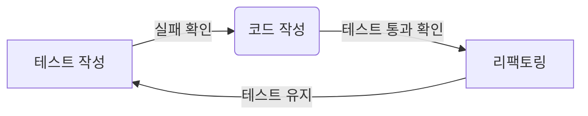
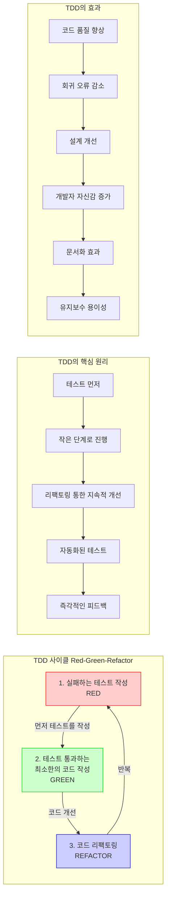
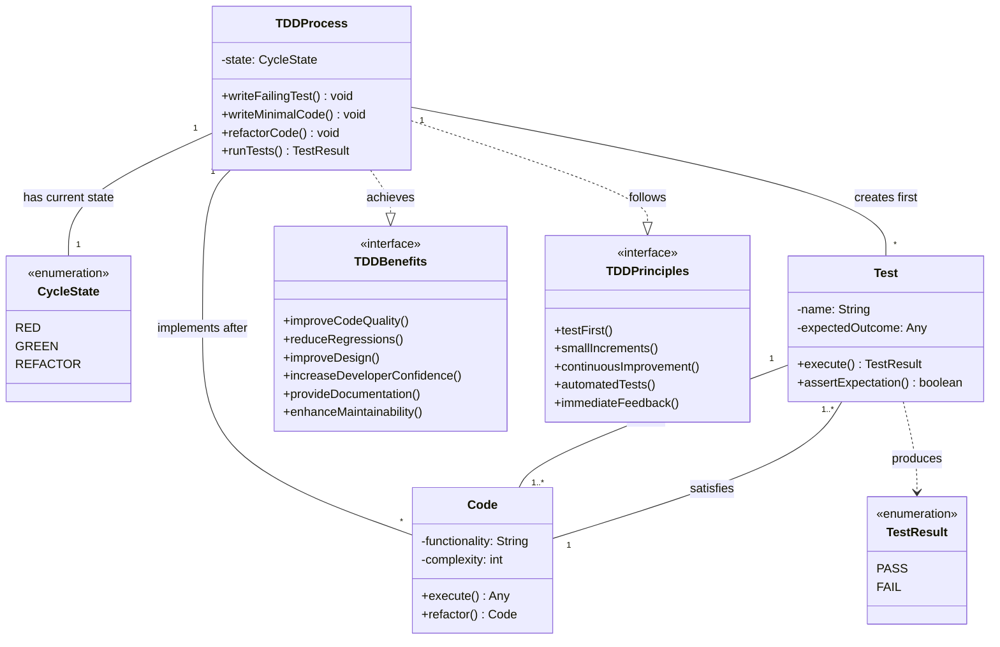

# TDD (Test Driven Development): 코드 품질과 안정성을 높이는 개발 방법론

<!-- mtoc-start -->

- [정의 및 개념](#정의-및-개념)
- [주요 특징](#주요-특징)
- [TDD 개발 절차](#tdd-개발-절차)
- [TDD 원리와 프로세스](#tdd-원리와-프로세스)
- [TDD 방법론의 종류](#tdd-방법론의-종류)
  - [1. 단위 테스트(Unit Test)](#1-단위-테스트unit-test)
  - [2. 통합 테스트(Integration Test)](#2-통합-테스트integration-test)
  - [3. 시스템 테스트(System Test)](#3-시스템-테스트system-test)
  - [4. 회귀 테스트(Regression Test)](#4-회귀-테스트regression-test)
- [TDD의 핵심 원리](#tdd의-핵심-원리)
- [TDD 사이클 (Red-Green-Refactor)](#tdd-사이클-red-green-refactor)
- [TDD 개념도](#tdd-개념도)
- [TDD 효과](#tdd-효과)
- [활용 사례](#활용-사례)
- [기대 효과 및 필요성](#기대-효과-및-필요성)
- [마무리](#마무리)
- [Keywords](#keywords)

<!-- mtoc-end -->

소프트웨어 개발에서 코드 품질과 유지보수성을 높이는 것은 필수적인 요소이다. 테스트 주도 개발(TDD, Test Driven Development)은 이를 달성하기 위한 방법론 중 하나로, 개발자가 코드를 작성하기 전에 먼저 테스트를 작성하고, 그 테스트를 통과하는 코드를 개발하는 방식이다. 이 방법론을 활용하면 코드의 안정성을 높이고, 개발 과정을 보다 체계적으로 관리할 수 있다.

## 정의 및 개념

- **테스트 주도 개발(TDD)**: 테스트를 먼저 작성한 후, 해당 테스트를 통과하는 코드를 작성하는 소프트웨어 개발 방법론.
- **특징**:
  - 코드 품질 향상
  - 버그 감소
  - 유지보수성 향상
  - 작은 단위의 개발 및 지속적인 개선

## 주요 특징

1. **코드 품질 향상**
   - 테스트를 먼저 작성함으로써 코드의 목적이 명확해지고, 보다 견고한 코드가 작성됨
2. **버그 감소**
   - 테스트를 사전에 수행하여 잠재적인 오류를 조기에 발견하고 수정 가능
3. **유지보수성 향상**
   - 테스트 코드가 문서화 역할을 하여 코드 변경 시에도 안정성을 유지
4. **작은 단위의 개발**
   - 기능을 작은 단위로 개발하고 점진적으로 개선하여 복잡성을 낮춤
5. **빠른 피드백 루프**
   - 코드 작성 후 즉시 테스트를 실행하여 빠르게 오류를 확인하고 수정 가능

## TDD 개발 절차

- **테스트 작성**: 구현할 기능에 대한 테스트 코드 작성 및 실패 확인
- **코드 작성**: 테스트를 통과하기 위한 최소한의 코드 작성
- **리팩토링**: 중복 제거 및 구조 개선 후 테스트 유지

## TDD 원리와 프로세스

## TDD 방법론의 종류

### 1. 단위 테스트(Unit Test)

- 개별 모듈이나 함수의 동작을 검증하는 테스트
- 작은 단위로 기능을 검증하며 코드의 신뢰성을 높임
- **예**: Python의 `unittest`, Java의 `JUnit`

### 2. 통합 테스트(Integration Test)

- 여러 모듈이 함께 동작하는 것을 검증하는 테스트
- 모듈 간의 상호작용을 확인하여 통합된 시스템의 동작을 검증
- **예**: API 테스트, DB 연동 테스트

### 3. 시스템 테스트(System Test)

- 전체 시스템의 동작을 검증하는 테스트
- 모든 구성 요소가 정상적으로 작동하는지 확인
- **예**: Selenium을 활용한 웹 애플리케이션 테스트

### 4. 회귀 테스트(Regression Test)

- 새로운 기능 추가나 코드 수정 후 기존 기능이 정상 동작하는지 확인
- 기존 테스트 케이스를 반복 실행하여 예상치 못한 오류를 방지
- **예**: CI/CD 파이프라인에서 자동화된 테스트 실행

## TDD의 핵심 원리

- **테스트 먼저 작성**: 구현 코드보다 테스트 코드를 먼저 작성합니다.
- **작은 단계로 진행**: 큰 기능을 작은 단위로 나누어 점진적으로 개발합니다.
- **리팩토링 통한 지속적 개선**: 코드가 작동한 후에도 지속적으로 개선합니다.
- **자동화된 테스트**: 모든 테스트는 자동화되어 즉시 실행 가능해야 합니다.
- **즉각적인 피드백**: 문제를 빠르게 발견하고 수정합니다.

## TDD 사이클 (Red-Green-Refactor)

1. **RED**: 실패하는 테스트를 먼저 작성합니다.
2. **GREEN**: 테스트를 통과하는 가장 간단한 코드를 작성합니다.
3. **REFACTOR**: 코드 품질을 개선하며 리팩토링합니다.

## TDD 개념도

1. **TDDProcess 클래스**

   - TDD의 중심 프로세스를 나타내며, Red-Green-Refactor 사이클의 현재 상태를 관리합니다.
   - 실패하는 테스트 작성, 최소 코드 구현, 코드 리팩토링의 핵심 메서드를 포함합니다.

2. **CycleState 열거형**

   - RED: 실패하는 테스트 단계
   - GREEN: 테스트 통과 단계
   - REFACTOR: 코드 개선 단계

3. **Test와 Code 클래스**

   - Test는 Code 구현보다 먼저 생성되며, Code는 Test를 만족시켜야 합니다.
   - 이 관계는 테스트 우선 원칙을 구조적으로 보여줍니다.

4. **TDDPrinciples 인터페이스**

   - 테스트 우선(testFirst)
   - 작은 단계로 진행(smallIncrements)
   - 지속적 개선(continuousImprovement)
   - 자동화된 테스트(automatedTests)
   - 즉각적인 피드백(immediateFeedback)

5. **TDDBenefits 인터페이스**
   - 코드 품질 향상(improveCodeQuality)
   - 회귀 오류 감소(reduceRegressions)
   - 설계 개선(improveDesign)
   - 개발자 자신감 증가(increaseDeveloperConfidence)
   - 문서화 제공(provideDocumentation)
   - 유지보수성 향상(enhanceMaintainability)

TDD는 테스트를 먼저 작성하고 코드를 구현하는 구조화된 개발 방법론입니다. TDD 사이클은 Red, Green, Refactor 단계로 구성되며, 테스트 결과는 즉각적인 피드백을 제공합니다. TDDPrinciples와 TDDBenefits 인터페이스를 통해 TDD의 원칙과 장점을 구현하여 소프트웨어 설계와 품질을 향상시킵니다.

## TDD 효과

- **코드 품질 향상**: 테스트를 통과하는 코드는 기본적인 품질이 보장됩니다.
- **회귀 오류 감소**: 기존 기능이 새로운 변경에 영향받지 않도록 보호합니다.
- **설계 개선**: 테스트 작성 과정에서 자연스럽게 좋은 설계가 도출됩니다.
- **개발자 자신감 증가**: 코드 변경에 대한 두려움이 감소합니다.
- **문서화 효과**: 테스트 코드는 실행 가능한 문서 역할을 합니다.
- **유지보수 용이성**: 명확한 테스트는 코드의 의도를 이해하기 쉽게 합니다.

## 활용 사례

- **애자일 개발 환경**: 빠른 피드백과 지속적인 개선이 필요한 애자일 환경에서 효과적으로 사용됨
- **오픈소스 프로젝트**: 협업 개발 시 코드 변경 사항을 신속히 검증하는 데 활용
- **대규모 엔터프라이즈 애플리케이션**: 복잡한 비즈니스 로직이 포함된 애플리케이션의 안정성을 유지하는 데 유용
- **DevOps 및 CI/CD**: 지속적인 배포 환경에서 자동화된 테스트를 활용하여 배포 안정성을 보장

## 기대 효과 및 필요성

- **소프트웨어 품질 향상**: 테스트를 기반으로 한 코드 작성으로 안정적인 소프트웨어 제공
- **디버깅 시간 절감**: 개발 단계에서 문제를 조기에 발견하여 수정 비용 감소
- **지속적인 개선 가능**: 코드 변경 시에도 테스트를 통해 신뢰성 확보
- **개발 생산성 향상**: 자동화된 테스트를 활용하여 개발 속도를 높이고, 유지보수를 용이하게 함

## 마무리

테스트 주도 개발(TDD)은 코드의 품질을 높이고 유지보수성을 향상시키는 효과적인 소프트웨어 개발 방법론이다. 테스트를 먼저 작성하는 방식은 초기에는 다소 부담이 될 수 있지만, 장기적으로는 개발 효율성과 코드 안정성을 크게 향상시킨다. 특히, 애자일 환경이나 DevOps를 도입한 조직에서는 TDD가 필수적인 요소로 자리 잡고 있다. 개발자는 TDD를 활용하여 보다 신뢰성 있는 소프트웨어를 만들고, 지속적인 코드 개선을 추구해야 한다.
TDD는 단순한 테스팅 기법이 아니라 소프트웨어 개발의 전체적인 접근 방식을 바꾸는 패러다임으로, 장기적으로 더 견고하고 유지보수하기 쉬운 코드베이스를 만들 수 있도록 도와줍니다.

## Keywords

Test Driven Development, TDD, Unit Test, Integration Test, System Test, Regression Test, Agile Development, Software Testing, Continuous Integration, DevOps, 테스트 주도 개발, 단위 테스트, 통합 테스트, 시스템 테스트, 회귀 테스트, 애자일 개발, 소프트웨어 테스트, 지속적 통합
