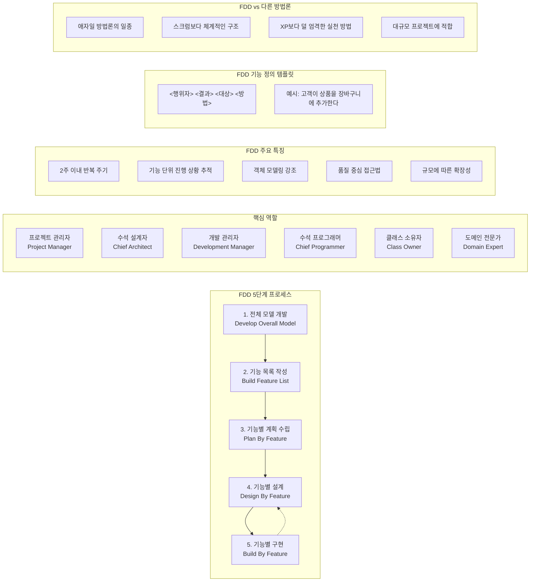

# FDD (Feature Driven Development): 기능 중심의 체계적인 개발 방법론

<!-- mtoc-start -->

- [정의 및 개념](#정의-및-개념)
- [주요 특징](#주요-특징)
- [FDD 개발 절차](#fdd-개발-절차)
- [FDD 개발 체계](#fdd-개발-체계)
  - [1. **5단계 프로세스**:](#1-5단계-프로세스)
  - [2. **주요 역할**:](#2-주요-역할)
  - [3. **차별화된 특징**:](#3-차별화된-특징)
  - [4. **다른 애자일 방법론과의 차이점**:](#4-다른-애자일-방법론과의-차이점)
- [활용 사례](#활용-사례)
- [기대 효과 및 필요성](#기대-효과-및-필요성)
- [마무리](#마무리)
- [Keywords](#keywords)

<!-- mtoc-end -->

소프트웨어 개발에서 프로젝트의 복잡성을 줄이고 개발 과정을 체계적으로 관리하는 것은 매우 중요하다. 기능 주도 개발(FDD, Feature Driven Development)은 기능 단위로 소프트웨어를 개발하는 방법론으로, 반복적이고 체계적인 접근 방식을 통해 효율적인 소프트웨어 개발을 가능하게 한다.

## 정의 및 개념

- **기능 주도 개발(FDD)**: 기능 단위로 소프트웨어를 개발하는 소프트웨어 개발 방법론.
- **특징**:
  - 기능 중심 개발
  - 반복적 개발
  - 명확한 목표 설정
  - 진행 상황 추적 용이

## 주요 특징

1. **기능 중심 개발**
   - 소프트웨어를 작은 기능 단위로 나누어 개발하고 관리
2. **반복적 개발**
   - 기능 단위로 개발과 테스트를 반복 수행하며 지속적인 개선 가능
3. **명확한 목표 설정**
   - 각 기능의 목표와 범위를 사전에 정의하여 개발 방향을 명확히 함
4. **진행 상황 추적 용이**
   - 기능 단위로 개발을 진행하여 프로젝트의 진행 상태를 쉽게 파악 가능
5. **효율적인 협업 가능**
   - 개발자, 도메인 전문가, 프로젝트 관리자 간의 협업을 강화하여 원활한 개발 진행 가능

## FDD 개발 절차

- **개념 모델링**: 도메인 전문가와 협력하여 시스템의 개념 모델을 작성하고 주요 개념과 관계를 정의
- **기능 목록 작성**: 시스템의 기능을 작은 단위로 나누어 목록을 작성하고 우선순위를 설정
- **기능별 계획 수립**: 각 기능에 대한 개발 계획을 수립하고 일정 및 자원을 할당
- **기능별 설계 및 구현**: 각 기능을 설계 및 구현하며, 기능 단위로 테스트 수행
- **기능 통합**: 구현된 기능을 통합하여 전체 시스템을 완성하고 통합 테스트 수행

## FDD 개발 체계

### 1. **5단계 프로세스**:

- **전체 모델 개발**: 도메인 전문가와 개발자가 협력하여 전체 시스템의 객체 모델을 작성
- **기능 목록 작성**: 비즈니스 가치가 있는 기능들을 목록화 ("고객이 상품을 장바구니에 추가한다" 형식)
- **기능별 계획 수립**: 기능들의 우선순위와 의존성을 고려해 개발 계획 수립
- **기능별 설계**: 각 기능에 대한 상세 설계와 클래스 다이어그램 작성
- **기능별 구현**: 설계에 따라 기능을 구현하고 테스트

### 2. **주요 역할**:

- 프로젝트 관리자, 수석 설계자, 개발 관리자, 수석 프로그래머, 클래스 소유자, 도메인 전문가

### 3. **차별화된 특징**:

- 객체 모델링에 대한 강조
- 2주 이내의 짧은 반복 주기
- 기능 단위의 명확한 진행 상황 추적
- 품질 중심 접근법
- 대규모 프로젝트에 적합한 확장성

### 4. **다른 애자일 방법론과의 차이점**:

- 스크럼보다 더 체계적인 프로세스 구조
- XP(익스트림 프로그래밍)보다 덜 엄격한 실천 방법
- 대규모 팀과 프로젝트에 적합한 구조

FDD는 비즈니스적으로 가치 있는 기능을 중심으로 개발을 진행하며, 객체 지향 개발과 반복적 개발 방식을 결합하여 복잡한 시스템을 효율적으로 구축할 수 있게 해주는 방법론입니다.

## 활용 사례

- **대규모 소프트웨어 개발 프로젝트**: 여러 기능을 병렬적으로 개발하고 통합하여 관리 가능
- **애자일 개발 환경**: 반복적 개발 방식을 적용하여 변화에 유연하게 대응
- **도메인 중심 개발**: 도메인 전문가와의 협업을 통해 효과적인 시스템 모델링 가능
- **CI/CD 환경**: 기능 단위로 개발 및 테스트를 수행하여 지속적 통합과 배포 지원

## 기대 효과 및 필요성

- **개발 효율성 향상**: 기능 단위 개발로 인해 코드 관리와 협업이 용이
- **변경 대응 용이**: 반복적 개발로 인해 변경 사항에 유연하게 대응 가능
- **품질 보장**: 기능 단위 테스트와 통합 테스트를 통해 소프트웨어의 품질을 유지
- **개발 일정 준수 가능**: 기능별 우선순위 설정과 일정 관리로 프로젝트 일정 준수 가능

## 마무리

기능 주도 개발(FDD)은 기능 단위로 소프트웨어를 개발하여 프로젝트의 복잡성을 줄이고, 개발 과정을 체계적으로 관리하는 데 효과적인 방법론이다. 반복적이고 명확한 목표 설정을 기반으로 한 개발 방식을 통해 개발 생산성을 높이고 소프트웨어 품질을 향상시킬 수 있다. 특히 대규모 프로젝트나 애자일 환경에서 FDD는 효율적인 소프트웨어 개발 프로세스를 구현하는 데 필수적인 접근 방식이다.

## Keywords

FDD, Feature Driven Development, Software Development, Iterative Development, Feature List, Agile Development, Domain Modeling, Continuous Integration, 기능 주도 개발, 소프트웨어 개발, 반복적 개발, 기능 목록, 기능 통합, 애자일 개발, 도메인 모델링, 지속적 통합
