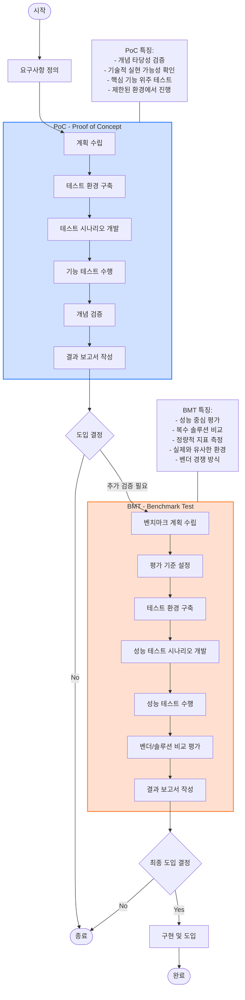

# PoC와 BMT: 사전 성능 테스트를 통한 검증

<!-- mtoc-start -->

- [정의 및 개념](#정의-및-개념)
- [BMT와 PoC의 차이점](#bmt와-poc의-차이점)
- [주요 특징](#주요-특징)
  - [BMT (BenchMarking Test)](#bmt-benchmarking-test)
  - [PoC (Proof of Concept)](#poc-proof-of-concept)
- [PoC와 BMT 절차](#poc와-bmt-절차)
  - [PoC (Proof of Concept)](#poc-proof-of-concept-1)
  - [BMT (Benchmark Test)](#bmt-benchmark-test)
  - [프로세스 흐름](#프로세스-흐름)
- [기대 효과 및 필요성](#기대-효과-및-필요성)
- [마무리](#마무리)
- [Keywords](#keywords)

<!-- mtoc-end -->

프로젝트 진행 중 경험할 수 있는 기술적인 핵심 요소와 고객 인프라 또는 아키텍처를 짧은 기간 내에 검증하는 것이 중요하다. 이를 위해 사전 성능 테스트가 필요하며, 대표적인 방식으로 BMT(BenchMarking Test)와 PoC(Proof of Concept)가 있다.

## 정의 및 개념

- **BMT (BenchMarking Test)**: 제품 간 성능을 비교하고 평가하는 테스트
- **PoC (Proof of Concept)**: 비교 대상 없이 기능과 성능이 목적에 부합하는지를 평가하는 검증 과정

## BMT와 PoC의 차이점

| 구분      | BenchMarking Test (BMT)     | Proof of Concept (PoC)                         |
| --------- | --------------------------- | ---------------------------------------------- |
| 평가 대상 | 제품들 간의 비교 평가       | 제품의 절대 평가                               |
| 측정 시기 | 개선, 구매, 도입 등 필요 시 | 신기술 도입 전 검증 (기술에 대한 확신 부족 시) |
| 목적      | 최선의 선택                 | 위험 완화                                      |
| 측정 관점 | 품질적 측면                 | 기술적 측면                                    |
| 사업 연계 | 일반적 기술 검토 포함       | 추진 사업 쟁점과 밀접한 관련                   |
| 측정 기관 | 내부, 외부 전문 업체 다수   | 고객사 위주의 검증                             |

## 주요 특징

### BMT (BenchMarking Test)

- 여러 제품을 동일한 기준으로 성능 비교
- 구매 결정, 최적의 선택을 위한 객관적 자료 제공
- 외부 전문기관을 활용한 검증 가능

### PoC (Proof of Concept)

- 특정 기술이나 솔루션이 비즈니스 목적에 적합한지 검증
- 신기술 도입 시 리스크를 최소화
- 고객사의 실제 환경에서 테스트 진행

## PoC와 BMT 절차

### PoC (Proof of Concept)

- **목적**: 새로운 기술이나 솔루션의 실현 가능성과 개념 타당성을 검증
- **특징**:
  - 기술적 실현 가능성 확인에 중점
  - 핵심 기능 위주의 제한적 테스트
  - 작은 규모의 테스트 환경에서 진행
  - "이 기술이 우리 환경에서 작동할 수 있는가?"라는 질문에 답함
- **단계**: 계획 수립 → 테스트 환경 구축 → 시나리오 개발 → 기능 테스트 → 검증 → 보고서 작성

### BMT (Benchmark Test)

- **목적**: 여러 솔루션/제품 간의 성능을 비교 평가하여 최적의 선택을 결정
- **특징**:
  - 정량적 성능 지표 측정 중심
  - 실제 환경과 유사한 조건에서 테스트
  - 복수의 솔루션을 동일한 기준으로 비교
  - 벤더 경쟁 방식으로 진행되는 경우가 많음
  - "어떤 솔루션이 우리 요구사항에 가장 잘 맞는가?"라는 질문에 답함
- **단계**: 계획 수립 → 평가 기준 설정 → 테스트 환경 구축 → 시나리오 개발 → 성능 테스트 → 비교 평가 → 보고서 작성

### 프로세스 흐름

1. 요구사항 정의로 시작
2. PoC를 통해 기술 타당성 검증
3. 필요시 BMT를 통해 최적 솔루션 선별
4. 최종 도입 결정 후 실제 구현

두 과정은 도입 전 리스크를 최소화하고 투자 효율성을 높이는 데 중요한 검증 단계입니다.

## 기대 효과 및 필요성

- BMT를 통해 시장에서 최적의 제품을 선정하고 비용 대비 효과를 극대화할 수 있음
- PoC를 통해 신기술 도입 전 위험을 줄이고 실질적인 적용 가능성을 확인 가능
- 두 가지 방법을 적절히 활용하여 프로젝트의 성공 가능성을 높일 수 있음

## 마무리

BMT와 PoC는 기술 검증 과정에서 중요한 역할을 한다. 프로젝트 성격에 맞게 적절한 방식을 선택하여 검증 과정을 거치면 비용 절감과 리스크 감소 효과를 기대할 수 있다.

## Keywords

BMT, PoC, 성능 테스트, 기술 검증, 벤치마킹 테스트, 개념 검증, 신기술 도입, 제품 비교, 품질 평가, 위험 완화
