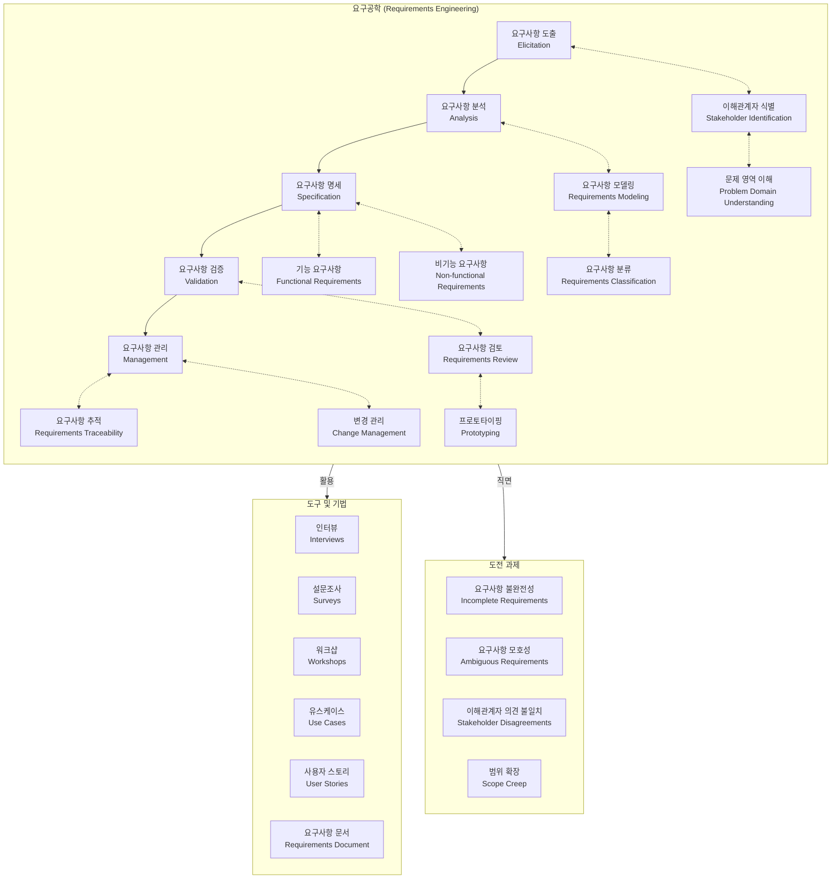

# 요구공학: 시스템이 풀어야 할 문제를 이해하는 작업

시스템이 해결해야 할 문제를 이해하고, 이해관계자들의 요구를 체계적으로 수집, 분석, 명세화, 검증하는 과정이다. 이를 통해 정확하고 명확한 요구사항을 도출하고, 개발 프로세스 전반에서 요구사항을 관리한다.

## 정의 및 개념

- **요구공학(Requirements Engineering)**: 시스템의 요구사항을 이해하고 조정하여 명확하게 정의하는 공정 및 학문
- **주요 과정**: 타당성 분석, 요구사항 추적 및 분석, 요구사항 명세화, 요구사항 검증

## 요구사항 개발 프로세스 (타추명검)

1. **타당성 분석**: 타당성 보고서를 작성하여 프로젝트 수행 가능성을 평가
2. **요구사항 추적 및 분석**: 시스템 모델을 기반으로 요구사항을 추적하고 분석
3. **요구사항 명세화**: 시스템 요구사항을 문서화하여 명확한 기준 설정
4. **요구사항 검증**: 요구사항 문서를 기반으로 검증 수행

## 요구사항 관리(협기변확)

- **요구사항 협상**: 이해관계자 간 의견 조정 및 요구사항 조율
- **요구사항 기준선 설정**: 개발 진행 중 변경을 최소화하기 위한 기준선 설정
- **요구사항 변경 관리**: 요구사항 변경 발생 시 체계적으로 관리
- **요구사항 확인 및 검증**: 문서화된 요구사항이 실제 시스템과 일치하는지 검증

## 요구사항 명세서 평가 기준(수완이의 개명 추정일 우검)

- **정확성**: 요구사항이 올바르게 기술되었는가?
- **명확성**: 요구사항이 혼동 없이 이해될 수 있는가?
- **완전성**: 모든 요구사항이 포함되었는가?
- **수정 용이성**: 요구사항 변경이 용이한가?
- **추적 가능성**: 요구사항의 변경 이력이 관리되는가?
- **이해 용이성**: 문서가 이해하기 쉬운가?
- **일관성**: 요구사항 간 충돌이 없는가?
- **개발 후 이용성**: 유지보수 및 확장이 용이한가?
- **우선순위 포함 여부**: 요구사항 간 중요도가 명확한가?
- **검증 가능성**: 요구사항이 객관적으로 검증될 수 있는가?

## 요구공학 프로세스 및 구성요소

요구공학은 시스템이 해결해야 할 문제를 이해하고 정의하는 체계적인 프로세스.

### 요구공학의 핵심 요소

1. **프로세스 단계**:

   - **요구사항 도출(Elicitation)**: 이해관계자로부터 요구사항을 수집
   - **요구사항 분석(Analysis)**: 수집된 요구사항을 분석하고 모델링
   - **요구사항 명세(Specification)**: 요구사항을 문서화하고 형식화
   - **요구사항 검증(Validation)**: 요구사항이 이해관계자의 필요를 충족하는지 확인
   - **요구사항 관리(Management)**: 요구사항 변경사항을 관리하고 추적

2. **주요 기법**:

   - 인터뷰, 설문조사, 워크샵을 통한 정보 수집
   - 유스케이스와 사용자 스토리를 활용한 요구사항 모델링
   - 프로토타이핑을 통한 요구사항 검증

3. **도전 과제**:

   - 불완전하거나 모호한 요구사항
   - 이해관계자 간의 의견 불일치
   - 범위 확장(Scope Creep)

4. **핵심 가치**:
   - 시스템 개발 초기에 문제를 정확히 이해함으로써 후속 개발 비용 절감
   - 이해관계자와 개발팀 간의 명확한 의사소통 기반 제공
   - 올바른 시스템을 개발하기 위한 기초 확립

요구공학은 "무엇을"(what) 구축할지에 집중하여 "어떻게"(how) 구축할지 결정하기 전에 문제 도메인을 철저히 이해하는 것을 목표로 합니다.

## 마무리

요구공학은 성공적인 시스템 개발을 위해 필수적인 과정이다. 정확한 요구사항 분석과 체계적인 관리를 통해 프로젝트 리스크를 줄이고 품질을 향상시킬 수 있다.

## Keywords

요구공학, 요구사항 분석, 요구사항 명세화, 요구사항 검증, 요구사항 관리, 타당성 분석, 시스템 요구사항, 요구사항 기준선, 요구사항 변경 관리, 소프트웨어 개발
