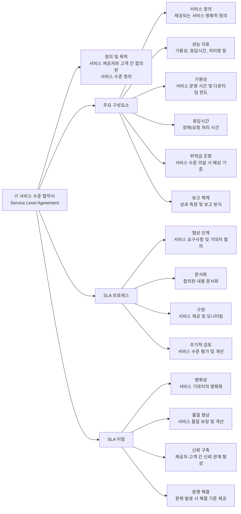

# SLA: IT 서비스 수준 협약서

<!-- mtoc-start -->

- [정의](#정의)
- [SLA 절차](#sla-절차)
- [SLA의 필요성](#sla의-필요성)
- [SLA 구성 요소](#sla-구성-요소)
- [SLA 구성도](#sla-구성도)
  - [1. **주요 구성요소**:](#1-주요-구성요소)
  - [2. **SLA 프로세스**:](#2-sla-프로세스)
  - [3. **이점**:](#3-이점)
- [기대 효과](#기대-효과)
- [마무리](#마무리)
- [Keywords](#keywords)

<!-- mtoc-end -->

IT 아웃소싱 서비스의 수준을 정량적으로 측정, 평가, 개선하는 고객과의 서비스 수준 합의서이다. SLA(Service Level Agreement)는 IT 서비스 제공자와 고객 간의 기대치를 명확히 정의하고, 서비스 품질을 보장하는 역할을 한다.

## 정의

SLA는 IT 서비스 제공자와 고객 간에 합의된 서비스 품질과 수준을 명문화한 계약입니다.

- 특징: 서비스 품질 보장, 성과 측정 지표, 보상 및 패널티 체계

## SLA 절차

1. **서비스 범위 및 내용 정의**: 제공할 서비스의 범위와 내용을 명확히 설정
2. **서비스 수준 관리 지표 선정**: 성과를 측정할 지표를 정의 (예: 가동률, 응답 속도)
3. **서비스 목표 수준 설정**: 서비스의 목표 수준을 정량적으로 결정 (예: 가용성 99.8%)
4. **보상 및 패널티 기준 선정**: 서비스 성과에 따른 보상 및 패널티 적용 기준 설정

## SLA의 필요성

- **측정의 어려움**: 서비스 품질을 객관적으로 평가하기 위한 기준 필요
- **기대 차이 해결**: 고객과 서비스 제공자 간 기대 수준 차이를 줄임
- **제한된 자원 관리**: 최적의 자원 배분을 통해 효율적인 서비스 제공
- **서비스 영역 확대 대응**: IT 서비스 확장 시 품질 유지 및 관리 필요

## SLA 구성 요소

- **기본 계약서**: ITO(IT 아웃소싱) 계약서 포함
- **SOW(Statement of Work)**: 서비스 대상 및 제공 항목 명시
- **서비스 수준 관리 지표(SLM)**: 서비스 성능을 측정하는 기준 (예: 시스템 가동율 99.9%)
- **서비스 목표 수준**: 서비스 가용성 유지 목표 (예: 99.8%)
- **서비스 수준 보고(SLO)**: 월간 서비스 보고 및 개선 계획서 포함
- **보상 체계**: Penalty(패널티) 및 Incentive(인센티브) 기준 포함

## SLA 구성도

### 1. **주요 구성요소**:

- 서비스 정의: 제공될 서비스의 범위와 내용을 명확히 정의
- 성능 지표(KPI): 가용성, 응답시간, 처리량 등 측정 가능한 지표 설정
- 가용성: 서비스가 정상 작동해야 하는 시간(예: 99.9% 업타임)
- 응답시간: 장애나 요청에 대한 대응 시간 약속(예: 중요 장애 30분 이내 대응)
- 위약금 조항: 서비스 수준 미달 시 적용되는 보상 체계
- 보고 체계: 성과 측정 및 보고 방식과 주기

### 2. **SLA 프로세스**:

- 협상: 서비스 요구사항과 기대치에 대한 협의
- 문서화: 합의된 내용을 공식 문서로 작성
- 구현: 서비스 제공 및 지속적 모니터링
- 검토: 주기적인 성과 평가 및 개선점 도출

### 3. **이점**:

- 서비스 기대치의 명확화로 오해 방지
- 측정 가능한 목표 설정으로 서비스 품질 보장
- 제공자와 고객 간 신뢰 관계 구축
- 문제 발생 시 해결 기준 제공으로 분쟁 최소화

SLA는 IT 서비스의 품질을 객관적으로 관리하고, 고객 만족도를 높이며, 서비스 제공자의 책임과 의무를 명확히 하는 중요한 관리 도구입니다.

## 기대 효과

- 발주자와 수주자 간 **비용 예측 가능**
- **불명확한 서비스의 대가 산정 문제 해결**
- 서비스 제공자와 사용자의 **분쟁 해결 수단 제공**

## 마무리

SLA는 IT 서비스 제공 시 필수적인 요소로, 명확한 기준을 통해 서비스 품질을 보장하고 이해관계자 간 신뢰를 형성한다. SLA를 체계적으로 관리하면 서비스 수준을 지속적으로 개선할 수 있다.

## Keywords

SLA, 서비스 수준 협약, IT 아웃소싱, 서비스 목표 수준, SLM, SLO, 서비스 가용성, 보상 체계, 패널티, 인센티브
