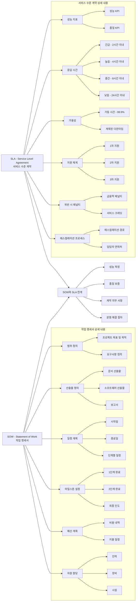

# SOW: SLA의 세부 작업 명세서

<!-- mtoc-start -->

- [SOW의 구성 요소](#sow의-구성-요소)
- [SOW와 SLA 세부 작업 명세서](#sow와-sla-세부-작업-명세서)
  - [**SOW(Statement of Work, 작업 명세서)**](#sowstatement-of-work-작업-명세서)
  - [**SLA(Service Level Agreement, 서비스 수준 계약)**](#slaservice-level-agreement-서비스-수준-계약)
  - [**SOW와 SLA의 연계**](#sow와-sla의-연계)
- [마무리](#마무리)
- [Keywords](#keywords)

<!-- mtoc-end -->

SOW(Statement of Work)는 SLA(Service Level Agreement)의 세부적인 범위 및 작업 내용을 규정한 작업 명세서이다. SLA가 서비스 수준과 목표를 정의한다면, SOW는 해당 서비스의 수행 방식과 범위를 구체적으로 명시하는 문서이다.

## SOW의 구성 요소

1. **업무 범위**: 제공되는 서비스 항목 및 상세 내용 정의
2. **책임 범위**: 서비스 제공에 따른 책임과 역할 규정
3. **서비스 프로세스**: 서비스 제공에 대한 모든 절차와 수행 방식 명시

## SOW와 SLA 세부 작업 명세서

### **SOW(Statement of Work, 작업 명세서)**

- 프로젝트의 기본 골격을 정의하는 문서로, 무엇을, 언제, 어떻게 수행할지 명시
- 주요 구성 요소: 범위 정의, 산출물, 일정 계획, 마일스톤, 예산, 자원 할당
- 프로젝트의 성공적 수행을 위한 기준점 제공

### **SLA(Service Level Agreement, 서비스 수준 계약)**

- 서비스 제공자와 고객 간의 합의된 서비스 품질 수준을 정의하는 문서
- 주요 구성 요소: 성능 지표, 응답 시간, 가용성, 지원 체계, 위반 시 패널티, 에스컬레이션 프로세스
- 서비스 품질 보장 및 책임 소재 명확화

### **SOW와 SLA의 연계**

- 성공적인 프로젝트 수행을 위해 SOW와 SLA는 상호 보완적인 관계
- SOW는 '무엇을 할 것인가'에 초점, SLA는 '얼마나 잘 할 것인가'에 초점
- 함께 사용될 때 명확한 프로젝트 기대치와 평가 기준 제공

## 마무리

SOW는 SLA의 이행을 보장하고, 서비스 제공자와 고객 간의 명확한 역할 및 책임을 규정하는 중요한 문서이다. 이를 통해 서비스 제공의 일관성을 유지하고, 기대치를 충족할 수 있도록 한다.

## Keywords

SOW, Statement of Work, 서비스 명세서, 작업 명세서, SLA, 업무 범위, 책임 범위, 서비스 프로세스, IT 아웃소싱, 서비스 계약
