# SW 품질 총론: 소프트웨어 서비스 품질 보장

<!-- mtoc-start -->

- [정의 및 개념](#정의-및-개념)
- [SW 품질 관리 체계](#sw-품질-관리-체계)
- [SW 품질 평가 모델](#sw-품질-평가-모델)
  - [1. 제품 품질 평가](#1-제품-품질-평가)
  - [2. 프로세스 품질 평가](#2-프로세스-품질-평가)
  - [3. 경영 측면 품질 평가](#3-경영-측면-품질-평가)
- [SW 품질 관리체계 및 표준](#sw-품질-관리체계-및-표준)
- [기대 효과 및 필요성](#기대-효과-및-필요성)
- [마무리](#마무리)
- [Keywords](#keywords)

<!-- mtoc-end -->

소프트웨어 품질은 단순히 검사로 보장되는 것이 아니라, 체계적인 계획, 설계, 그리고 내재화를 통해 확보되어야 한다. 현대의 소프트웨어 개발 환경에서 품질 관리는 필수적인 요소이며, 공동체 의식과 품질에 대한 인식 전환이 필요하다.

## 정의 및 개념

- **SW 품질**: 요구사항을 만족시키는 소프트웨어 제품의 특성과 기능
- **SW 품질 관리**: 주어진 요구를 만족하는 제품이나 서비스의 질을 보존하는데 필요한 제반 활동과 기법
- **SW 품질 관리의 필요성**
  - **복잡도 증가**: 시스템 거대화, 기능 다양성 증가
  - **품질 문제**: 납기 지연, 고객 불만족 등의 질적 문제 발생

## SW 품질 관리 체계

SW 품질 관리는 세 가지 주요 활동으로 구성된다.

1. **품질 관리(Quality Management)**
   - **품질 계획(Quality Planning)**: 표준 식별 및 적용 계획 수립
   - **품질 보증(Quality Assurance)**: 제3자의 입장에서 요구사항 일치 여부 검토
   - **품질 통제(Quality Control)**: 자체적 품질 활동 수행

## SW 품질 평가 모델

소프트웨어 품질 관리를 위해 다양한 평가 모델이 활용된다.

### 1. 제품 품질 평가

- **ISO 9126**: 사용자 입장에서의 품질 특성 표준
- **ISO 14598**: 소프트웨어 평가 프로세스 국제 표준
- **ISO 12119**: 소프트웨어 패키지 품질 요구사항 표준

### 2. 프로세스 품질 평가

- **ISO 12207**: ISO에서 정의한 표준 SDLC (Software Development Life Cycle)
- **SPICE**: 소프트웨어 프로세스 개선 및 능력 측정 기준
- **CMMI**: 소프트웨어 공학의 능력과 성숙도 평가 모델

### 3. 경영 측면 품질 평가

- **6시그마(Six Sigma)**: 품질 혁신과 고객 만족을 위한 전사적 경영 전략
- **ISO 9000**: 품질경영시스템 국제 규격

## SW 품질 관리체계 및 표준

```mermaid
graph LR
    A[소프트웨어 품질 관리] --> B[품질 관리체계]
    A --> C[국제 표준]
    A --> D[품질 특성]

    %% 품질 관리체계
    B --> B1[품질 계획]
    B --> B2[품질 보증]
    B --> B3[품질 통제]
    B --> B4[품질 개선]

    %% 품질 계획
    B1 --> B1a[품질 목표 설정]
    B1 --> B1b[품질 메트릭 정의]
    B1 --> B1c[검증 방법론 계획]

    %% 품질 보증
    B2 --> B2a[프로세스 표준화]
    B2 --> B2b[품질 감사]
    B2 --> B2c[리뷰와 인스펙션]

    %% 품질 통제
    B3 --> B3a[테스팅]
    B3 --> B3b[결함 관리]
    B3 --> B3c[성능 모니터링]

    %% 품질 개선
    B4 --> B4a[지속적 개선]
    B4 --> B4b[교훈 학습]
    B4 --> B4c[프로세스 최적화]

    %% 국제 표준
    C --> C1[ISO/IEC 9126]
    C --> C2[ISO/IEC 25010]
    C --> C3[ISO/IEC 12207]
    C --> C4[CMMI]
    C --> C5[IEEE 730]

    %% ISO/IEC 9126
    C1 --> C1a[구 품질 특성 모델]

    %% ISO/IEC 25010
    C2 --> C2a[현 품질 특성 모델]
    C2 --> C2b[제품 품질 모델]
    C2 --> C2c[사용 품질 모델]

    %% ISO/IEC 12207
    C3 --> C3a[SW 생명주기 프로세스]

    %% CMMI
    C4 --> C4a[프로세스 성숙도 모델]
    C4 --> C4b[단계적 개선 프레임워크]

    %% IEEE 730
    C5 --> C5a[SW 품질 보증 계획]

    %% 품질 특성
    D --> D1[기능성]
    D --> D2[신뢰성]
    D --> D3[사용성]
    D --> D4[효율성]
    D --> D5[유지보수성]
    D --> D6[이식성]
    D --> D7[보안성]
    D --> D8[호환성]

    %% 기능성
    D1 --> D1a[적합성]
    D1 --> D1b[정확성]
    D1 --> D1c[상호운용성]

    %% 신뢰성
    D2 --> D2a[성숙성]
    D2 --> D2b[결함허용성]
    D2 --> D2c[복구성]

    %% 사용성
    D3 --> D3a[이해성]
    D3 --> D3b[학습성]
    D3 --> D3c[운용성]
    D3 --> D3d[UI 심미성]

    %% 효율성
    D4 --> D4a[시간 효율성]
    D4 --> D4b[자원 효율성]

    %% 유지보수성
    D5 --> D5a[분석성]
    D5 --> D5b[변경성]
    D5 --> D5c[안정성]
    D5 --> D5d[테스트 용이성]

    %% 이식성
    D6 --> D6a[적응성]
    D6 --> D6b[설치 용이성]
    D6 --> D6c[공존성]
    D6 --> D6d[대체성]

    %% 보안성
    D7 --> D7a[기밀성]
    D7 --> D7b[무결성]
    D7 --> D7c[부인방지]
    D7 --> D7d[책임추적성]
    D7 --> D7e[인증성]

    %% 호환성
    D8 --> D8a[공존성]
    D8 --> D8b[상호운용성]

    %% 품질 생명주기
    E[품질 생명주기] --> E1[요구사항 분석]
    E --> E2[설계]
    E --> E3[구현]
    E --> E4[테스트]
    E --> E5[배포]
    E --> E6[유지보수]

    A --> E

    %% 품질 측정
    F[품질 측정] --> F1[정적 분석]
    F --> F2[동적 분석]
    F --> F3[메트릭 수집]

    A --> F

    %% 정적 분석
    F1 --> F1a[코드 리뷰]
    F1 --> F1b[정적 코드 분석 도구]
    F1 --> F1c[소스 코드 메트릭]

    %% 동적 분석
    F2 --> F2a[단위 테스트]
    F2 --> F2b[통합 테스트]
    F2 --> F2c[시스템 테스트]
    F2 --> F2d[성능 테스트]
    F2 --> F2e[보안 테스트]

    %% 메트릭 수집
    F3 --> F3a[코드 복잡도]
    F3 --> F3b[결함 밀도]
    F3 --> F3c[테스트 커버리지]
    F3 --> F3d[사용자 만족도]
```

소프트웨어 품질 관리는 개발 과정 전반에 걸쳐 제품의 품질을 보장하는 체계적인 접근 방식.

1. **품질 관리체계**

   - **품질 계획**: 목표 설정, 메트릭 정의, 검증 방법론 계획 수립
   - **품질 보증**: 프로세스 표준화, 품질 감사, 리뷰와 인스펙션 수행
   - **품질 통제**: 테스팅, 결함 관리, 성능 모니터링 실행
   - **품질 개선**: 지속적 개선, 교훈 학습, 프로세스 최적화 진행

2. **국제 표준**

   - **ISO/IEC 9126**: 구 소프트웨어 품질 특성 모델
   - **ISO/IEC 25010**: 현 소프트웨어 품질 특성 모델 (제품 품질, 사용 품질)
   - **ISO/IEC 12207**: 소프트웨어 생명주기 프로세스 표준
   - **CMMI**: 프로세스 성숙도 모델 및 단계적 개선 프레임워크
   - **IEEE 730**: 소프트웨어 품질 보증 계획 표준

3. **품질 특성**

   - **기능성**: 사용자 요구사항 충족 정도 (적합성, 정확성, 상호운용성)
   - **신뢰성**: 지정된 조건에서 기능 유지 능력 (성숙성, 결함허용성, 복구성)
   - **사용성**: 사용자가 이해하고 배우고 사용하기 쉬운 정도
   - **효율성**: 자원 사용 대비 성능 수준
   - **유지보수성**: 변경 용이성과 결함 수정 능력
   - **이식성**: 다른 환경으로 이전 용이성
   - **보안성**: 정보와 데이터 보호 능력
   - **호환성**: 다른 시스템과의 공존 및 상호작용 능력

4. **품질 생명주기**

   - 요구사항 분석부터 유지보수까지 전체 개발 과정에서 품질 관리 통합

5. **품질 측정**
   - **정적 분석**: 코드 실행 없이 수행 (코드 리뷰, 정적 분석 도구)
   - **동적 분석**: 코드 실행을 통한 분석 (단위/통합/시스템/성능/보안 테스트)
   - **메트릭 수집**: 품질 정량화 (복잡도, 결함 밀도, 테스트 커버리지, 만족도)

소프트웨어 품질 관리는 단순한 테스팅 이상의 체계적이고 지속적인 과정으로, 요구사항부터 유지보수까지 전체 개발 생명주기에 걸쳐 적용되며, 국제 표준에 기반한 다양한 품질 속성을 측정하고 개선하는 종합적인 활동.

## 기대 효과 및 필요성

- **소프트웨어 품질 향상**: 신뢰성 및 유지보수성 강화
- **개발 비용 절감**: 오류 감소를 통한 비용 절감
- **고객 만족도 향상**: 품질 높은 소프트웨어 제공
- **경쟁력 강화**: 글로벌 표준 준수를 통한 기업 경쟁력 확보

## 마무리

소프트웨어 품질 관리는 단순한 검사 단계를 넘어, 조직 전반에 걸쳐 체계적으로 계획되고 실행되어야 한다. 품질 관리 체계를 확립하고 평가 모델을 적용함으로써 높은 품질의 소프트웨어를 개발할 수 있다. 지속적인 품질 개선 활동을 통해 고객 만족과 기업 경쟁력을 동시에 확보하는 것이 중요하다.

## Keywords

Software Quality, SW 품질, ISO 9126, CMMI, 6시그마, 품질보증, 품질통제, 소프트웨어 평가, SPICE, ISO 9000
