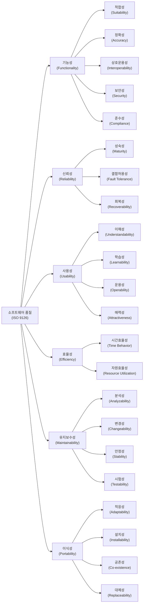

# ISO 9126: 사용자 관점의 SW 품질 측정

<!-- mtoc-start -->

- [구성 요소](#구성-요소)
- [품질 특성과 세부 항목(기신사효유이)](#품질-특성과-세부-항목기신사효유이)
  - [1. 기능성 (Functionality)(적정상유보)](#1-기능성-functionality적정상유보)
  - [2. 신뢰성 (Reliability)(성오회)](#2-신뢰성-reliability성오회)
  - [3. 사용성 (Usability)(이습운)](#3-사용성-usability이습운)
  - [4. 효율성 (Efficiency)(실자)](#4-효율성-efficiency실자)
  - [5. 유지보수성 (Maintainability)(해변안시)](#5-유지보수성-maintainability해변안시)
  - [6. 이식성 (Portability)(환이일치)](#6-이식성-portability환이일치)
- [ISO-9126 SW 풀질 특성 모델](#iso-9126-sw-풀질-특성-모델)
  - [1. 기능성(Functionality)](#1-기능성functionality)
  - [2. 신뢰성(Reliability)](#2-신뢰성reliability)
  - [3. 사용성(Usability)](#3-사용성usability)
  - [4. 효율성(Efficiency)](#4-효율성efficiency)
  - [5. 유지보수성(Maintainability)](#5-유지보수성maintainability)
  - [6. 이식성(Portability)](#6-이식성portability)
- [기대 효과](#기대-효과)
- [Keywords](#keywords)

<!-- mtoc-end -->

ISO 9126은 소프트웨어 제품 품질을 내부적, 외부적, 그리고 사용자 관점에서 측정하기 위한 국제 표준이다. 이 표준은 품질 평가를 위한 기준을 제공하며, 소프트웨어의 품질 특성과 메트릭을 정의한다.

## 구성 요소

ISO 9126은 총 4개의 부분으로 구성된다.

- **ISO 9126-1**: 품질 특성과 부특성 정의
- **ISO 9126-2**: 외부 품질 메트릭(External Metrics)
- **ISO 9126-3**: 내부 품질 메트릭(Internal Metrics)
- **ISO 9126-4**: 사용 품질(Usability Metrics)

## 품질 특성과 세부 항목(기신사효유이)

ISO 9126에서 정의하는 주요 품질 특성과 그 하위 항목은 다음과 같다.

### 1. 기능성 (Functionality)(적정상유보)

- **적합성**(Suitability)
- **정확성**(Accuracy)
- **상호호환성**(Interoperability)
- **유연성**(Compliance)
- **보안성**(Security)

### 2. 신뢰성 (Reliability)(성오회)

- **성숙성**(Maturity)
- **오류 허용성**(Fault Tolerance)
- **회복성**(Recoverability)

### 3. 사용성 (Usability)(이습운)

- **이해성**(Understandability)
- **습득성**(Learnability)
- **운용성**(Operability)

### 4. 효율성 (Efficiency)(실자)

- **실행 효율성**(Time Behavior)
- **자원 효율성**(Resource Utilization)

### 5. 유지보수성 (Maintainability)(해변안시)

- **해석성**(Analyzability)
- **변경성**(Changeability)
- **안정성**(Stability)
- **시험성**(Testability)

### 6. 이식성 (Portability)(환이일치)

- **환경 적응성**(Adaptability)
- **이식 작업성**(Installability)
- **일치성**(Conformance)
- **치환성**(Replaceability)

## ISO-9126 SW 풀질 특성 모델

ISO 9126은 소프트웨어 제품 품질을 평가하기 위한 국제 표준으로, 사용자 관점에서 소프트웨어의 품질을 6가지 주요 특성과 그에 따른 부특성으로 분류.

### 1. 기능성(Functionality)

- 요구된 기능을 정확하게 제공하는 능력
- 부특성: 적합성, 정확성, 상호운용성, 보안성, 준수성

### 2. 신뢰성(Reliability)

- 명시된 조건에서 성능 수준을 유지하는 능력
- 부특성: 성숙성, 결함허용성, 회복성

### 3. 사용성(Usability)

- 사용자가 이해하고 학습하며 사용하기 쉬운 정도
- 부특성: 이해성, 학습성, 운용성, 매력성

### 4. 효율성(Efficiency)

- 자원 사용 대비 성능 수준을 제공하는 능력
- 부특성: 시간효율성, 자원효율성

### 5. 유지보수성(Maintainability)

- 수정이나 개선이 용이한 정도
- 부특성: 분석성, 변경성, 안정성, 시험성

### 6. 이식성(Portability)

- 다른 환경으로 이전될 수 있는 능력
- 부특성: 적응성, 설치성, 공존성, 대체성

ISO 9126은 사용자가 직접 느끼는 품질(외부 품질)과 개발자가 확인하는 내부적 품질을 모두 고려하며, 각 품질 특성은 측정 가능한 지표로 평가될 수 있습니다. 이 표준은 소프트웨어 개발 전 과정에서 품질 목표를 설정하고 평가하는 기준으로 활용되며, 이후 ISO/IEC 25010 표준으로 발전되었습니다.

## 기대 효과

ISO 9126을 활용하면 소프트웨어 품질을 객관적으로 평가할 수 있으며, 사용자 만족도를 높이고 유지보수성을 개선할 수 있다. 또한, 다양한 품질 특성을 기준으로 지속적인 품질 개선이 가능하다.

## Keywords

ISO 9126, 소프트웨어 품질, 품질 평가, 기능성, 신뢰성, 사용성, 효율성, 유지보수성, 이식성
