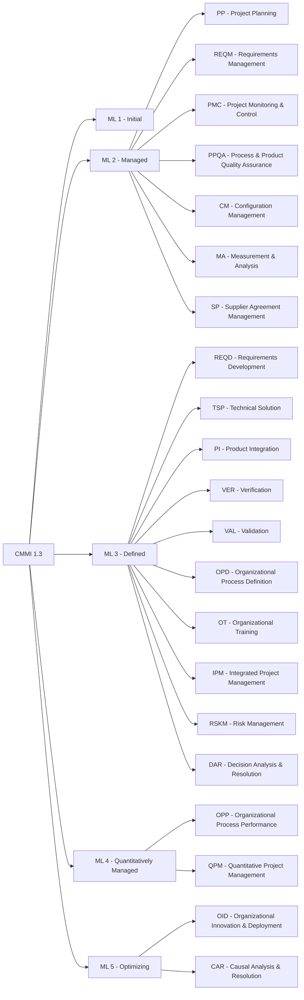

```mermaid
graph LR;
  A[CMMI 1.3] --> B[ML 1 - Initial]
  A --> C[ML 2 - Managed]
  A --> D[ML 3 - Defined]
  A --> E[ML 4 - Quantitatively Managed]
  A --> F[ML 5 - Optimizing]

  %% ML 2 프로세스 영역
  C --> C1[PP - Project Planning]
  C --> C2[REQM - Requirements Management]
  C --> C3[PMC - Project Monitoring & Control]
  C --> C4[PPQA - Process & Product Quality Assurance]
  C --> C5[CM - Configuration Management]
  C --> C6[MA - Measurement & Analysis]
  C --> C7[SP - Supplier Agreement Management]

  %% ML 3 프로세스 영역
  D --> D1[REQD - Requirements Development]
  D --> D2[TSP - Technical Solution]
  D --> D3[PI - Product Integration]
  D --> D4[VER - Verification]
  D --> D5[VAL - Validation]
  D --> D6[OPD - Organizational Process Definition]
  D --> D7[OT - Organizational Training]
  D --> D8[IPM - Integrated Project Management]
  D --> D9[RSKM - Risk Management]
  D --> D10[DAR - Decision Analysis & Resolution]

  %% ML 4 프로세스 영역
  E --> E1[OPP - Organizational Process Performance]
  E --> E2[QPM - Quantitative Project Management]

  %% ML 5 프로세스 영역
  F --> F1[OID - Organizational Innovation & Deployment]
  F --> F2[CAR - Causal Analysis & Resolution]
```
